This integration was integrated and tested with McAfee ePO v5.3.2.

## Configure McAfee ePO in Cortex

*   **Name**: a textual name for the integration instance.
*   **Url**: for example: `https://****:port`
*   **Username**
*   **Password**
*   **Trust any certificate (not secure)** Mark to trust Certificate Authority.
*   **Use system proxy settings**

## Permissions
McAfee ePO has a highly flexible and powerful permissions system. The permissions required for the user that uses this integration depend on which operations they need to perform. The API user should have the same permissions a regular user would have in order to access the data via the UI. It is possible to view the exact permissions needed for a specific command by running the `!epo-help` command. The `!epo-help` command's output will include help information for the specific command including required permissions. 
More info about McAfee ePO's permissions model is available [here](https://docs.mcafee.com/bundle/epolicy-orchestrator-5.10.0-product-guide/page/GUID-1AEFA219-0726-4090-A8C2-BCAA1CAA7B37.html).

Example `!epo-help` outputs with permission information: 
* `!epo-help command="repository.findPackages"`:
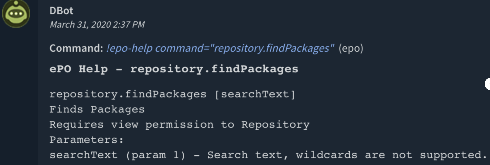
* `!epo-help command="repository.deletePackage"`:
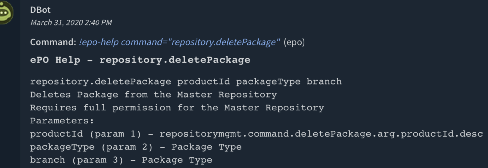

## Playbooks
* McAfee ePO Endpoint Connectivity Diagnostics - Perform a check on ePO endpoints to see if any endpoints are unmanaged or lost connectivity with ePO and take steps to return to valid state.
* McAfee ePO Endpoint Compliance - Discover endpoints that are not using the latest McAfee AV Signatures
* McAfee ePO Repository Compliance - Ensures that ePO servers are updated to the latest McAfee published AV signatures (DAT file version). 
* Endpoint Enrichment - Generic v2: uses `epo-find-systems` to enrich an endpoint by hostname.

## Commands

You can execute these commands from the CLI, as part of an automation, or in a playbook. After you successfully execute a command, a DBot message appears in the War Room with the command details.

1.  Print help for ePO commands: epo-help
2.  Get the latest DAT file: epo-get-latest-dat
3.  Check the current DAT file version: epo-get-current-dat
4.  Update the DAT file: epo-update-client-dat
5.  Update a repository: epo-update-repository
6.  Get system tree groups: epo-get-system-tree-group
7.  Find systems in the system tree: epo-find-systems
8.  epo-command
9.  epo-advanced-command
10. Wake up an agent: epo-wakeup-agent
11. Apply a tag: epo-apply-tag
12. Clear a tag: epo-clear-tag
13. Query an ePO table: epo-query-table
14. Get an ePO table: epo-get-table
15. Get the ePO version: epo-get-version
16. Find systems in the system tree: epo-find-system
17. Move a system to a different group: epo-move-system

### 1. Print help for ePO commands

Prints help (information) for ePO commands. If no command argument is specified, returns all ePO commands.

##### Base Command

    epo-help

##### Input

|Argument Name|Description|Required|
|--- |--- |--- |
|search|String to search for in help.|Optional|
|command|Command for which to print help.|Optional|

##### Context Output

There is no context output for this command.

##### Command Example

!epo-help search="agent"

##### Human Readable Output

[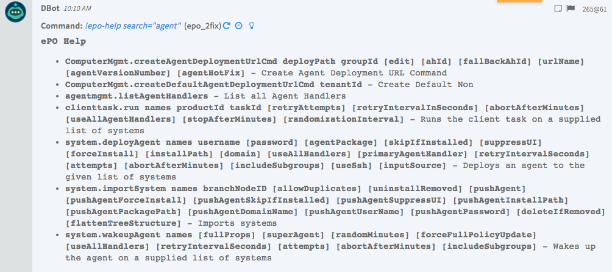](../../doc_files/44625852-d013c300-a91a-11e8-839e-b4f139ab893d.png)

### 2. Get the latest DAT file

Checks for the latest DAT file in the McAfee repository.

##### Base Command

    epo-get-latest-dat

##### Input

There is no input for this command. 

##### Context Output

|Path|Type|Description|
|--- |--- |--- |
|McAfee.ePO.latestDAT|Number|Latest McAfee DAT file version.|

##### Command Example

!epo-get-latest-dat

##### Human Readable Output

### 3. Check the current DAT file version

Checks the existing DAT file version in ePO.

##### Base Command

    epo-get-current-dat

##### Input

There is no input for this command.

##### Context Output

|Path|Type|Description|
|--- |--- |--- |
|McAfee.ePO.epoDAT|number|Current McAfee DAT file in the ePO repository.|

##### Command Example

!epo-get-current-dat

##### Human Readable Output

[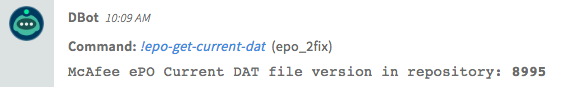](../../doc_files/44625764-7bbc1380-a919-11e8-9959-1090d30f1db3.png)

### 4. Update the DAT file

Run client task to update the DAT file.

To run this command, you need to create a task on the ePO server with a specific name.

1.  Log on to the ePO server.
2.  Select **System Tree**.
3.  Select **Assigned Client Tasks** > **Actions** > **New Client Task Assignment**.
4.  Configure the **Select Task** section.  
    
|Field|Value|
|--- |--- |
|Product|McAfee Agent|
|Task Type|Product Update|
|Task Name|DAT Update|

    
5.  Select **Create New Task**.  
    
|Field|Value|
|--- |--- |
|Task Name|VSEContentUpdateDemisto|
|Package Selection|Selected packages|
|Signatures and Engines|DAT|

##### Base Command

    epo-update-client-dat

##### Input

|Argument Name|Description|Required|
|--- |--- |--- |
|systems|A CSV list of IP addresses or system names.|Required|
|retryAttempts|Number of times the server will attempt to send the task to the client. Default is 1 retry.|Optional|
|retryIntervalInSeconds|Retry interval in seconds. Default is 30 seconds.|Optional|
|abortAfterMinutes|The threshold (in minutes) after which attempts to send the task to the client are aborted. Default is 5.|Optional|
|stopAfterMinutes|The threshold (in minutes) that the client task is allowed to run. Defaults to 20.|Optional|
|randomizationInterval|Duration (in minutes) over which to randomly spread task execution. Default is 0 (executes on all clients immediately).|Optional|

##### Context Output

There is no context output for this command.

##### Command Example

!epo-update-client-dat systems=ADMIN-PC

##### Human Readable Output

[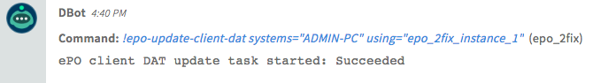](../../doc_files/44625952-9d6aca00-a91c-11e8-92b7-2a42b2b618d6.png)

### 5. Update a repository

Triggers a server task in specific ePO servers to retrieve the latest signatures from the update server.

##### Base Command

    epo-update-repository

##### Input

There is no input for this command.

##### Context Output

There is no context output for this command.

##### Command Example

!epo-update-repository

##### Human Readable Output

[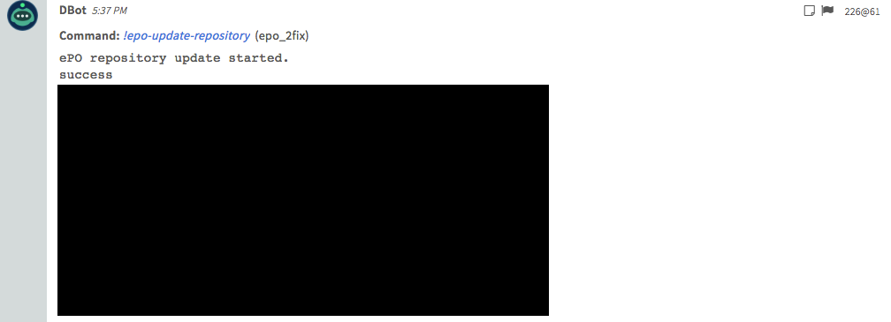](../../doc_files/44625662-65ad5380-a917-11e8-8120-5e6211e148bd.png)

### 6. Get system tree groups

Returns system tree groups.

##### Base Command

`epo-get-system-tree-group`

##### Input

|Argument Name|Description|Required|
|--- |--- |--- |
|search|String to search for in the system tree group.|Optional|

##### Context Output

|Path|Type|Description|
|--- |--- |--- |
|McAfee.ePO.SystemTreeGroups.groupId|number|System tree group ID.|
|McAfee.ePO.SystemTreeGroups.groupPath|string|System tree group path.|

##### Human Readable Output

[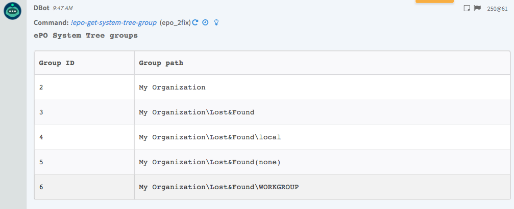](../../doc_files/44625635-d0aa5a80-a916-11e8-826d-15bae934412c.png)

### 7. Find systems in the system tree

Find systems in the System Tree - by group ID or by search

##### Base Command

`epo-find-systems`

##### Input

|Argument Name|Description|Required|
|--- |--- |--- |
|groupId|System tree group ID.|Required|
|verbose|Whether to return all system data.|Optional|

##### Context Output

| Path                             |Type|Description|
|----------------------------------|--- |--- |
| Endpoint.Name                    |string|Endpoint name.|
| Endpoint.Domain                  |string|Endpoint domain.|
| Endpoint.Hostname                |string|Endpoint hostname.|
| Endpoint.IPAddress               |string|Endpoint IP address.|
| Endpoint.OS                      |string|Endpoint OS.|
| Endpoint.OSVersion               |string|Endpoint OS version.|
| Endpoint.Processor               |string|Processor model.|
| Endpoint.Processors              |number|Number of processors.|
| Endpoint.Memory                  |number|Endpoint memory.|
| McAfee.ePO.Endpoint.ComputerName |string|Endpoint name.|
| McAfee.ePO.Endpoint.Domain       |string|Endpoint domain.|
| McAfee.ePO.Endpoint.Hostname     |string|Endpoint hostname.|
| McAfee.ePO.Endpoint.IPAddress    |string|Endpoint IP address.|
| McAfee.ePO.Endpoint.OS           |string|Endpoint OS.|
| McAfee.ePO.Endpoint.OSVersion    |string|Endpoint OS version.|
| McAfee.ePO.Endpoint.Processor    |string|Processor model.|
| McAfee.ePO.Endpoint.Processors   |number|Number of processors|
| McAfee.ePO.Endpoint.Memory       |number|Endpoint memory.|

### 8. epo-command

Executes the ePO command. Receives the mandatory ''command'' argument, and other optional arguments.

To get a list of available commands, run the ''epo-help'' command to get a list of available commands. You can also specify the ''headers'' argument to filter table headers. Example/:/ !epo-command command=system.find searchText=10.0.0.1 headers=EPOBranchNode.AutoID,EPOComputerProperties.ComputerName

##### Base Command

epo-command

##### Command Example

!epo-command command=system.find searchText=10.0.0.1

  
[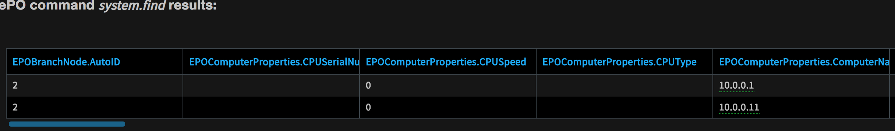](../../doc_files/46333148-e1da3b80-c627-11e8-82cf-40970f8e5aab.png)

!epo-command command=agentmgmt.listAgentHandlers

  
[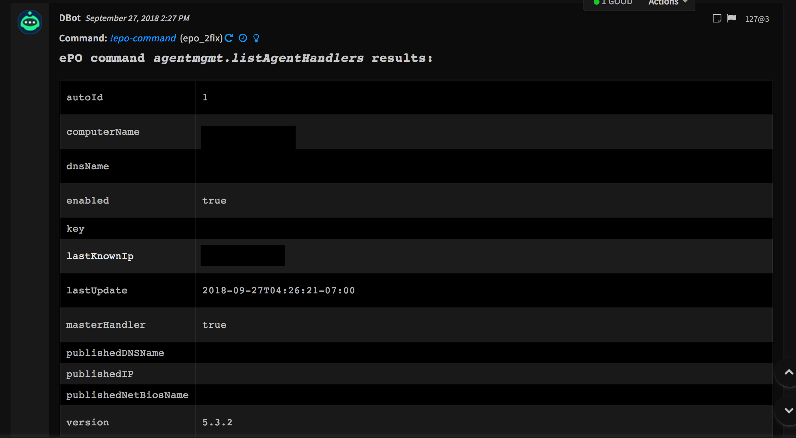](../../doc_files/46333232-37164d00-c628-11e8-91a7-1be03063edb0.png)

### 9. epo-advanced-command

Executes the ePO command.

To get a list of available commands, run the ''epo-help'' command. For example/:/ !epo-advanced-command command=clienttask.find commandArgs=searchText:On-demand. You can also specify the ''headers'' argument to filter table headers, for example/:/ !epo-command command=system.find searchText=10.0.0.1 headers=EPOBranchNode.AutoID,EPOComputerProperties.ComputerName.

##### Base Command

    epo-advanced-command

##### Input

|Argument Name|Description|Required|
|--- |--- |--- |
|command|The command to execute. Run either the core.help command or the !epo-help to get all available commands.|Required|
|commandArgs|CSV list of key value pairs as additional arguments to pass, for example, "argName1:argValue1,argName2:argValue2".|Required|

##### Context Output

 There is no context output for this command.

##### Command Example

!epo-advanced-command command="clienttask.find" commandArgs="searchText:On-demand"

  
[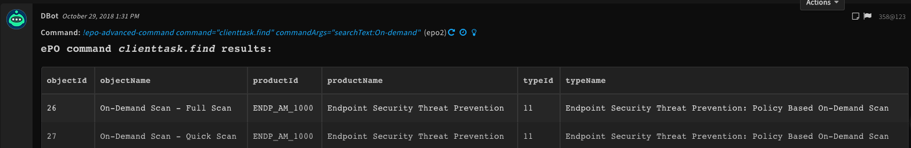](../../doc_files/47647276-27cee480-db7f-11e8-9430-b3685d914cde.png)

### 10. Wake up an agent

Wakes up an agent.

##### Input

|Argument Name|Description|Required|
|--- |--- |--- |
|names|Agent hostname.|Required|

### 11. Apply a tag

Applies a tag to hostnames.

##### Input

|Argument Name|Description|Required|
|--- |--- |--- |
|names|Hostnames on which to apply tags.|Required|
|tagName|Tag name.|Required|

#### Command Example

!epo-apply-tag names="ADMIN-PC" tagName="Compromised"

### 12. Clear a tag

Clears a tag from hostnames.

##### Input

|Argument Name|Description|Required|
|--- |--- |--- |
|names|Hostnames from which to clear tags.|Required|
|tagName|Tag name.|Required|

#### Command Example

!epo-clear-tag names="ADMIN-PC" tagName="Compromised"

### 13. Query an ePO table

Queries an ePO table.

##### Base Command

    epo-query-table

##### Input

|Argument Name|Description|Required|
|--- |--- |--- |
|target|Table name.|Required|
|select|The columns to select, in SQUID syntax. Example: "(select EPOEvents.AutoID EPOEvents.DetectedUTC EPOEvents.ReceivedUTC)".|Optional|
|where|Filter results, in SQUID syntax. Example: "(where ( eq ( OrionTaskLogTask .UserName "ga" )))".|Optional|
|order|Order in which to return the results, in SQUID syntax. Example: "(order (asc OrionTaskLogTask.StartDate) )").|Optional|
|group|Group the results, in SQUID Syntax. Example: "(group EPOBranchNode.NodeName)".|Optional|
|joinTables|Perform join, in SQUID syntax.|Optional|
|query_name|Name for the query to appear in the context.|Optional|

##### Context Output

|Path|Description|
|--- |--- |
|McAfee.ePO.Query|Query result.|

##### Human Readable Output

`!epo-query-table target=EPOLeafNode select="(select EPOLeafNode.NodeName EPOLeafNode.Tags EPOBranchNode.NodeName)" where="(hasTag EPOLeafNode.AppliedTags 4)"`

  
[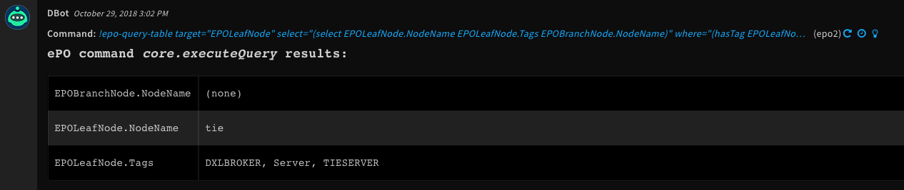](../../doc_files/47652110-bf3b3400-db8d-11e8-934d-56542c178b6f.png)

`!epo-query-table target=EPOLeafNode select="(select (top 3) EPOLeafNode.NodeName EPOLeafNode.Tags EPOBranchNode.NodeName)"`

  
[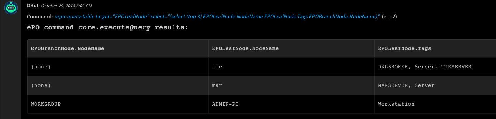](../../doc_files/47652140-d417c780-db8d-11e8-819b-542dcc01c925.png)

`!epo-query-table target="EPOEvents" select="(select EPOEvents.AutoID EPOEvents.DetectedUTC EPOEvents.ReceivedUTC)" order="(order(desc EPOEvents.DetectedUTC))"`

  
[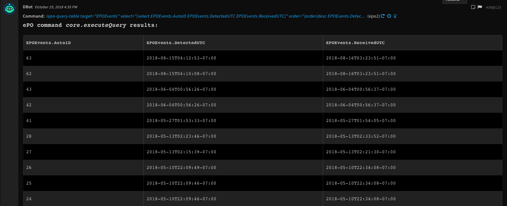](../../doc_files/47656891-b734c180-db98-11e8-9c65-1b58fd4c8268.png)

`!epo-query-table target="EPExtendedEvent" select="(select (top 250) EPOEvents.ThreatName EPOEvents.AutoID EPExtendedEvent.EventAutoID EPExtendedEvent.TargetHash EPExtendedEvent.TargetPath EPOEvents.SourceHostName)" order="(order(desc EPExtendedEvent.TargetHash))" joinTables="EPOEvents"where="(where(eq EPOEvents.ThreatName "real Protect-LS!d5435f1fea5e"))"`

  
[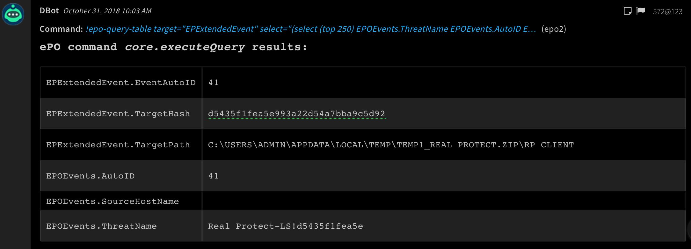](../../doc_files/47773949-4b676b80-dcf4-11e8-9562-c67fced9176c.png)

### 14. Get an ePO table

Returns an ePO table.

##### Base Command

    epo-get-tables

##### Input

|Argument Name|Description|Required|
|--- |--- |--- |
|table|Name of the table to return.|Optional|

##### Context Output

There is no context output for this command.

##### Command Example

!epo-get-tables

##### Human Readable Output

##### [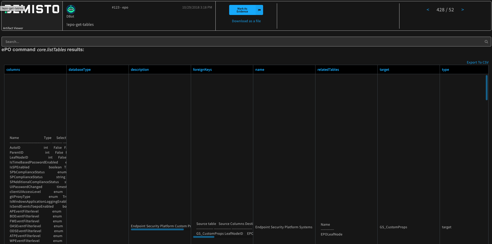](../../doc_files/47652211-06292980-db8e-11e8-8075-87a415c92b20.png)

### 15. Get the ePO version

Gets the ePO version. This command requires global admin permissions.

##### Base Command

    epo-get-version

##### Context Output

|Path|Type|Description|
|--- |--- |--- |
|McAfee.ePO.Version|string|ePO version.|

##### Human Readable Output

!epo-get-version

  
[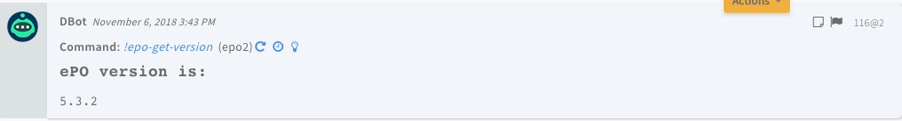](../../doc_files/48068154-b58f7d00-e1da-11e8-97c1-410d77954d6d.png)

### 16. Find systems in the system tree

Finds systems in the system tree.

##### Base Command

    epo-find-system

##### Input

|Argument Name|Description|Required|
|--- |--- |--- |
|searchText|Hostname to search.|Optional|
|verbose|Print all system data|Optional|

##### Context Output

| Path                             |Type|Description|
|----------------------------------|--- |--- |
| Endpoint.Name                    |string|Endpoint name.|
| Endpoint.Domain                  |string|Endpoint domain.|
| Endpoint.Hostname                |string|Endpoint hostname.|
| Endpoint.IPAddress               |string|Endpoint IP address.|
| Endpoint.OS                      |string|Endpoint OS.|
| Endpoint.OSVersion               |string|Endpoint OS version.|
| Endpoint.Processor               |string|Processor model.|
| Endpoint.Processors              |number|Number of processors.|
| Endpoint.Memory                  |number|Endpoint memory.|
| McAfee.ePO.Endpoint.ComputerName |string|Endpoint name.|
| McAfee.ePO.Endpoint.Domain       |string|Endpoint domain.|
| McAfee.ePO.Endpoint.Hostname     |string|Endpoint hostname.|
| McAfee.ePO.Endpoint.IPAddress    |string|Endpoint IP address.|
| McAfee.ePO.Endpoint.OS           |string|Endpoint OS.|
| McAfee.ePO.Endpoint.OSVersion    |string|Endpoint OS version.|
| McAfee.ePO.Endpoint.Processor    |string|Processor model.|
| McAfee.ePO.Endpoint.Processors   |number|Number of processors.|
| McAfee.ePO.Endpoint.Memory       |number|Endpoint memory.|

##### Human Readable Output

!epo-find-system searchText=mar

  
[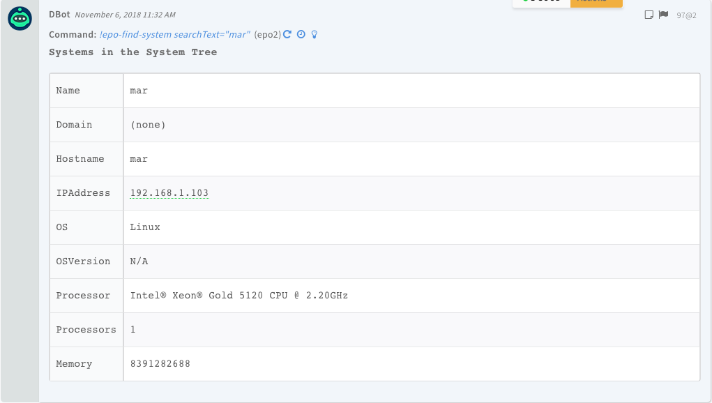](../../doc_files/48068300-1fa82200-e1db-11e8-9b4c-1df113f5934d.png)

### 17. Move a system to a different group

Moves a system to a different group.

##### Base Command

`epo-move-system`

##### Input

|Argument Name|Description|Required|
|--- |--- |--- |
|names|Asset name.|Required|
|parentGroupId|Group ID.|Required|

##### Context Output

There is no context output for this command.

##### Command Example

!epo-move-system names=tie parentGroupId=3

##### Human Readable Output

[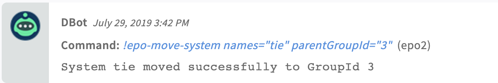](../../doc_files/62196720-30ab4b80-b387-11e9-93e2-56f5821cd34c.png)