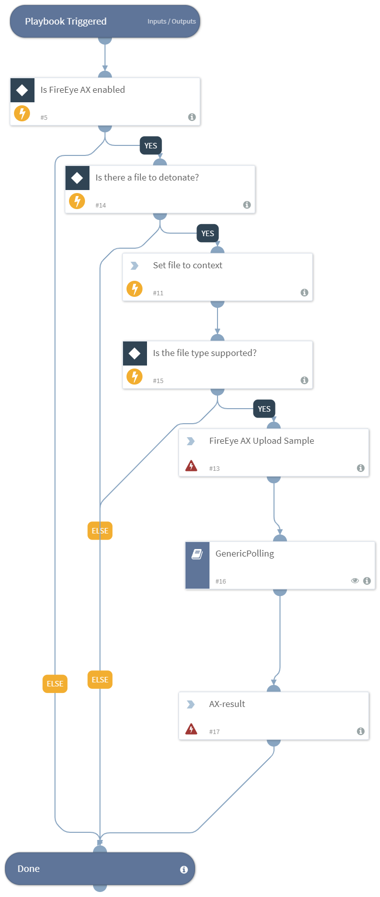

Detonates one or more files using the FireEye AX integration. This playbook returns relevant reports to the War Room and file reputations to the context data. 

The detonation supports the following file types - PE32, EXE, DLL, JAR, JS, PDF, DOC, DOCX, RTF, XLS, PPT, PPTX, XML, ZIP, VBN, SEP, XZ, GZ, BZ2, TAR, MHTML, SWF, LNK, URL, MSI, JTD, JTT, JTDC, JTTC, HWP, HWT, HWPX, BAT, HTA, PS1, VBS, WSF, JSE, VBE, CHM.

## Dependencies
This playbook uses the following sub-playbooks, integrations, and scripts.

### Sub-playbooks
* GenericPolling

### Integrations
* fireeye

### Scripts
* Set

### Commands
* fe-submit
* fe-submit-result

## Playbook Inputs
---

| **Name** | **Description** | **Default Value** | **Source** | **Required** |
| --- | --- | --- | --- | --- |
| File | The file object of the file to detonate. | None | File | Optional |
| Interval | The polling frequency. How often the polling command should run (in minutes). | 1 | - | Required |
| Timeout | The time to wait before a timeout occurs (in minutes). | 30 | - | Required |

## Playbook Outputs
---

| **Path** | **Description** | **Type** |
| --- | --- | --- |
| File.SHA256 | The SHA256 hash of the file. | string |
| File.Malicious | The file's malicious description. | unknown |
| File.Type | The file type. For example, "PE". | string |
| File.Size | The file size. | number |
| File.MD5 | The MD5 hash of the file. | string |
| File.Name | The filename. | string |
| File.SHA1 | The SHA1 hash of the file. | string |
| File | The file object. | unknown |
| File.Malicious.Vendor | The vendor that made the decision that the file is malicious. | string |
| DBotScore | The DBotScore object. | unknown |
| DBotScore.Indicator | The indicator that was tested. | string |
| DBotScore.Type | The type of the indicator. | string |
| DBotScore.Vendor | The vendor used to calculate the score. | string |
| DBotScore.Score | The actual score. | number |

## Playbook Image
---

