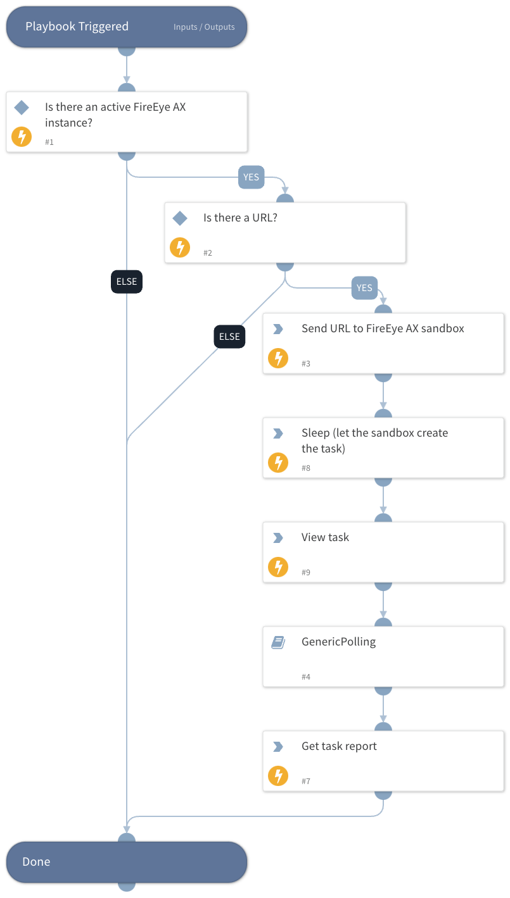

Detonating URL with FireEye AX

## Dependencies

This playbook uses the following sub-playbooks, integrations, and scripts.

### Sub-playbooks

GenericPolling

### Integrations

fireeye

### Scripts

Sleep

### Commands

- fe-submit-result
- fe-submit-status
- fe-submit-url

## Playbook Inputs

---

| **Name** | **Description**                                        | **Default Value** | **Required** |
| -------- | ------------------------------------------------------ | ----------------- | ------------ |
| URL      | URL to detonate.                                       | URL.Data          | Optional     |
| interval | How often to poll for results.                         | 1                 | Optional     |
| timeout  | How long to wait before giving up waiting for results. | 10                | Optional     |

## Playbook Outputs

---

| **Path**                        | **Description**                     | **Type** |
| ------------------------------- | ----------------------------------- | -------- |
| FireEyeAX.Submissions.Key       | The submission key.                 | unknown  |
| FireEyeAX.Submissions.Severity  | The severity level of the file.     | unknown  |
| FireEyeAX.Submissions.InfoLevel | The info level of the report.       | unknown  |
| DBotScore.Score                 | The actual score.                   | unknown  |
| DBotScore.Indicator             | The indicator that was tested.      | unknown  |
| DBotScore.Vendor                | Vendor used to calculate the score. | unknown  |

## Playbook Image

---

