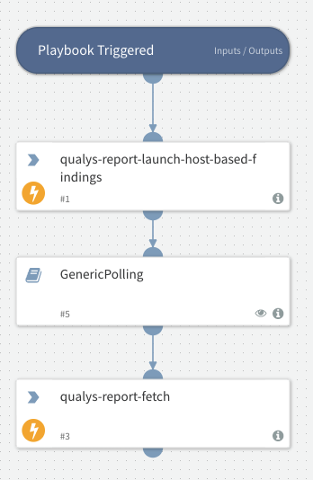

Launches a host based report and fetches the report when it's ready.

## Dependencies
This playbook uses the following sub-playbooks, integrations, and scripts.

### Sub-playbooks
GenericPolling

### Integrations
QualysV2

### Scripts
This playbook does not use any scripts.

### Commands
* qualys-report-launch-host-based-findings
* qualys-report-fetch

## Playbook Inputs
---

| **Name** | **Description** | **Default Value** | **Required** |
| --- | --- | --- | --- |
| template_id | The template ID of the report you want to launch. Can be found by running qualys-report-template-list. |  | Required |
| output_format | One output format may be specified. When output_format=pdf is specified, the Secure PDF Distribution may be used. |  | Required |
| report_title | A user-defined report title. The title may have a maximum of 128 characters. For a PCI compliance report, the report title is provided by Qualys and cannot be changed. |  | Optional |
| hide_header | \(Valid for CSV format report only\). Specify hide_header=1 to omit the header information from the report. By default this information is included. |  | Optional |
| recipient_group_id | Specify users who will receive the email notification when the report is complete \(i.e. supply a distribution group ID\). Where do I find this ID? Log in to your Qualys account, go to Users &amp;gt; Distribution Groups and select Info for a group in the list. |  | Optional |
| pdf_password | '\(Optional; Required for secure PDF distribution\) The password to be used for encryption. Requirements:  - The password must have a minimum of 8 characters \(ascii\), and a maximum of 32 characters  - The password must contain alpha and numeric characters  - The password cannot match the password for the user’s Qualys account.  - The password must follow the password security guidelines defined for your subscription \(log in and go to Subscription Setup—&amp;gt;Security Options\).' |  | Optional |
| recipient_group | Optional; Optional for secure PDF distribution\) The report recipients in the form of one or more distribution groups, as defined using the Qualys UI. Multiple distribution groups are comma separated. A maximum of 50 distribution groups may be entered. Chapter 4 — Report API Launch Report  recipient_group=\{value\} |  | Optional |
| ips | Specify IPs/ranges to change \(override\) the report target, as defined in the scan report template. Multiple IPs/ranges are comma separated. When specified, hosts defined in the report template are not included in the report. See also “Using Asset Tags.” |  | Optional |
| asset_group_ids | Specify asset group IDs to change \(override\) the report target, as defined in the scan report template. When specified, hosts defined in the report template are not included in the report. Looking for asset group IDs? Use the asset_group_list.php function \(see the API v1 User Guide\). |  | Optional |
| ips_network_id | Optional, and valid only when the Network Support feature is enabled for the user’s account\) The ID of a network that is used to restrict the report’s target to the IPs/ranges specified in the“ips” parameter. Set to a custom network ID \(note this does not filter IPs/ranges specified in “asset_group_ids”\). Or set to “0” \(the default\) for the Global Default Network - this is used to report on hosts outside of your custom networks. |  | Optional |

## Playbook Outputs
---
There are no outputs for this playbook.

## Playbook Image
---

