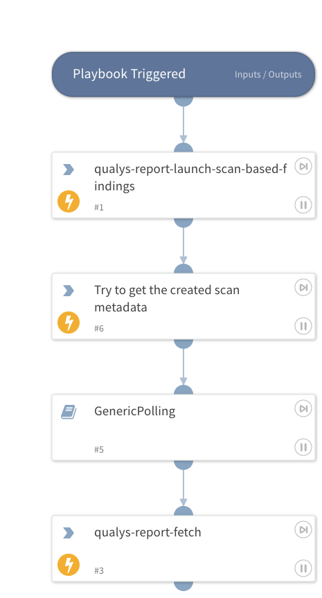

Launches a scan based report and fetcesh the report when it's ready.

## Dependencies
This playbook uses the following sub-playbooks, integrations, and scripts.

### Sub-playbooks
GenericPolling

### Integrations
QualysV2

### Scripts
This playbook does not use any scripts.

### Commands
* qualys-report-fetch
* qualys-report-launch-scan-based-findings
* qualys-report-list

## Playbook Inputs
---

| **Name** | **Description** | **Default Value** | **Required** |
| --- | --- | --- | --- |
| template_id | The template ID of the report you want to launch. Can be found by running qualys-report-template-list. |  | Required |
| output_format | One output format may be specified. When output_format=pdf is specified, the Secure PDF Distribution may be used. |  | Required |
| report_refs | This parameter specifies the scan references to include. A scan reference starts with the string "scan/" followed by a reference ID number. Multiple scan references are comma separated. Reference can be found by running the command qualys-vm-scan-list. |  | Required |
| report_title | A user-defined report title. The title may have a maximum of 128 characters. For a PCI compliance report, the report title is provided by Qualys and cannot be changed. |  | Optional |
| hide_header | \(Valid for CSV format report only\). Specify hide_header=1 to omit the header information from the report. By default this information is included. |  | Optional |
| recipient_group_id | Specify users who will receive the email notification when the report is complete \(i.e. supply a distribution group ID\). Where do I find this ID? Log in to your Qualys account, go to Users &amp;gt; Distribution Groups and select Info for a group in the list. |  | Optional |
| pdf_password | '\(Optional; Required for secure PDF distribution\) The password to be used for encryption. Requirements: - the password must have a minimum of 8 characters \(ascii\), and a maximum of 32 characters - the password must contain alpha and numeric characters - the password cannot match the password for the user’s Qualys account. - the password must follow the password security guidelines defined for your subscription \(log in and go to Subscription Setup—&amp;gt;Security Options\).' |  | Optional |
| recipient_group | Optional; Optional for secure PDF distribution\) The report recipients in the form of one or more distribution groups, as defined using the Qualys UI. Multiple distribution groups are comma separated. A maximum of 50 distribution groups may be entered. Chapter 4 — Report API Launch Report  recipient_group=\{value\} |  | Optional |
| ip_restriction | For a scan report, the report content will be restricted to the specified IPs/ranges. Multiple IPs and/or ranges are comma separated. |  | Optional |

## Playbook Outputs
---

| **Path** | **Type** | **Description** |
| --- | --- | --- |
| InfoFile.Name | unknown | The file name. | 
| InfoFile.EntryID | unknown | The ID for locating the file in the War Room. | 
| InfoFile.Size | unknown | The size of the file \(in bytes\). | 
| InfoFile.Type | unknown | The file type, as determined by libmagic \(same as displayed in file entries\). | 
| InfoFile.Extension | unknown | The file extension. | 
| InfoFile.Info | unknown | Basic information about the file. | 

## Playbook Image
---

