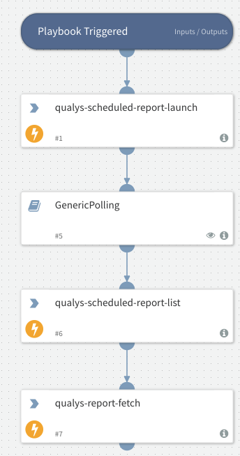

Launches a scheduled report and fetches the report when it's ready.

## Dependencies
This playbook uses the following sub-playbooks, integrations, and scripts.

### Sub-playbooks
GenericPolling

### Integrations
QualysV2

### Scripts
This playbook does not use any scripts.

### Commands
* qualys-scheduled-report-launch
* qualys-report-fetch
* qualys-scheduled-report-list

## Playbook Inputs
---

| **Name** | **Description** | **Default Value** | **Required** |
| --- | --- | --- | --- |
| id | Scheduled report ID. Can be found by running the command qualys-scheduled-report-list. |  | Required |

## Playbook Outputs
---
There are no outputs for this playbook.

## Playbook Image
---

