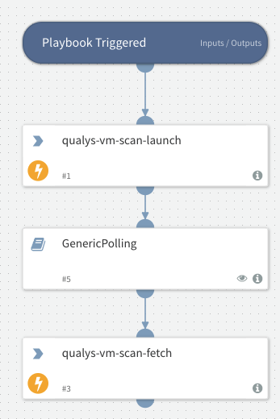

Launches a scan and fetches the scan when it's ready.

## Dependencies

This playbook uses the following sub-playbooks, integrations, and scripts.

### Sub-playbooks

* GenericPolling

### Integrations

* QualysV2

### Scripts

This playbook does not use any scripts.

### Commands

* qualys-vm-scan-fetch
* qualys-vm-scan-launch

## Playbook Inputs

---

| **Name** | **Description** | **Default Value** | **Required** |
| --- | --- | --- | --- |
| scan_title | The scan title. This can be a maximum of 2000 characters \(ascii\). |  | Optional |
| target_from | Specify “assets” \(the default\) when your scan target will include IP addresses/ranges and/or asset groups. Specify “tags” when your scan target will include asset tags. |  | Optional |
| ip | The IP addresses to be scanned. You may enter individual IP addresses and/or ranges. Multiple entries are comma separated. One of these parameters is required: ip, asset_groups or asset_group_ids. |  | Optional |
| asset_groups | The titles of asset groups containing the hosts to be scanned. Multiple titles are comma separated. One of these parameters is required: ip, asset_groups or asset_group_ids. |  | Optional |
| asset_group_ids | The IDs of asset groups containing the hosts to be scanned. Multiple IDs are comma separated. One of these parameters is required: ip, asset_groups or asset_group_ids. |  | Optional |
| exclude_ip_per_scan | The IP addresses to be excluded from the scan when the scan target is specified as IP addresses \(not asset tags\). You may enter individual IP addresses and/or ranges. Multiple entries are comma separated. |  | Optional |
| tag_include_selector | Select “any” \(the default\) to include hosts that match at least one of the selected tags. Select “all” to include hosts that match all of the selected tags. |  | Optional |
| tag_exclude_selector | Select “any” \(the default\) to exclude hosts that match at least one of the selected tags. Select “all” to exclude hosts that match all of the selected tags. |  | Optional |
| tag_set_by | Specify “id” \(the default\) to select a tag set by providing tag IDs. Specify “name” to select a tag set by providing tag names. |  | Optional |
| tag_set_include | Specify a tag set to include. Hosts that match these tags will be included. You identify the tag set by providing tag name or IDs. Multiple entries are comma separated. |  | Optional |
| tag_set_exclude | Specify a tag set to exclude. Hosts that match these tags will be excluded. You identify the tag set by providing tag name or IDs. Multiple entries are comma separated. |  | Optional |
| use_ip_nt_range_tags_include | Specify “0” \(the default\) to select from all tags \(tags with any tag rule\). Specify “1” to scan all IP addresses defined in tag selection. When this is specified, only tags with the dynamic IP address rule called “IP address in Network Range\(s\)” can be selected. valid only when target_from=tags is specified. |  | Optional |
| use_ip_nt_range_tags_exclude | Specify “0” \(the default\) to select from all tags \(tags with any tag rule\). Specify “1” to exclude all IP addresses defined in tag selection. When this is specified, only tags with the dynamic IP address rule called “IP address in Network Range\(s\)” can be selected.  valid only when target_from=tags is specified. |  | Optional |
| use_ip_nt_range_tags | Specify “0” \(the default\) to select from all tags \(tags with any tag rule\). Specify “1” to scan all IP addresses defined in tags. When this is specified, only tags with the dynamic IP address rule called “IP address in Network Range\(s\)” can be selected. |  | Optional |
| iscanner_id | The IDs of the scanner appliances to be used. Multiple entries are comma separated. For an Express Lite user, Internal Scanning must be enabled in the user's account. One of these parameters must also be specified in a request: iscanner_name, iscanner_id, default_scanner, scanners_in_ag, scanners_in_tagset. When none of these are specified, External scanners are used. These parameters are mutually exclusive and cannot be specified in the same request: iscanner_id and iscanner_name. |  | Optional |
| iscanner_name | Specifies the name of the Scanner Appliance for the map, when the map target has private use internal IPs. Using Express Lite, Internal Scanning must be enabled in your account. |  | Optional |
| default_scanner | Specify 1 to use the default scanner in each target asset group. For an Express Lite user, Internal Scanning must be enabled in the user’s account. |  | Optional |
| scanners_in_ag | Specify 1 to distribute the scan to the target asset groups’ scanner appliances. Appliances in each asset group are tasked with scanning the IPs in the group. By default up to 5 appliances per group will be used and this can be configured for your account \(please contact your Account Manager or Support\). For an Express Lite user, Internal Scanning must be enabled in the user’s account. |  | Optional |
| scanners_in_tagset | Specify 1 to distribute the scan to scanner appliances that match the asset tags specified for the scan target. One of these parameters must be specified in a request for an internal scan: iscanner_name, iscanner_id, default_scanner, scanners_in_ag, scanners_in_tagset. When none of these are specified, External scanners are used. valid when the target_from=tags is specified. |  | Optional |
| scanners_in_network | Specify 1 to distribute the scan to all scanner appliances in the network. |  | Optional |
| option_title | The title of the compliance option profile to be used. One of these parameters must be specified in a request: option_title or option_id. These are mutually exclusive and cannot be specified in the same request. |  | Optional |
| option_id | The ID of the compliance option profile to be used. One of these parameters must be specified in a request: option_title or option_id. These are mutually exclusive and cannot be specified in the same request. |  | Optional |
| priority | Specify a value of 0 - 9 to set a processing priority level for the scan. When not specified, a value of 0 \(no priority\) is used. 0 = No Priority \(the default\), 1 = Emergency, 2 = Ultimate, 3 = Critical, 4 = Major, 5 = High, 6 = Standard, 7 = Medium, 8 = Minor, 9 = Low |  | Optional |
| connector_name | \(Required for EC2 scan\) The name of the EC2 connector for the AWS integration you want to run the scan on. |  | Optional |
| ec2_endpoint | \(Required for EC2 scan\) The EC2 region code or the ID of the Virtual Private Cloud \(VPC\) zone. |  | Optional |
| ec2_instance_ids | The ID of the EC2 instance on which you want to launch the VM or compliance scan. Multiple ec2 instance ids are comma separated. You can add up to maximum 10 instance Ids. |  | Optional |
| ip_network_id | The ID of a network used to filter the IPs/ranges specified in the“ip” parameter. Set to a custom network ID \(note this does not filter IPs/ranges specified in “asset_groups” or “asset_group_ids”\). Or set to “0” \(the default\) for the Global Default Network - this is used to scan hosts outside of your custom networks. |  | Optional |
| runtime_http_header | Set a custom value in order to drop defenses \(such as logging, IPs, etc\) when an authorized scan is being run. The value you enter will be used in the “Qualys-Scan:” header that will be set for many CGI and web application fingerprinting checks. Some discovery and web server fingerprinting checks will not use this header. |  | Optional |
| scan_type | Launch a CertView type scan. This option will be supported when CertView GA is released and enabled for your account. |  | Optional |
| fqdn | The target FQDN for a vulnerability scan. You must specify at least one target i.e. IPs, asset groups or FQDNs. Multiple values are comma separated. |  | Optional |
| client_id | Id assigned to the client \(Consultant type subscription only\). Parameter client_id or client_name may be specified for the same request. |  | Optional |
| client_name | Name of the client \(Consultant type subscriptions  only\). Parameter client_id or client_name may be specified for the same request. |  | Optional |
| include_agent_targets | Specify 1 when your scan target includes agent hosts. This lets you scan private IPs where agents are installed when these IPs are not in your VM/PC license. |  | Optional |
| ips | qualys-vm-scan-fetch - Show only certain IP addresses/ranges in the scan results. One or more IPs/ranges may be specified. A range entry is specified using a hyphen \(for example, 10.10.10.1-10.10.10.20\). Multiple entries are comma separated.  |  | Optional |
| mode | qualys-vm-scan-fetch - The verbosity of the scan results details. One verbosity mode may be specified: brief \(the default\) or extended. The brief output includes this information: IP address, DNS hostname, NetBIOS hostname, QID and scan test results if applicable. The extended output includes the brief output plus this extended information: protocol, port, an SSL flag \(“yes” is returned when SSL was used for the detection, “no” is returned when SSL was not used\), and FQDN if applicable. |  | Optional |

## Playbook Outputs

---

| **Path** | **Description** | **Type** |
| --- | --- | --- |
| Qualys.Report.VM.Launched | Launched VM scan. | unknown |

## Playbook Image

---

