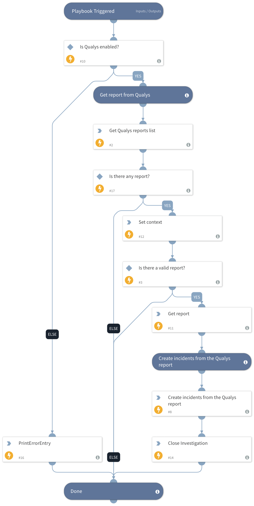

Use the latest Qualys report to manage vulnerabilities.

This playbook runs as a job, and by default creates incidents of type "Vulnerability" based on assets and vulnerabilities.
The incidents are created from the latest version of the report determined by the report timestamp.
You can define the minimum severity (minSeverity) that incidents are created for.
Duplicate incidents are not created for the same asset ID and QID.

This playbook is a part of a series of playbooks for Qualys vulnerability management and remediation.
For this series of playbooks to run successfully, create a Job and do the following:
1. Assign this playbook to the Job
2. Enter the Qualys XML report name into the "Details" field
3. Associate the "Vulnerability" type incident to the "Vulnerability Handling - Qualys" playbook.

## Dependencies
This playbook uses the following sub-playbooks, integrations, and scripts.

### Sub-playbooks
This playbook does not use any sub-playbooks.

### Integrations
QualysVulnerabilityManagementV2

### Scripts
* PrintErrorEntry
* Set
* QualysCreateIncidentFromReport

### Commands
* closeInvestigation
* qualys-report-list
* qualys-report-fetch

## Playbook Inputs
---

| **Name** | **Description** | **Default Value** | **Required** |
| --- | --- | --- | --- |
| QualysReportTitle | The report title as it appears in Qualys. Has to be in XML format.  | incident.details | Required |
| MinSeverity | The minimum Qualys severity \(1 -5\) to create incidents for | 3 | Required |

## Playbook Outputs
---
There are no outputs for this playbook.

## Playbook Image
---

