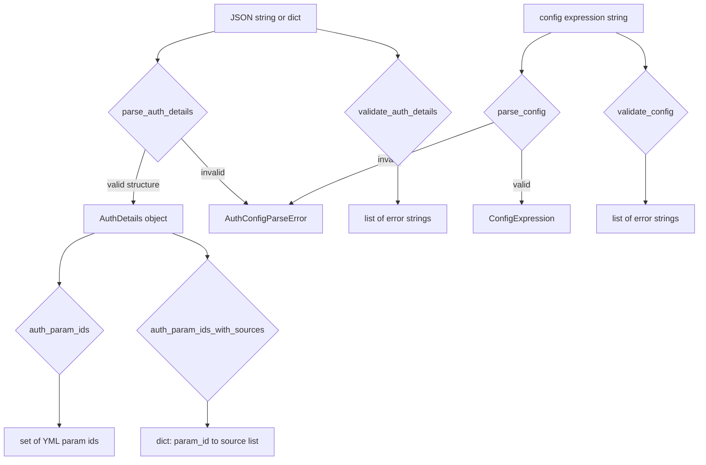

# `auth_config_parser` — Package Design

Standalone Python package that extracts, formalizes, and improves the Auth
Details Config parser currently embedded in
[`workflow_state.py`](../workflow_state.py).

---

## 1. Motivation

The Auth Details parsing/validation logic in
[`workflow_state.py`](../workflow_state.py:430) has grown to ~600 lines
spanning six functions and three regex constants. It is consumed by:

1. **`workflow_state.py`** itself — the `set-auth` CLI setter and the
   `auth-params` helper.
2. **`check_command_params.py`** — via
   [`auth_param_ids()`](../workflow_state.py:940) for the overlap-rejection
   ignore set.
3. **`check_auth_parity.py`** (planned) — will need structured access to
   parsed `AuthDetails` objects, not raw dicts.

Extracting this into a self-contained package provides:

- **Typed data model** — dataclasses with proper type hints replace ad-hoc
  dicts, enabling IDE autocompletion and `mypy` checking.
- **Separation of concerns** — parsing (raise on bad input) vs. validation
  (return error lists) vs. utilities (param extraction) are cleanly split.
- **Testability** — pure functions with no CSV/filesystem dependencies.
- **Reusability** — `check_auth_parity.py` and future tools import from
  one canonical package instead of reaching into `workflow_state`.

---

## 2. Package Layout

```
connectus/auth_config_parser/
├── __init__.py          # Public API re-exports
├── types.py             # Dataclasses, enums, custom exceptions
├── parser.py            # Pure parsing functions
├── validator.py         # Validation functions (return error lists)
├── utils.py             # Utility functions (param extraction)
├── DESIGN.md            # This file
└── tests/
    ├── __init__.py
    ├── test_parser.py   # Parser unit tests
    ├── test_validator.py# Validation tests
    └── test_utils.py    # Utility tests
```

---

## 3. Module Specifications

### 3.1 `types.py` — Data Model

All public types live here. Pure Python, no external dependencies.

```python
from __future__ import annotations

import enum
from dataclasses import dataclass, field


class AuthType(enum.Enum):
    """The 7 valid auth-type enum values for Auth Details entries."""
    OAuth2AuthCode = "OAuth2AuthCode"
    OAuth2ClientCreds = "OAuth2ClientCreds"
    OAuth2JWT = "OAuth2JWT"
    APIKey = "APIKey"
    Plain = "Plain"
    Other = "Other"
    NoneRequired = "NoneRequired"


class ClauseOperator(enum.Enum):
    """Operators in the config expression mini-grammar."""
    REQUIRED = "REQUIRED"
    OPTIONAL = "OPTIONAL"
    CHOICE = "CHOICE"


@dataclass(frozen=True)
class AuthEntry:
    """One entry in auth_types[]: a single UCP connection type.

    Attributes:
        type: The auth-type enum value.
        name: Free-form logical id (unique within the row).
        xsoar_param_map: Mapping from XSOAR field path (bare id or
            dotted form) to the role that secret plays inside the
            ConnectUs envelope for this connection. Required and
            non-empty for every AuthEntry, including entries with
            interpolated=True. The allowed role values are
            constrained per ``type`` — see the table in
            :doc:`../column-schemas` ("Auth Details" §
            "type → allowed role values").
        interpolated: When True, the value is templated at runtime
            rather than supplied by the user. Defaults to False.
    """
    type: AuthType
    name: str
    xsoar_param_map: dict[str, str]
    interpolated: bool = False


@dataclass(frozen=True)
class ConfigClause:
    """One clause in a config expression.

    Attributes:
        operator: REQUIRED, OPTIONAL, or CHOICE.
        names: The connection-type names referenced by this clause.
    """
    operator: ClauseOperator
    names: list[str]


@dataclass(frozen=True)
class ConfigExpression:
    """Parsed config expression.

    Attributes:
        none_required: True when the expression is the literal
            'NoneRequired'. When True, clauses is empty.
        clauses: Ordered list of parsed clauses. Empty when
            none_required is True.
    """
    none_required: bool = False
    clauses: list[ConfigClause] = field(default_factory=list)

    @property
    def referenced_names(self) -> list[str]:
        """All connection-type names referenced across all clauses,
        in order, possibly with duplicates."""
        names: list[str] = []
        for clause in self.clauses:
            names.extend(clause.names)
        return names


@dataclass(frozen=True)
class AuthDetails:
    """Fully parsed Auth Details JSON object.

    Attributes:
        auth_types: List of auth entries, sorted by (type, name).
        config: Parsed config expression.
        other_connection: Sorted list of YML param ids for
            connection-adjacent non-auth params. None when the key
            is absent (legacy rows).
    """
    auth_types: list[AuthEntry]
    config: ConfigExpression
    other_connection: list[str] | None = None

    @property
    def auth_type_names(self) -> set[str]:
        """Set of all auth_types[].name values."""
        return {e.name for e in self.auth_types}


class AuthConfigParseError(Exception):
    """Raised by parser functions when input is structurally invalid.

    Attributes:
        message: Human-readable description of the parse failure.
        errors: List of individual error strings (may contain >1 for
            multi-error reporting).
    """
    def __init__(self, message: str, errors: list[str] | None = None):
        super().__init__(message)
        self.message = message
        self.errors = errors or [message]
```

#### Design decisions

| Decision | Rationale |
|----------|-----------|
| `AuthType` is a `str` enum | Enables `AuthType("APIKey")` construction from JSON values and `entry.type.value` for serialization. |
| `ConfigExpression.none_required` flag | Avoids a sentinel clause; `NoneRequired` is semantically distinct from an empty clause list. |
| `AuthDetails.other_connection` is `Optional` | Legacy CSV rows lack this key. `None` signals "not present" vs `[]` which means "present but empty". |
| All dataclasses are `frozen=True` | Parsed results are immutable value objects. |
| `AuthConfigParseError.errors` list | Mirrors the validator's multi-error pattern so callers can display all issues at once. |

---

### 3.2 `parser.py` — Pure Parsing Functions

Converts raw input (strings, dicts, JSON) into typed data model objects.
Raises `AuthConfigParseError` on invalid input.

#### Public API

```python
def parse_config(expr: str) -> ConfigExpression:
    """Parse a config expression string into a ConfigExpression.

    Args:
        expr: The config expression string, e.g.
            'REQUIRED(api_key) + OPTIONAL(oauth_creds)'
            or 'NoneRequired'.

    Returns:
        A ConfigExpression with parsed clauses.

    Raises:
        AuthConfigParseError: If the expression is malformed.

    Examples:
        >>> parse_config("NoneRequired")
        ConfigExpression(none_required=True, clauses=[])

        >>> parse_config("REQUIRED(api_key)")
        ConfigExpression(none_required=False, clauses=[
            ConfigClause(operator=ClauseOperator.REQUIRED, names=["api_key"])
        ])

        >>> parse_config("REQUIRED(creds) + OPTIONAL(oauth)")
        ConfigExpression(none_required=False, clauses=[
            ConfigClause(operator=ClauseOperator.REQUIRED, names=["creds"]),
            ConfigClause(operator=ClauseOperator.OPTIONAL, names=["oauth"]),
        ])
    """
```

```python
def parse_auth_details(data: str | dict) -> AuthDetails:
    """Parse Auth Details from a JSON string or pre-parsed dict.

    Performs structural parsing only — converts raw JSON into typed
    objects. Does NOT perform cross-referencing validation (e.g.
    checking that config names match auth_types names). Use
    validate_auth_details() for full validation.

    Args:
        data: Either a JSON string or an already-parsed dict.

    Returns:
        An AuthDetails object.

    Raises:
        AuthConfigParseError: If the input is not valid JSON, not a
            dict, or is missing required keys / has wrong types.

    Examples:
        >>> details = parse_auth_details({
        ...     "auth_types": [{"type": "APIKey", "name": "credentials",
        ...                     "xsoar_param_map": {
        ...                         "credentials.password": "key"}}],
        ...     "config": "REQUIRED(credentials)",
        ...     "other_connection": ["url", "proxy"]
        ... })
        >>> details.auth_types[0].type
        AuthType.APIKey
        >>> details.auth_types[0].xsoar_param_map
        {'credentials.password': 'key'}
        >>> details.config.clauses[0].operator
        ClauseOperator.REQUIRED
    """
```

#### Internal helpers (private)

| Function | Purpose |
|----------|---------|
| `_parse_config_impl(expr)` | Core config parsing; returns `(ConfigExpression, list[str])` — the parsed result and any errors. Extracted from current [`_parse_auth_config()`](../workflow_state.py:445). |
| `_parse_auth_entry(index, raw_dict)` | Parse one `auth_types[]` entry dict into an `AuthEntry`. |

#### Regex constants (module-level, private)

Moved from [`workflow_state.py`](../workflow_state.py:435):

```python
_CLAUSE_RE = re.compile(
    r"^\s*(REQUIRED|OPTIONAL|CHOICE)\s*\(\s*([^)]*?)\s*\)\s*$"
)
_NAME_RE = re.compile(r"^[A-Za-z_][A-Za-z0-9_]*$")
_SPLIT_RE = re.compile(r"\s*\+\s*")
```

#### Relationship to current code

| Current function | New location | Change |
|-----------------|--------------|--------|
| [`_parse_auth_config()`](../workflow_state.py:445) | `parser._parse_config_impl()` | Returns `ConfigExpression` + error list instead of `(names, errors)` tuple. The public `parse_config()` raises on errors. |
| JSON parsing in [`validate_auth_detail()`](../workflow_state.py:522) lines 572-578 | `parser.parse_auth_details()` | Structural parsing extracted; validation stays in `validator.py`. |

---

### 3.3 `validator.py` — Validation Functions

Returns error lists (empty = valid). Never raises. Matches the current
[`validate_auth_detail()`](../workflow_state.py:522) contract.

#### Public API

```python
def validate_config(expr: str) -> list[str]:
    """Validate a config expression string.

    Returns a list of human-readable error strings. Empty list means
    the expression is syntactically valid.

    This validates syntax only — it does NOT check that operand names
    match any auth_types[].name. Use validate_auth_details() for
    cross-referencing validation.

    Args:
        expr: The config expression string.

    Returns:
        List of error strings (empty = valid).

    Examples:
        >>> validate_config("REQUIRED(api_key)")
        []
        >>> validate_config("REQUIRED()")
        ["clause 'REQUIRED(...)' has no operands"]
        >>> validate_config("FOO(bar)")
        ["malformed clause 'FOO(bar)' ..."]
    """
```

```python
def validate_auth_details(data: str | dict) -> list[str]:
    """Validate Auth Details JSON shape. Returns list of errors.

    Performs ALL validation currently done by workflow_state.py's
    validate_auth_detail(), including:

    - JSON parsing
    - Required keys: auth_types, config, other_connection
    - auth_types[] entry shape (type enum, name uniqueness,
      xsoar_param_map non-empty dict[str, str] with non-empty keys
      and non-empty role values, interpolated bool)
    - xsoar_param_map role-value enum enforcement per
      auth_types[].type:

      - APIKey → values must be from {"key"}.
      - Plain → values must be from {"username", "password"}.
      - OAuth2ClientCreds, OAuth2AuthCode, OAuth2JWT, Other →
        any non-empty string (enum deliberately undefined for now,
        to be narrowed in a future PR).
      - NoneRequired → no entries in auth_types[]; rule moot.
    - Legacy xsoar_params key is **rejected** with a migration-help
      error pointing at column-schemas.md "Auth Details" §
      "Migration from xsoar_params".
    - auth_types[] sort order by (type, name)
    - config expression syntax (via validate_config)
    - config operand names cross-referenced against auth_types[].name
    - NoneRequired ↔ empty auth_types coherence
    - other_connection: list of non-empty unique sorted strings

    Args:
        data: JSON string or pre-parsed dict.

    Returns:
        List of error strings (empty = valid).

    Examples:
        >>> validate_auth_details('{"auth_types":[],'
        ...     '"config":"NoneRequired","other_connection":[]}')
        []
    """
```

#### Relationship to current code

| Current function | New location | Change |
|-----------------|--------------|--------|
| [`validate_auth_detail()`](../workflow_state.py:522) | `validator.validate_auth_details()` | Name pluralized for consistency. Accepts `str | dict`. Same error messages for backward compat. |

---

### 3.4 `utils.py` — Utility Functions

Pure functions that extract derived information from parsed `AuthDetails`
objects. No CSV/filesystem dependencies.

#### Public API

```python
def project_xsoar_param_to_yml_id(xsoar_param: str) -> str:
    """Collapse a dotted XSOAR param path to its base YML param id.

    Bare ids pass through unchanged. Dotted forms like
    'credentials.identifier' collapse to the segment before the
    first '.' ('credentials').

    Args:
        xsoar_param: An XSOAR field path string.

    Returns:
        The base YML param id.

    Examples:
        >>> project_xsoar_param_to_yml_id("api_key")
        "api_key"
        >>> project_xsoar_param_to_yml_id("credentials.identifier")
        "credentials"
        >>> project_xsoar_param_to_yml_id("credentials.password")
        "credentials"
    """
```

```python
def auth_param_ids(details: AuthDetails) -> set[str]:
    """Extract the set of YML param ids from an AuthDetails object.

    Returns the deduplicated set of bare YML configuration[].name
    values composed from:

    - Every key in every auth_types[].xsoar_param_map, projected via
      project_xsoar_param_to_yml_id().
    - Every entry in other_connection (already bare YML ids).

    Args:
        details: A parsed AuthDetails object.

    Returns:
        Set of YML param id strings.

    Examples:
        >>> details = parse_auth_details({
        ...     "auth_types": [{"type": "Plain", "name": "creds",
        ...         "xsoar_param_map": {
        ...             "credentials.identifier": "username",
        ...             "credentials.password": "password"}}],
        ...     "config": "REQUIRED(creds)",
        ...     "other_connection": ["url", "proxy"]
        ... })
        >>> auth_param_ids(details)
        {"credentials", "url", "proxy"}
    """
```

```python
def auth_param_ids_with_sources(
    details: AuthDetails,
) -> dict[str, list[str]]:
    """Extract YML param ids with source attribution.

    Returns a dict mapping each YML param id to a list of
    human-readable source descriptions indicating where the param
    was declared.

    Args:
        details: A parsed AuthDetails object.

    Returns:
        Dict of {yml_param_id: [source_description, ...]}.

    Examples:
        >>> sources = auth_param_ids_with_sources(details)
        >>> sources["credentials"]
        ["auth_types[].name='creds' (xsoar_param_map={'credentials.identifier': 'username', 'credentials.password': 'password'})"]
        >>> sources["url"]
        ["other_connection"]
    """
```

#### Relationship to current code

| Current function | New location | Change |
|-----------------|--------------|--------|
| [`_project_xsoar_param_to_yml_id()`](../workflow_state.py:871) | `utils.project_xsoar_param_to_yml_id()` | Made public. Same logic. |
| [`_auth_param_sources()`](../workflow_state.py:885) | `utils.auth_param_ids_with_sources()` | Accepts `AuthDetails` instead of raw dict. Same source-descriptor format. |
| [`auth_param_ids()`](../workflow_state.py:940) (CSV-coupled) | `utils.auth_param_ids()` | Decoupled from CSV. Accepts `AuthDetails` object. Returns `set[str]` instead of `list[str]` (callers that need sorted output call `sorted()`). |

**Key design change:** The current [`auth_param_ids()`](../workflow_state.py:940)
in `workflow_state.py` loads the CSV, finds the row, parses JSON, and
handles legacy rows. The new `utils.auth_param_ids()` is a pure function
that operates on an already-parsed `AuthDetails` object. The CSV-loading
wrapper remains in `workflow_state.py` and delegates to this package.

---

### 3.5 `__init__.py` — Public API

Re-exports all public symbols for convenient importing:

```python
from auth_config_parser.types import (
    AuthConfigParseError,
    AuthDetails,
    AuthEntry,
    AuthType,
    ClauseOperator,
    ConfigClause,
    ConfigExpression,
)
from auth_config_parser.parser import (
    parse_auth_details,
    parse_config,
)
from auth_config_parser.validator import (
    validate_auth_details,
    validate_config,
)
from auth_config_parser.utils import (
    auth_param_ids,
    auth_param_ids_with_sources,
    project_xsoar_param_to_yml_id,
)

__all__ = [
    # Types
    "AuthConfigParseError",
    "AuthDetails",
    "AuthEntry",
    "AuthType",
    "ClauseOperator",
    "ConfigClause",
    "ConfigExpression",
    # Parsing
    "parse_auth_details",
    "parse_config",
    # Validation
    "validate_auth_details",
    "validate_config",
    # Utilities
    "auth_param_ids",
    "auth_param_ids_with_sources",
    "project_xsoar_param_to_yml_id",
]
```

---

## 4. Data Flow



---

## 5. Backward Compatibility Plan

### 5.1 `workflow_state.py` migration

After the package is implemented, `workflow_state.py` will be updated to
import from it. The migration is mechanical:

```python
# Before (inline):
from workflow_state import VALID_AUTH_TYPES, validate_auth_detail

# After (delegating):
from auth_config_parser import (
    AuthType,
    validate_auth_details,
    auth_param_ids as _auth_param_ids_pure,
    auth_param_ids_with_sources as _auth_param_sources_pure,
    parse_auth_details,
    project_xsoar_param_to_yml_id,
)
```

The `VALID_AUTH_TYPES` set constant in `workflow_state.py` becomes:

```python
VALID_AUTH_TYPES = {t.value for t in AuthType}
```

The CSV-coupled [`auth_param_ids(integration_id)`](../workflow_state.py:940)
wrapper stays in `workflow_state.py` but delegates to the pure function:

```python
def auth_param_ids(integration_id: str) -> list[str]:
    # ... CSV loading, row lookup, JSON parsing, legacy handling ...
    details = parse_auth_details(parsed)
    return sorted(_auth_param_ids_pure(details))
```

Similarly, [`validate_auth_detail(value)`](../workflow_state.py:522)
becomes a thin wrapper:

```python
def validate_auth_detail(value: str) -> list[str]:
    return validate_auth_details(value)
```

### 5.2 Error message compatibility

The validator MUST produce identical error message strings to the current
implementation. Tests in
[`workflow_state_test.py`](../workflow_state_test.py:1128) assert on
specific substrings like:

- `"Invalid JSON"`
- `"Missing required keys"`
- `"invalid type 'INVALID'"`
- `"must be sorted by (type, name)"`
- `"must contain at least one entry"`
- `"unknown connection-type name"`
- `"no operands"`
- `"ends with '+'"`
- `"malformed clause"`
- `"'config' is 'NoneRequired' but 'auth_types' contains entries"`
- `"must be a list"`
- `"must be sorted ascending"`
- `"duplicate"`

All of these must be preserved verbatim.

### 5.3 `validate_auth_detail` vs `validate_auth_details` naming

The current function is singular (`validate_auth_detail`). The new package
uses plural (`validate_auth_details`) for grammatical consistency. The
wrapper in `workflow_state.py` keeps the old name for backward compat.

---

## 6. Test Plan

### 6.1 `tests/test_parser.py`

Tests for `parse_config()` and `parse_auth_details()`.

| Test | Description |
|------|-------------|
| `test_parse_config_none_required` | `"NoneRequired"` → `ConfigExpression(none_required=True)` |
| `test_parse_config_single_required` | `"REQUIRED(api_key)"` → one clause |
| `test_parse_config_single_optional` | `"OPTIONAL(oauth)"` → one clause |
| `test_parse_config_single_choice` | `"CHOICE(a, b)"` → one clause with two names |
| `test_parse_config_multi_clause` | `"REQUIRED(a) + OPTIONAL(b)"` → two clauses |
| `test_parse_config_whitespace_tolerance` | Extra spaces around `+`, `,`, parens |
| `test_parse_config_empty_raises` | Empty string → `AuthConfigParseError` |
| `test_parse_config_leading_plus_raises` | `"+ REQUIRED(a)"` → error |
| `test_parse_config_trailing_plus_raises` | `"REQUIRED(a) +"` → error |
| `test_parse_config_empty_operands_raises` | `"REQUIRED()"` → error |
| `test_parse_config_bad_keyword_raises` | `"FOO(a)"` → error |
| `test_parse_config_bad_operand_name_raises` | `"REQUIRED(123bad)"` → error |
| `test_parse_config_stray_comma_raises` | `"REQUIRED(a,,b)"` → error |
| `test_parse_config_referenced_names` | Verify `ConfigExpression.referenced_names` property |
| `test_parse_auth_details_valid_simple` | Full valid JSON → `AuthDetails` with correct types |
| `test_parse_auth_details_valid_none_required` | NoneRequired variant |
| `test_parse_auth_details_from_dict` | Accepts pre-parsed dict |
| `test_parse_auth_details_from_string` | Accepts JSON string |
| `test_parse_auth_details_invalid_json_raises` | Bad JSON → `AuthConfigParseError` |
| `test_parse_auth_details_not_dict_raises` | JSON array → error |
| `test_parse_auth_details_missing_keys_raises` | Missing `config` → error |
| `test_parse_auth_details_invalid_auth_type_raises` | Unknown type enum → error |
| `test_parse_auth_details_interpolated_default_false` | Missing `interpolated` key defaults to `False` |
| `test_parse_auth_details_interpolated_true` | `"interpolated": true` → `AuthEntry.interpolated == True` |
| `test_parse_auth_details_legacy_no_other_connection` | Missing `other_connection` → `AuthDetails.other_connection is None` |

### 6.2 `tests/test_validator.py`

Tests for `validate_auth_details()` and `validate_config()`. Mirrors
existing [`TestValidateAuthDetail`](../workflow_state_test.py:1128) with
identical assertions.

| Test | Description |
|------|-------------|
| `test_valid_simple` | Valid JSON → `[]` |
| `test_valid_none_required` | NoneRequired → `[]` |
| `test_invalid_json` | `"not json"` → `["Invalid JSON: ..."]` |
| `test_missing_keys` | Missing `config` + `other_connection` → error |
| `test_invalid_auth_type` | `"INVALID"` type → error |
| `test_all_valid_auth_types` | Each of the 7 types passes |
| `test_valid_two_clause_config` | `REQUIRED + OPTIONAL` → `[]` |
| `test_valid_choice` | `CHOICE(a, b)` → `[]` |
| `test_config_unknown_name` | Operand not in auth_types → error |
| `test_config_empty_required` | `REQUIRED()` → error |
| `test_config_trailing_plus` | Trailing `+` → error |
| `test_config_unknown_keyword` | `FOO(x)` → error |
| `test_config_missing_parens` | `REQUIRED api_key` → error |
| `test_none_required_with_entries` | NoneRequired + non-empty auth_types → error |
| `test_non_none_required_empty_types` | Config refs but empty auth_types → error |
| `test_sort_order_violation` | Out-of-order entries → error with pair names |
| `test_sort_order_same_type_by_name` | Same type, names out of order → error |
| `test_empty_xsoar_param_map` | `{}` xsoar_param_map → error |
| `test_missing_xsoar_param_map` | Entry without `xsoar_param_map` → error |
| `test_legacy_xsoar_params_rejected` | Entry with legacy `xsoar_params` key → migration-help error |
| `test_xsoar_param_map_apikey_role_enum` | `APIKey` with role `"username"` → error; `"key"` → ok |
| `test_xsoar_param_map_plain_role_enum` | `Plain` with role `"key"` → error; `"username"`/`"password"` → ok |
| `test_xsoar_param_map_oauth_role_freeform` | `OAuth2ClientCreds` with any non-empty string value → ok (enum deliberately undefined for now) |
| `test_xsoar_param_map_other_role_freeform` | `Other` with any non-empty string value → ok |
| `test_xsoar_param_map_empty_role_value_rejected` | Role value `""` → error regardless of type |
| `test_xsoar_param_map_interpolated_still_required` | `interpolated: true` entry with empty/missing map → error |
| `test_duplicate_name` | Two entries with same name → error |
| `test_other_connection_valid` | Sorted list → `[]` |
| `test_other_connection_empty_list` | `[]` → `[]` |
| `test_other_connection_missing_key` | Missing key → error |
| `test_other_connection_not_list` | String instead of list → error |
| `test_other_connection_non_string` | `[42]` → error |
| `test_other_connection_empty_string` | `[""]` → error |
| `test_other_connection_duplicates` | `["url", "url"]` → error |
| `test_other_connection_unsorted` | `["url", "proxy"]` → error with suggestion |
| `test_validate_config_standalone` | `validate_config()` works independently |

### 6.3 `tests/test_utils.py`

Tests for utility functions.

| Test | Description |
|------|-------------|
| `test_project_bare_id` | `"api_key"` → `"api_key"` |
| `test_project_dotted_identifier` | `"credentials.identifier"` → `"credentials"` |
| `test_project_dotted_password` | `"credentials.password"` → `"credentials"` |
| `test_project_empty_string` | `""` → `""` |
| `test_project_non_string` | Non-string input → `""` |
| `test_auth_param_ids_mixed` | APIKey + Plain + other_connection → correct union |
| `test_auth_param_ids_deduped` | Dotted forms collapsing to same id → single entry |
| `test_auth_param_ids_none_required` | NoneRequired + other_connection → only other_connection |
| `test_auth_param_ids_no_other_connection` | Legacy `None` → only auth_types ids |
| `test_auth_param_ids_empty` | NoneRequired + no other_connection → empty set |
| `test_auth_param_ids_with_sources_mixed` | Correct source descriptors for each param |
| `test_auth_param_ids_with_sources_dotted_dedup` | Two dotted forms → one descriptor per entry |
| `test_auth_param_ids_with_sources_other_connection` | other_connection items → `"other_connection"` source |

---

## 7. Implementation Sequence

The implementation should proceed in this order to maintain a green test
suite at each step:

1. **Create `types.py`** — all dataclasses, enums, and the custom
   exception. No dependencies on other modules.

2. **Create `parser.py`** — implement `parse_config()` and
   `parse_auth_details()`. Port the regex constants and
   `_parse_auth_config()` logic.

3. **Create `validator.py`** — implement `validate_auth_details()` and
   `validate_config()`. Port the validation logic from
   `validate_auth_detail()`, delegating config parsing to `parser.py`.

4. **Create `utils.py`** — implement the three utility functions. Port
   from `_project_xsoar_param_to_yml_id()` and `_auth_param_sources()`.

5. **Create `__init__.py`** — wire up all re-exports.

6. **Create `tests/`** — port and expand tests from
   `workflow_state_test.py`.

7. **Update `workflow_state.py`** — replace inline implementations with
   imports from `auth_config_parser`. Keep the CSV-coupled wrappers.

---

## 8. Design Constraints Checklist

- [x] Pure Python, no external dependencies beyond stdlib
- [x] Python 3.9+ compatible (`from __future__ import annotations`)
- [x] All public types are frozen dataclasses with type hints
- [x] Parser raises `AuthConfigParseError` on invalid input
- [x] Validator returns error lists (never raises)
- [x] Backward-compatible error messages
- [x] `workflow_state.py` can import from this package
- [x] Docstrings with examples on all public functions
- [x] No CSV/filesystem dependencies in the package
