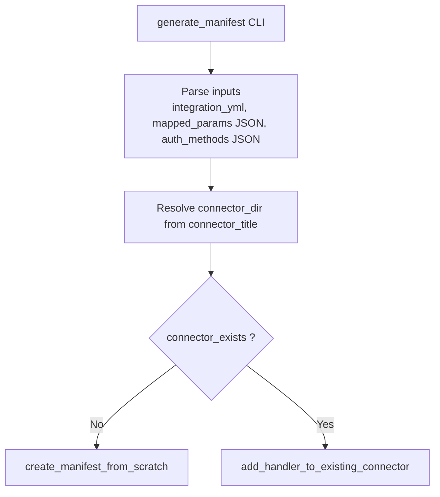
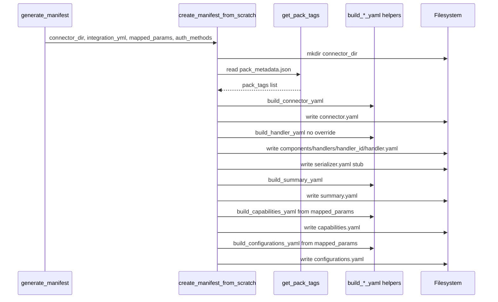
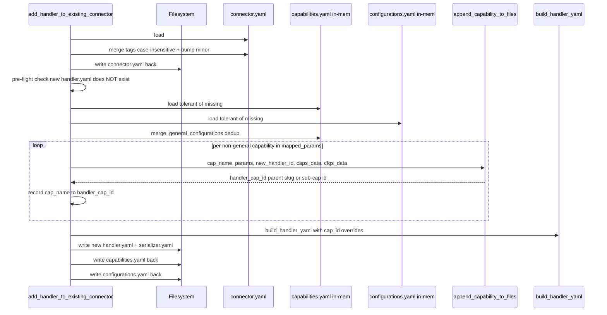
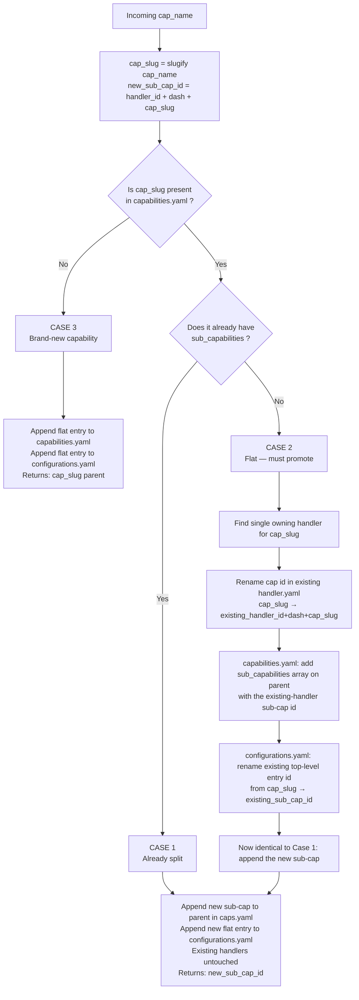

# Manifest Generator — Flow & Field-Level Reference

This document describes exactly **what files are written** and **which fields are touched** when the [`manifest_generator.py`](manifest_generator.py:1) script runs. There are two top-level flows:

1. **From-Scratch** — connector folder does not yet exist, scaffold it from a single integration.
2. **Append-Handler** — connector folder already exists, add a new handler (and merge its capabilities/configurations into the shared files).

---

## 0. Running the Tests

The test files use **sibling imports** (`from manifest_generator import …`, `from connector_param_mapper import …`), which depend on pytest's auto-rootdir mechanism to put the directory on `sys.path`. **Run via pytest only** — `python -m unittest` will fail with `ModuleNotFoundError`.

```bash
cd connectus/connectus_migration && python -m pytest connector_param_mapper_test.py manifest_generator_test.py -v
```

Or from the repo root:

```bash
python -m pytest connectus/connectus_migration/ -v
```

> **Note:** the scripts are intentionally self-contained (stdlib `json` / PyYAML / stdlib `logging` — no `demisto-sdk` dependency). Runtime deps: `typer` and `PyYAML`. The codebase's TID251 ruff rule is suppressed for this directory via per-file-ignores in [`pyproject.toml`](../../pyproject.toml:1) and [`nightly_ruff.toml`](../../nightly_ruff.toml:1).

---

## 1. Top-Level Decision

The CLI entry-point [`generate_manifest()`](manifest_generator.py:848) dispatches based on whether the connector directory already exists:



**Inputs (CLI args):**
- `integration_path` — path to the XSOAR integration `.yml` (e.g. `Packs/Jira/Integrations/JiraV3/JiraV3.yml`)
- `connector_title` — human-readable connector title (e.g. `"Jira"`)
- `mapped_params` — JSON string from [`connector_param_mapper.py`](connector_param_mapper.py:1), e.g.
  ```json
  {
    "general_configurations": ["server_url", "verify_ssl"],
    "Fetch Issues": ["fetch_query", "fetch_limit"],
    "Automation": ["api_token"]
  }
  ```
- `auth_methods` — JSON string describing auth profiles, e.g.
  ```json
  {
    "auth_types": [
      {"name": "api_key", "config": {...}},
      {"name": "oauth2_client_credentials", "config": {...}}
    ]
  }
  ```

**Identifiers derived once and used throughout:**
| Var | Source | Example |
|---|---|---|
| `handler_id` | [`derive_handler_id(integration_id)`](manifest_generator.py:207) | `"xsoar_jira"` |
| `cap_slug` | [`slugify_capability_name(name)`](manifest_generator.py:220) | `"fetch-issues"` |
| `sub_cap_id` | `f"{handler_id}-{cap_slug}"` | `"xsoar_jira-fetch-issues"` |

---

## 2. From-Scratch Flow

Entry point: [`create_manifest_from_scratch()`](manifest_generator.py:631)

### 2.1 Files Written (6 files total)

```
<connector_dir>/
├── connector.yaml                                   ← NEW
├── capabilities.yaml                                ← NEW (with schema directive)
├── configurations.yaml                              ← NEW
├── summary.yaml                                     ← NEW (only on from-scratch)
└── components/
    └── handlers/
        └── <handler_id>/
            ├── handler.yaml                         ← NEW (with schema directive)
            └── serializer.yaml                      ← NEW (stub placeholder)
```

### 2.2 Sequence Diagram



### 2.3 Field-by-Field — From-Scratch

#### 📄 `connector.yaml` — built by [`build_connector_yaml()`](manifest_generator.py:172)

| Field | Value | Source |
|---|---|---|
| `id` | slug from `connector_title` (via [`title_to_slug`](manifest_generator.py:40)) | derived |
| `metadata.title` | `connector_title` | input |
| `metadata.version` | `"1.0.0"` | hardcoded |
| `metadata.tags` | `pack_tags` | from pack_metadata.json |
| `metadata.description` | `f"{connector_title} connector"` | derived |
| `metadata.maintainers` | `["@xsoar-content"]` | hardcoded |
| `metadata.support_level` | `"xsoar"` | hardcoded |

#### 📄 `handler.yaml` — built by [`build_handler_yaml()`](manifest_generator.py:239)

Written via [`write_handler_yaml()`](manifest_generator.py:333) which prepends the `# yaml-language-server: $schema=...` directive.

| Field | Value |
|---|---|
| `id` | `derive_handler_id(integration_yml.commonfields.id)` → e.g. `"xsoar_jira"` |
| `metadata.version` | `"1.0.0"` |
| `metadata.description` | `f"XSOAR handler for {display} integration for {connector_title} connector"` |
| `metadata.module` | `"xsoar"` |
| `metadata.tags` | copy of `pack_tags` |
| `metadata.ownership.team` | `"xsoar"` |
| `metadata.ownership.maintainers` | `["@xsoar-content"]` |
| `enabled` | `True` |
| `triggering.type` | `"PUB_SUB"` |
| `triggering.labels.xsoar-content-id` | `""` |
| `triggering.args` | `{}` |
| `capabilities[]` | one entry per non-`general_configurations` key in `mapped_params`. **Each entry uses the bare slug as id** (no override mapping passed on from-scratch path). |
| `capabilities[].id` | `slugify_capability_name(cap_name)` (e.g. `"fetch-issues"`) |
| `capabilities[].auth_options` | `[{"id": at.name, "scopes": ["api"]} for at in auth_methods.auth_types]` |
| `test_connection.type` | `"endpoint"` |
| `test_connection.host` | `"xsoar-api"` |
| `test_connection.endpoint` | `"/test/api/"` |

#### 📄 `serializer.yaml` — written by [`write_serializer_yaml()`](manifest_generator.py:348)

Stub file — a placeholder string constant `SERIALIZER_PLACEHOLDER`. No structured fields yet.

#### 📄 `summary.yaml` — built by [`build_summary_yaml()`](manifest_generator.py:609)

Written **only on from-scratch**. Not touched on append.

#### 📄 `capabilities.yaml` — built by [`build_capabilities_yaml()`](manifest_generator.py:371)

Written via [`write_capabilities_yaml()`](manifest_generator.py:400) which prepends the schema directive.

```yaml
# yaml-language-server: $schema=...
general_configurations:           # only if mapped_params has it
  description: ""
  configurations:
    - fields:
        - id: <param1>
        - id: <param2>
capabilities:
  - id: <cap_slug_1>              # flat — no sub_capabilities at this stage
  - id: <cap_slug_2>
```

**Key:** From-scratch always produces a **flat** capabilities list (no `sub_capabilities` nesting). Sub-caps only emerge during append (Cases 1 & 2 below).

#### 📄 `configurations.yaml` — built by [`build_configurations_yaml()`](manifest_generator.py:410)

```yaml
general_configurations:           # only if mapped_params has it
  description: ""
  configurations:
    - fields:
        - id: <param1>
configurations:
  - id: <cap_slug_1>
    configurations:
      - fields:
          - id: <p1>
          - id: <p2>
  - id: <cap_slug_2>
    configurations:
      - fields:
          - id: <p3>
```

---

## 3. Append-Handler Flow

Entry point: [`add_handler_to_existing_connector()`](manifest_generator.py:706)

### 3.1 Files Touched

| File | Operation |
|---|---|
| `connector.yaml` | **Modified** — merge tags + bump minor version |
| `summary.yaml` | **Untouched** |
| `capabilities.yaml` | **Modified** — append capabilities/sub-capabilities + merge general configurations |
| `configurations.yaml` | **Modified** — append entries (parent or sub-cap, depending on case) |
| `components/handlers/<new_handler_id>/handler.yaml` | **NEW** (raises `FileExistsError` if it already exists — pre-flight check) |
| `components/handlers/<new_handler_id>/serializer.yaml` | **NEW** (stub) |
| `components/handlers/<existing_handler_id>/handler.yaml` | **Modified IFF Case 2 fires for any capability** — its capability id gets renamed from bare slug to sub-cap id |

### 3.2 High-Level Append Sequence



### 3.3 The 3-Case Capability Decision

For **each capability** in `mapped_params` (excluding `general_configurations`), [`append_capability_to_files()`](manifest_generator.py:508) makes a decision:



### 3.4 Case-by-Case Field Mutations

#### 🟢 Case 3 — Brand-new capability

**`capabilities.yaml`:** append to top-level `capabilities` list:
```yaml
capabilities:
  - id: <cap_slug>          # ← appended, flat
```

**`configurations.yaml`:** append to top-level `configurations` list:
```yaml
configurations:
  - id: <cap_slug>          # ← appended
    configurations:
      - fields:
          - id: <p1>
          - id: <p2>
```

**`new handler.yaml` capabilities entry:** uses `cap_slug` (the parent id).

**Other handlers:** untouched.

#### 🟡 Case 1 — Capability already split (sub_capabilities exist)

**`capabilities.yaml`:** append to existing parent's `sub_capabilities` list:
```yaml
capabilities:
  - id: <cap_slug>
    sub_capabilities:
      - id: xsoar_existing-cap_slug   # was already there
      - id: xsoar_new-cap_slug        # ← appended
```

**`configurations.yaml`:** append a new flat entry (configurations is always flat, even for sub-caps):
```yaml
configurations:
  - id: xsoar_existing-cap_slug   # was already there
  - id: xsoar_new-cap_slug        # ← appended
    configurations:
      - fields:
          - id: <p1>
```

**`new handler.yaml` capabilities entry:** uses `xsoar_new-cap_slug` (the new sub-cap id).

**Other handlers:** untouched.

#### 🔴 Case 2 — Flat capability must be promoted to sub-caps

**Pre-state:**
```yaml
# capabilities.yaml
capabilities:
  - id: <cap_slug>          # flat — only one handler owns this

# configurations.yaml
configurations:
  - id: <cap_slug>
    configurations: ...

# components/handlers/xsoar_existing/handler.yaml
capabilities:
  - id: <cap_slug>          # ← bare slug
```

**Step-by-step mutations** (all four files):

| # | File | Action |
|---|---|---|
| 1 | `components/handlers/xsoar_existing/handler.yaml` | Rename cap id: `<cap_slug>` → `xsoar_existing-<cap_slug>`. Schema directive + all other fields preserved (via [`rename_handler_capability_id()`](manifest_generator.py:483)). |
| 2 | `capabilities.yaml` | On parent entry: introduce `sub_capabilities: [{id: xsoar_existing-<cap_slug>}]` |
| 3 | `configurations.yaml` | Rename existing entry id: `<cap_slug>` → `xsoar_existing-<cap_slug>` (parent's flat entry is dropped — the renamed entry IS the existing-handler's sub-cap entry) |
| 4 | `capabilities.yaml` | Append new sub-cap to parent: `sub_capabilities += [{id: xsoar_new-<cap_slug>}]` |
| 5 | `configurations.yaml` | Append new flat entry: `{id: xsoar_new-<cap_slug>, configurations: [...]}` |
| 6 | `components/handlers/xsoar_new/handler.yaml` (NEW file) | `capabilities[].id = xsoar_new-<cap_slug>` (sub-cap id, not parent) |

**Post-state:**
```yaml
# capabilities.yaml
capabilities:
  - id: <cap_slug>
    sub_capabilities:
      - id: xsoar_existing-<cap_slug>
      - id: xsoar_new-<cap_slug>

# configurations.yaml
configurations:
  - id: xsoar_existing-<cap_slug>   # renamed from <cap_slug>
    configurations: ...             # unchanged content
  - id: xsoar_new-<cap_slug>        # appended
    configurations: ...

# components/handlers/xsoar_existing/handler.yaml — modified
capabilities:
  - id: xsoar_existing-<cap_slug>   # renamed (auth_options preserved)

# components/handlers/xsoar_new/handler.yaml — new
capabilities:
  - id: xsoar_new-<cap_slug>
```

**Critical invariants in Case 2:**
- The existing handler's `auth_options`, ownership, triggering, test_connection, etc. are **never touched** (only the cap entry's `id` field is rewritten).
- The schema directive line on the existing handler.yaml is **preserved** (read separately, re-prepended on write).
- Other capabilities on the existing handler that aren't being promoted are **unchanged**.

### 3.5 General Configurations Merge

Handled by [`merge_general_configurations()`](manifest_generator.py:586) **on `capabilities.yaml` only** (per the field group structure):

| Pre-state | Action |
|---|---|
| Section missing | Create `general_configurations: {description: "", configurations: [{fields: [...]}]}` |
| Section exists | Append new field ids to the first field group, **case-sensitive dedup** (skip if id already present) |
| Empty input list | No-op |

### 3.6 connector.yaml Mutations on Append

| Field | Action |
|---|---|
| `metadata.tags` | Merged via [`merge_tags_case_insensitive()`](manifest_generator.py:126) — existing wins on case conflict |
| `metadata.version` | Bumped via [`bump_minor_version()`](manifest_generator.py:148) — `X.Y.Z` → `X.(Y+1).0` |
| All other fields | Preserved as-is |

### 3.7 Pre-flight & Tolerance Behaviors

| Behavior | Where | Why |
|---|---|---|
| Refuse if new handler.yaml path already exists | Before any mutation, raises `FileExistsError` | Prevents leaving capabilities.yaml/configurations.yaml in a half-updated state if append can't complete |
| Tolerate missing `capabilities.yaml` | Treated as empty `{}` starting state | Older partially-scaffolded connectors |
| Tolerate missing `configurations.yaml` | Treated as empty `{}` starting state | Same |
| Case 2 raises if 0 or >1 owning handlers | [`find_existing_handler_for_capability()`](manifest_generator.py:438) | A flat capability should always be owned by exactly one handler — anything else is a structural error |

---

## 4. Worked Example: Adding `xsoar_jira` to a Connector with Existing `xsoar_servicenow`

**Setup:**
- Connector dir already has `xsoar_servicenow` handler claiming `Fetch Issues` capability (flat).
- Adding new handler `xsoar_jira` with `mapped_params = {"Fetch Issues": ["jql", "limit"], "Automation": ["api_token"]}`.

**Decision per capability:**
- `Fetch Issues` → exists in capabilities.yaml, no sub_capabilities → **Case 2 (promotion)**
- `Automation` → does not exist in capabilities.yaml → **Case 3 (brand new)**

**Resulting file diffs:**

| File | Change |
|---|---|
| `connector.yaml` | tags merged with Jira pack tags; version `1.4.2` → `1.5.0` |
| `capabilities.yaml` | `fetch-issues` gets `sub_capabilities: [{id: xsoar_servicenow-fetch-issues}, {id: xsoar_jira-fetch-issues}]`; new `automation` entry appended flat |
| `configurations.yaml` | existing `fetch-issues` entry renamed to `xsoar_servicenow-fetch-issues`; new `xsoar_jira-fetch-issues` and `automation` entries appended |
| `components/handlers/xsoar_servicenow/handler.yaml` | cap id `fetch-issues` → `xsoar_servicenow-fetch-issues` (everything else preserved) |
| `components/handlers/xsoar_jira/handler.yaml` | NEW; capabilities `[{id: xsoar_jira-fetch-issues}, {id: automation}]` (mixed: sub-cap for Case 2, parent slug for Case 3) |
| `components/handlers/xsoar_jira/serializer.yaml` | NEW (stub) |
| `summary.yaml` | UNTOUCHED |

---

## 5. Quick Reference — Helper-to-File Map

| Helper | File(s) Touched | Notes |
|---|---|---|
| [`build_connector_yaml`](manifest_generator.py:172) | connector.yaml | from-scratch build |
| [`merge_tags_case_insensitive`](manifest_generator.py:126) + [`bump_minor_version`](manifest_generator.py:148) | connector.yaml | append updates |
| [`build_handler_yaml`](manifest_generator.py:239) + [`write_handler_yaml`](manifest_generator.py:333) | handler.yaml (new) | both flows; `cap_name_to_handler_cap_id` override only on append |
| [`write_serializer_yaml`](manifest_generator.py:348) | serializer.yaml (new) | both flows |
| [`build_summary_yaml`](manifest_generator.py:609) | summary.yaml | from-scratch only |
| [`build_capabilities_yaml`](manifest_generator.py:371) | capabilities.yaml (new) | from-scratch only |
| [`build_configurations_yaml`](manifest_generator.py:410) | configurations.yaml (new) | from-scratch only |
| [`merge_general_configurations`](manifest_generator.py:586) | capabilities.yaml | append; dedup case-sensitive on field id |
| [`append_capability_to_files`](manifest_generator.py:508) | capabilities.yaml + configurations.yaml + (Case 2 only) existing handler.yaml | append; 3-case decision tree |
| [`find_existing_handler_for_capability`](manifest_generator.py:438) | reads handler.yaml files | append, Case 2 only; raises on 0 or >1 matches |
| [`rename_handler_capability_id`](manifest_generator.py:483) | existing handler.yaml | append, Case 2 only; preserves schema directive + all other fields |

---

## 6. What's Still TODO

| File | Status |
|---|---|
| `connection.yaml` | 📋 Not yet implemented (from-scratch and append paths both end with TODO comments). Will consume the already-plumbed `auth_methods` JSON input and produce a Profile-per-auth-type structure per [`connection.schema.json`](../../../unified-connectors-content/schema/connection.schema.json:1). |
