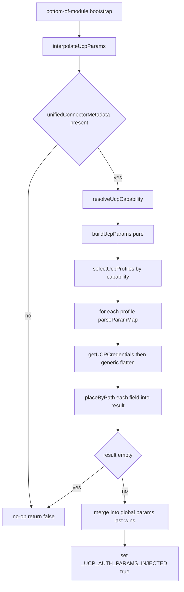

# Interpolation feature — full cross-language spec + JS/PowerShell parity

> Companion to [`interpolated-param-schemas-and-fix.md`](interpolated-param-schemas-and-fix.md)
> (envelope schemas + generator fix/enforcement plan) and
> [`connectus_migration/interpolation_map_plan.md`](connectus_migration/interpolation_map_plan.md)
> (generator emission).
>
> This document has two roles:
>
> 1. **§A — Language-agnostic feature specification.** The complete, normative
>    behavior of UCP `param_map` → dotted-path interpolation, derived from the
>    two shipping runtimes (`CommonServerPython.py` and `CommonServer.js`). This
>    is the **blueprint** for implementing the feature in *any* additional
>    language (the immediate target is PowerShell — see §C).
> 2. **§B — JavaScript parity plan.** The original plan that ported the feature
>    from Python to `CommonServer.js`. Now **shipping** — retained as the
>    canonical worked example of porting the spec, and as the parity reference
>    for new ports.
> 3. **§C — PowerShell implementation plan** (`CommonServerPowerShell.ps1`),
>    built directly from §A.
>
> The Python implementation lives in
> `Packs/Base/Scripts/CommonServerPython/CommonServerPython.py`; the JavaScript
> twin in `Packs/Base/Scripts/CommonServer/CommonServer.js`.

---

## §A. Language-agnostic feature specification (the blueprint)

> Normative. Any new-language implementation MUST reproduce the behavior below.
> All `file:line` citations are to the two shipping runtimes and are the source
> of truth when this prose and the code disagree.

### A.0 What the feature does

At integration load time, reshape a UCP credentials **envelope** (returned by
the host's `getUCPCredentials`) into the nested legacy `params` shape that
integrations read via `demisto.params()`. The reshape is driven by a per-profile
`interpolation_mapping` string in the connector metadata. When no
`interpolation_mapping` is present, the feature is a **no-op** and legacy
behavior is preserved. It must **never throw** out of the load-time bootstrap.

### A.1 Inputs, seams, and the merge target

The implementation depends on these host-provided seams (named per language):

| Seam | Python | JS | What it provides |
|---|---|---|---|
| Connector metadata | `demisto.unifiedConnectorMetadata()` | `unifiedConnectorMetadata()` | `{connectionProfiles: [...]}` or empty/None when not in UCP mode |
| Credentials fetch | `get_ucp_credentials(method_unique_id)` | `getUCPCredentials(methodId, false)` | the **envelope** (§A.4) |
| Current command | `demisto.command()` (via `resolve_ucp_capability`) | global `command` | drives capability resolution |
| Merge target | `demisto.callingContext['params']` (`:14032`) | module-global `params` object (`:2811`) | where interpolated values are written so later param reads observe them |
| Injected flag | `_UCP_AUTH_PARAMS_INJECTED` (`:14034`) | `_UCP_AUTH_PARAMS_INJECTED` (`:2819`) | set `true` on success so `should_use_ucp_auth()`/`shouldUseUcpAuth()` stop per-request injection |

### A.2 Capability resolution

Constants (Python `:13690-13694`, JS `:2125-2129`):

```
_UCP_DEFAULT_CAPABILITY   = 'automation-and-remediation'
_UCP_COMMAND_CAPABILITIES = { 'fetch-incidents': 'collection-and-ingestion',
                              'fetch-assets':    'collection-and-ingestion' }
```

`resolve_ucp_capability(cmd=current command)` returns
`_UCP_COMMAND_CAPABILITIES[cmd]` if present, else `_UCP_DEFAULT_CAPABILITY`
(Python `:resolve_ucp_capability`, JS `resolveUcpCapability:2236`).

### A.3 The mapping grammar (`parseParamMap` / `_parse_param_map`)

Source: Python `:13758`, JS `:2548`. Canonical form is a **single
comma-separated string** of `field_id:dotted.destination` entries, e.g.:

```
username:credentials.identifier,password:credentials.password,server_url:server_url
```

Exact parsing rules (MUST match):

1. Falsy/empty input ⇒ empty list (no pairs).
2. **Coerce the whole input via the language's string cast, then split on `,`.**
   ⚠️ Both runtimes do `str(param_map).split(',')` — so a **dict/object input
   does NOT parse** (it stringifies to e.g. `"[object Object]"` / `"{...}"`).
   The docstrings *claim* dict support; the code does not implement it. A new
   port MUST replicate the string-only behavior for parity (do **not** "fix"
   this), and the generator only ever emits the comma-string anyway.
3. Trim each entry; skip empties.
4. Entry with no `:` ⇒ log error + skip.
5. Split on the **first** `:` only (`split(':', 1)`); any later `:` stays in the
   destination.
6. Trim both sides; drop the pair if either side is empty.
7. **Preserve order.**

### A.4 The credentials envelope & flatten

The envelope is keyed by a `type` discriminator (full schemas + comparison table
in [`interpolated-param-schemas-and-fix.md` §2](interpolated-param-schemas-and-fix.md)):

```
plain:        {"type":"plain","plain":{username, password}}
api_key:      {"type":"api_key","api_key":{key, header_name}}     # NOTE key is 'key'
passthrough:  {"type":"passthrough","passthrough":{"parameters":{<role>:<v>, ...}}}
```

**Generic flatten** (Python inline `:13936-13951`, JS
`_flattenUcpCredentialsGeneric:2635`):

```
flat = creds[creds.type]          # descend into the type key
if flat is not an object:  flat = creds          # already-flat fallback
if flat has object 'parameters':  flat = flat.parameters   # passthrough: one level deeper
```

Result: a flat map of `auth.parameter -> value`. Do **not** reuse any
type-specific/hardcoded flattener (e.g. JS `_flattenUcpCredentials`) — it drops
non-fixed fields.

### A.5 Canonical-key aliasing (flatten-v3) — REQUIRED for parity

Source: Python `_UCP_CANONICAL_FIELD_KEYS:13711`, JS `:2147`. Fixed-schema types
(`api_key`, `plain`) store secrets under a known envelope key regardless of the
mapping's LEFT id. The runtime **owns** this knowledge and aliases the LEFT
`field_id` to the real envelope key before lookup:

```
_UCP_CANONICAL_FIELD_KEYS = {
    'api_key': { 'api_key': 'key' },                       # LEFT 'api_key' reads envelope key 'key'
    'plain':   { 'username': 'username', 'password': 'password' },
}
# passthrough: NO entry -> free-form, looked up generically by field_id
```

At lookup: `lookup_key = canonical_keys.get(field_id, field_id)`
(Python `:13961`, JS `:2743`). **A new port MUST include this map and aliasing**
or `api_key` profiles will silently fail. (The matching `[UCP-CODE-VERSION]
flatten-v3` debug marker exists so a stale bundle is detectable — emit the
equivalent.)

### A.6 Path placement & folding (`placeByPath` / `_place_by_path`)

Source: Python `:13719`, JS `:2503`.

- Split the destination on `.`, **drop empty segments** (`a..b` → `[a,b]`;
  `''`/`.` ⇒ no-op).
- Walk/create intermediate **objects**; if an intermediate currently holds a
  non-object (incl. null/array), **overwrite it** with a fresh object.
- Set the leaf to the value.
- **Folding:** two destinations sharing a parent merge into one object — this is
  how `credentials.identifier` + `credentials.password` become the type-9
  `{credentials:{identifier, password}}` shape.

### A.7 The pure core (`buildUcpParams` / `build_ucp_params`)

Source: Python `:13832`, JS `:2678`. Side-effect-free; returns a new params
object, touches no host state.

```
result = {}
if not connector_metadata: return result
capability = capability or resolve_ucp_capability()
profiles   = connector_metadata.connectionProfiles or []
selected   = selectUcpProfiles(profiles, capability)        # ALL where profile.capability == capability
for profile in selected:
    mapping = profile.metadata.xsoar.interpolation_mapping
    pairs   = parseParamMap(mapping); if empty: continue
    creds   = getUCPCredentials(profile.method_unique_id)
    flat    = genericFlatten(creds)
    canon   = _UCP_CANONICAL_FIELD_KEYS[creds.type] or {}
    for (field_id, destination) in pairs:
        value = flat[ canon.get(field_id, field_id) ]
        if value is None/undefined: continue        # empty-string, 0, false ARE placed
        placeByPath(result, destination, value)
return result
```

Cross-profile merge is **last-wins** in `connectionProfiles` order (later
`placeByPath` calls overwrite earlier leaves at the same path).

> **Skip rule precision:** only `None`/`null`/`undefined` are skipped. `""`,
> `0`, and `false` are valid values and MUST be placed (Python
> `if field_value is None`, JS `=== null || === undefined`).

### A.8 Profile selection (`selectUcpProfiles` / `_select_ucp_profiles`)

Return **all** profiles where `profile.capability == capability` (an array,
possibly empty). Multi-profile is intentional. Python `:13804`, JS `:2601`.

### A.9 The applier (`interpolateUcpParams` / `interpolate_ucp_params`)

Source: Python `:13975`, JS `:2778`.

1. If no metadata passed, fetch it; if absent/None ⇒ return `false` (not in UCP).
2. Resolve capability (best-effort; swallow errors).
3. `interpolated = buildUcpParams(metadata, capability)`; if empty ⇒ `false`.
4. **Merge into the host merge target** (§A.1), last-wins.
5. Set `_UCP_AUTH_PARAMS_INJECTED = true`; return `true`.
6. The whole applier is wrapped so it **never throws**.

### A.10 Bootstrap

At the **bottom of the module** (after all helpers are defined), call the
applier inside a swallow-all guard (Python `:14335`, JS `:2831-2835`). When not
under UCP this is a cheap no-op.

---

## §B. JavaScript parity plan (shipping — worked example)

> This plan ported §A from Python to JavaScript and is now **implemented in
> `CommonServer.js`** (helpers at `:2503-2835`). It is kept as the canonical
> worked example for future ports and as the JS↔Python parity reference. The
> task list below is historical (all items landed); use it as a porting recipe.

## Goal

Make `Packs/Base/Scripts/CommonServer/CommonServer.js` reshape UCP connector
field values into the nested `params` shape integrations expect — a **1:1
behavioral twin** of the Python `interpolate_ucp_params()` / `build_ucp_params()`
pipeline. When no `interpolation_mapping` (`param_map`) is present, the change is
a no-op and legacy behavior is preserved.

## What already exists in CommonServer.js (do NOT re-create)

The JS UCP layer (~lines 2122–2455) already has:

- `_UCP_AUTH_PARAMS_INJECTED`, `_UCP_REFRESH_THRESHOLD_SECONDS`, `_ucpCredentialsCache`
- `isUcpEnabled()`, `shouldUseUcpAuth()`, `resolveUcpCapability(cmd)`
- `_getUcpProfiles()`, `getUcpMethodUniqueId(capability, subCapability)`
- `getUcpCredentials(...)`, `invalidateUcpCredentialsCache(...)`, `_extractUcpExpiry(...)`
- `_flattenUcpCredentials(creds)` — but it is **type-specific/hardcoded**
  (only `oauth2` / `api_key` / `plain` with fixed output fields)
- A mutable module-global `params` object (top of file) — the merge target.

## Gap analysis (Python → JS)

| Python (`CommonServerPython.py`) | JS status | Action |
|---|---|---|
| `_place_by_path(target, path, value)` | missing | add `placeByPath()` |
| `_parse_param_map(param_map)` | missing | add `parseParamMap()` |
| `_select_ucp_profiles(profiles, capability)` | missing (only single-match `getUcpMethodUniqueId`) | add `selectUcpProfiles()` (plural) |
| generic creds flatten (`creds[creds.type]` → descend into `parameters`) | only hardcoded `_flattenUcpCredentials` | add generic flatten path for interpolation |
| `build_ucp_params(metadata, capability)` (pure) | missing | add `buildUcpParams()` |
| `interpolate_ucp_params(metadata)` (applier) | missing | add `interpolateUcpParams()` |
| bottom-of-module bootstrap call | missing | add guarded call |

## Key design constraints (carry over from Python)

1. **Metadata-first, capability-scoped, multi-profile.** Read
   `connectionProfiles[]`, keep **every** profile whose `capability` matches the
   resolved capability. Each matching profile contributes its mapped values.
2. **Mapping location:** `profile.metadata.xsoar.interpolation_mapping`
   (the canonical `param_map`). Canonical form is a comma-separated string
   `field_id:dotted.destination,...`; also accept a `{field_id: destination}` object.
3. **Values come from credentials, not the profile.** For each profile, call
   `getUCPCredentials(method_unique_id)` and read mapped `field_id`s out of the
   **generically flattened** envelope (`creds[creds.type]`, then descend into
   `parameters` when present). Do **not** reuse the hardcoded
   `_flattenUcpCredentials` — it drops non-fixed fields.
4. **Folding via shared parent.** `credentials.identifier` +
   `credentials.password` merge into one `credentials` dict (type-9 shape) for free.
5. **Last-wins merge** across profiles in `connectionProfiles` order.
6. **Legacy-safe:** absent/empty mapping ⇒ no-op; never throw out of the bootstrap.
7. **Set `_UCP_AUTH_PARAMS_INJECTED = true`** on success so `shouldUseUcpAuth()`
   stays correct (interpolation already injected the secrets).
8. **Merge target = the module-global `params` object** (JS analog of Python's
   `demisto.callingContext['params']`). Confirm with the team (Task 1).

## Flow



## Task List

### Phase 1 — Confirm seams

- **Task 1: Confirm the JS merge target and bootstrap placement.**
  - Verify that mutating the module-global `params` object is observed by
    downstream integration code (mirrors Python `callingContext['params']`).
  - Confirm `getUCPCredentials(methodId, false)` returns the same envelope
    shape the Python flattener consumes (`{type, <type>:{...}}`, optionally
    nested `parameters`).
  - Output: a short note appended to [`plans/interpolation.md`](plans/interpolation.md).

### Phase 2 — Pure helpers (no demisto state)

- **Task 2: `placeByPath(target, path, value)`.**
  - Split on `.`, drop empty segments, build intermediate objects, set leaf.
  - Single segment ⇒ flat scalar. Shared parent ⇒ merge (folding).
  - Mirror `_place_by_path` exactly.

- **Task 3: `parseParamMap(paramMap)`.**
  - Accept comma-separated string `field_id:dest` (split on first `:`),
    also accept object form. Trim, skip empty/`:`-less entries, log + skip
    malformed. Preserve order. Mirror `_parse_param_map`.

- **Task 4: `selectUcpProfiles(profiles, capability)`.**
  - Return **all** profiles where `profile.capability === capability`
    (array, possibly empty). Mirror `_select_ucp_profiles`.

- **Task 5: Generic credential flatten for interpolation.**
  - New helper (e.g. `_flattenUcpCredentialsGeneric(creds)`): read
    `creds[creds.type]`; if object use it, else fall back to `creds`; then if
    it has a `parameters` object, descend into it. Mirror the inline flatten in
    Python `build_ucp_params`. Leave the existing `_flattenUcpCredentials` untouched.

### Phase 3 — Core + applier

- **Task 6: `buildUcpParams(connectorMetadata, capability)` (pure).**
  - Resolve capability if not given; read `connectionProfiles`; `selectUcpProfiles`;
    per profile read `metadata.xsoar.interpolation_mapping`, `parseParamMap`,
    fetch creds via `getUCPCredentials(method_unique_id)`, generic-flatten,
    `placeByPath` each `field_id → destination`; skip missing values; last-wins.
  - Return the reshaped object (no demisto mutation). Mirror `build_ucp_params`.

- **Task 7: `interpolateUcpParams(connectorMetadata)` (applier).**
  - Fetch `unifiedConnectorMetadata()` if not passed; guard for absence;
    resolve capability; call `buildUcpParams`; if non-empty, merge into the
    global `params` (last-wins) and set `_UCP_AUTH_PARAMS_INJECTED = true`;
    return boolean. Wrap in try/catch — never throw. Mirror `interpolate_ucp_params`.

- **Task 8: Bottom-of-module bootstrap.**
  - Add a guarded `try { interpolateUcpParams(); } catch (e) {}` at the end of
    the UCP section, matching the Python module-tail call.

- **Task 9: Debug logging + version marker.**
  - Mirror the `[UCP][CommonServer.js]` debug lines and the
    `[UCP-CODE-VERSION] flatten-v3` code-version marker so stale-bundle
    detection works the same as Python (the current shipping marker is
    `flatten-v3`, reflecting the canonical-key aliasing in §A.5 — see
    `CommonServer.js:2722`).

### Phase 4 — Tests & docs

- **Task 10: JS unit tests** (same scenarios as the Python suite):
  - type-9 credentials folding (`username`+`password` → `credentials.*`),
  - flat scalar (`server_url → url`), 3-level deep path,
  - two paths merging into one parent,
  - unmapped field passthrough, empty/absent mapping = legacy no-op,
  - multi-profile merge (last-wins), capability filtering,
  - values sourced from flattened creds (incl. nested `parameters`).
  - Place in the CommonServer.js test harness used by the repo.

- **Task 11: Update docs.**
  - Tick the JS items in [`plans/interpolation.md`](plans/interpolation.md);
    cross-reference this plan; document the generic-flatten decision and the
    global-`params` merge target.

## Risks & mitigations

| Risk | Mitigation |
|---|---|
| Behavior drift from Python | Port helper-by-helper; share the exact test scenarios; keep naming 1:1. |
| Reusing hardcoded `_flattenUcpCredentials` would drop mapped fields | Add a **separate** generic flatten for interpolation; don't touch existing auth flatten. |
| Wrong merge target (global `params` not observed downstream) | Confirm in Task 1 before implementing the applier. |
| Bootstrap throwing at module load | Wrap in try/catch; legacy no-op on any error. |
| `getUCPCredentials` envelope differs in JS host | Confirm shape in Task 1; generic flatten already handles `type`/`parameters` nesting. |

## Out of scope (of §B, the JS plan)

- PowerShell parity — **now in scope of this document**; see §C below.
- UCP authoring-schema / OPA validator changes in `unified-connectors-content`
  (tracked in the generator plans; the runtimes are schema-agnostic).

---

## §C. PowerShell implementation plan (`CommonServerPowerShell.ps1`)

> Built directly from §A. There is **no existing PowerShell UCP layer** today,
> so this is a greenfield port. Implement the §A helpers as PowerShell functions
> with **1:1 behavior** to Python/JS. Keep names recognisable (`Build-UcpParams`,
> `Invoke-UcpParamInterpolation`, etc.) but spec-faithful.
>
> **Target file path is confirm-first:** assume `CommonServerPowerShell.ps1`
> (analogous to `CommonServer.js` / `CommonServerPython.py`). Confirm the actual
> path and the host seams (§A.1) with the team before writing code (Task C1).

### C.1 Language-mapping cheat-sheet (Python/JS → PowerShell)

| Concept | Python / JS | PowerShell | Parity gotcha |
|---|---|---|---|
| Object / dict | `dict` / `{}` | `[hashtable]` or `[ordered]` | Use **`[ordered]`** hashtables for the result + intermediate objects so merge order is deterministic (§A.7 last-wins). |
| "missing"/skip sentinel | `None` / `null`+`undefined` | `$null` | §A.7: skip **only** `$null`. `''`, `0`, `$false` MUST be placed. Beware: a missing hashtable key returns `$null`, which is the correct skip behavior. |
| Key lookup | `d.get(k)` / `o[k]` | `$h[$k]` or `$h.ContainsKey($k)` | PS hashtables are **case-insensitive by default** — Python/JS keys are case-sensitive. Use `[hashtable]::new(0,[StringComparer]::Ordinal)` (or `[System.Collections.Specialized.OrderedDictionary]` with an ordinal comparer) to match. |
| String cast + split | `str(x).split(',')` | `[string]$x -split ','` | Replicate the **string-only** parse (§A.3 rule 2); do not special-case hashtable input. |
| Split on first `:` | `split(':',1)` | `$e -split ':',2` | The `,2` limit reproduces "first colon only". |
| Drop empty segments | list-comp filter | `$path -split '\.' \| Where-Object { $_ -ne '' }` | Note `-split '.'` needs the escaped `'\.'` (regex). |
| Never-throw bootstrap | `try/except` swallow | `try { ... } catch { }` | Wrap the applier call at module tail. |
| Merge target | `callingContext['params']` / global `params` | **confirm-first (Task C1)** | The PS analog of the params object the host exposes to `$demisto`/`DemistoParams`. Biggest unknown. |

### C.2 Functions to implement (mirror §A.3–A.10)

1. `Set-ByPath -Target <hashtable> -Path <string> -Value <obj>` ⇒ §A.6
   (empty-segment drop, non-object overwrite, folding).
2. `ConvertFrom-ParamMap -ParamMap <obj>` ⇒ §A.3 (string-only, first-colon
   split, trim/skip, **order-preserving** — return an array of `[pscustomobject]`
   or `[string[]]` pairs).
3. `Select-UcpProfiles -Profiles <array> -Capability <string>` ⇒ §A.8.
4. `ConvertFrom-UcpCredentials -Credentials <obj>` (generic flatten) ⇒ §A.4.
5. Module constant `$script:UcpCanonicalFieldKeys` ⇒ §A.5 (api_key/plain alias
   map) — **do not omit**, and apply `lookup_key = canon[field_id] ?? field_id`.
6. `Build-UcpParams -ConnectorMetadata <obj> [-Capability <string>]` ⇒ §A.7
   (pure; last-wins; skip only `$null`).
7. `Invoke-UcpParamInterpolation [-ConnectorMetadata <obj>]` ⇒ §A.9 (applier;
   merge into the host target; set `$script:UcpAuthParamsInjected = $true`;
   never throw).
8. `Resolve-UcpCapability [-Command <string>]` + the two capability constants
   ⇒ §A.2.
9. Module-tail bootstrap ⇒ §A.10, wrapped in `try {} catch {}`.
10. Debug lines + a `[UCP-CODE-VERSION] flatten-v3` marker (§A.5) for
    stale-bundle detection, using the PS host's debug logger.

### C.3 Task list

- **Task C1 (confirm seams — do FIRST).** Confirm the PowerShell host exposes:
  `unifiedConnectorMetadata`, `getUCPCredentials`, current command, and a
  **mutable params merge target** observed by downstream integration code
  (the PS analog of `callingContext['params']`). Confirm `getUCPCredentials`
  returns the same envelope shape (§A.4). Output: a short note appended here.
- **Task C2.** Implement the pure helpers C.2 #1–#5 (no host state).
- **Task C3.** Implement `Build-UcpParams` (#6) and `Invoke-UcpParamInterpolation`
  (#7) + capability resolution (#8).
- **Task C4.** Add the module-tail bootstrap (#9) and version marker/logging (#10).
- **Task C5.** Port the parity test matrix (§C.4) into the PS test harness.

### C.4 Parity test matrix (identical scenarios to JS/Python)

Mirror exactly so the three runtimes can never diverge:

- type-9 folding (`username`+`password` → `credentials.identifier/.password`),
- flat scalar (`server_url → url`), 3-level deep destination path,
- two destinations merging into one parent (folding),
- unmapped passthrough field passthrough, empty/absent mapping ⇒ legacy no-op,
- multi-profile merge (**last-wins**), capability filtering,
- values sourced from the **flattened** envelope incl. nested `parameters`,
- **`api_key` alias**: mapping LEFT `api_key` resolves envelope key `key` (§A.5),
- **plain** canonical keys; **passthrough** free-form keys,
- **skip precision:** `$null` skipped, but `''` / `0` / `$false` placed (§A.7).

### C.5 Risks & mitigations (PowerShell-specific)

| Risk | Mitigation |
|---|---|
| PS hashtable case-insensitivity diverges from case-sensitive Py/JS keys | Use ordinal-comparer hashtables/ordered dicts (§C.1). |
| `-split '.'` treats `.` as regex (splits every char) | Always escape: `-split '\.'`. |
| `$null` vs `''`/`0`/`$false` skip confusion | Test the skip-precision case explicitly (§C.4); compare against `$null` only. |
| Omitting the canonical-key map ⇒ `api_key` profiles silently fail | §A.5 is mandatory; include the `api_key`-alias parity test. |
| Wrong/absent merge target | Block on Task C1 before writing the applier. |
| Bootstrap throwing at module load | `try {} catch {}` swallow; legacy no-op on any error. |

### C.6 Out of scope (of §C)

- UCP authoring-schema / OPA validator changes (generator plans own these).
- Generator-side `interpolation_mapping` emission/enforcement — see
  [`interpolated-param-schemas-and-fix.md` §6.6](interpolated-param-schemas-and-fix.md)
  (Plan B) and
  [`connectus_migration/interpolation_map_plan.md`](connectus_migration/interpolation_map_plan.md).
