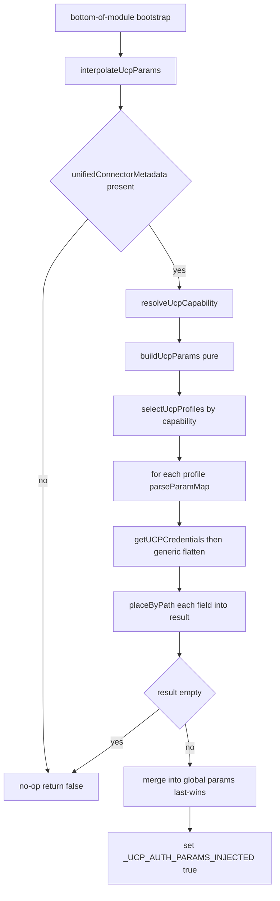

# Plan: Bring the Interpolation feature to JavaScript (CommonServer.js) at parity with Python

> Companion to [`plans/interpolation.md`](plans/interpolation.md). This plan covers
> **only** the JavaScript runtime — porting the UCP `param_map` → dotted-path
> interpolation that is already implemented and shipping in
> `Packs/Base/Scripts/CommonServerPython/CommonServerPython.py`.

## Goal

Make `Packs/Base/Scripts/CommonServer/CommonServer.js` reshape UCP connector
field values into the nested `params` shape integrations expect — a **1:1
behavioral twin** of the Python `interpolate_ucp_params()` / `build_ucp_params()`
pipeline. When no `interpolation_mapping` (`param_map`) is present, the change is
a no-op and legacy behavior is preserved.

## What already exists in CommonServer.js (do NOT re-create)

The JS UCP layer (~lines 2122–2455) already has:

- `_UCP_AUTH_PARAMS_INJECTED`, `_UCP_REFRESH_THRESHOLD_SECONDS`, `_ucpCredentialsCache`
- `isUcpEnabled()`, `shouldUseUcpAuth()`, `resolveUcpCapability(cmd)`
- `_getUcpProfiles()`, `getUcpMethodUniqueId(capability, subCapability)`
- `getUcpCredentials(...)`, `invalidateUcpCredentialsCache(...)`, `_extractUcpExpiry(...)`
- `_flattenUcpCredentials(creds)` — but it is **type-specific/hardcoded**
  (only `oauth2` / `api_key` / `plain` with fixed output fields)
- A mutable module-global `params` object (top of file) — the merge target.

## Gap analysis (Python → JS)

| Python (`CommonServerPython.py`) | JS status | Action |
|---|---|---|
| `_place_by_path(target, path, value)` | missing | add `placeByPath()` |
| `_parse_param_map(param_map)` | missing | add `parseParamMap()` |
| `_select_ucp_profiles(profiles, capability)` | missing (only single-match `getUcpMethodUniqueId`) | add `selectUcpProfiles()` (plural) |
| generic creds flatten (`creds[creds.type]` → descend into `parameters`) | only hardcoded `_flattenUcpCredentials` | add generic flatten path for interpolation |
| `build_ucp_params(metadata, capability)` (pure) | missing | add `buildUcpParams()` |
| `interpolate_ucp_params(metadata)` (applier) | missing | add `interpolateUcpParams()` |
| bottom-of-module bootstrap call | missing | add guarded call |

## Key design constraints (carry over from Python)

1. **Metadata-first, capability-scoped, multi-profile.** Read
   `connectionProfiles[]`, keep **every** profile whose `capability` matches the
   resolved capability. Each matching profile contributes its mapped values.
2. **Mapping location:** `profile.metadata.xsoar.interpolation_mapping`
   (the canonical `param_map`). Canonical form is a comma-separated string
   `field_id:dotted.destination,...`; also accept a `{field_id: destination}` object.
3. **Values come from credentials, not the profile.** For each profile, call
   `getUCPCredentials(method_unique_id)` and read mapped `field_id`s out of the
   **generically flattened** envelope (`creds[creds.type]`, then descend into
   `parameters` when present). Do **not** reuse the hardcoded
   `_flattenUcpCredentials` — it drops non-fixed fields.
4. **Folding via shared parent.** `credentials.identifier` +
   `credentials.password` merge into one `credentials` dict (type-9 shape) for free.
5. **Last-wins merge** across profiles in `connectionProfiles` order.
6. **Legacy-safe:** absent/empty mapping ⇒ no-op; never throw out of the bootstrap.
7. **Set `_UCP_AUTH_PARAMS_INJECTED = true`** on success so `shouldUseUcpAuth()`
   stays correct (interpolation already injected the secrets).
8. **Merge target = the module-global `params` object** (JS analog of Python's
   `demisto.callingContext['params']`). Confirm with the team (Task 1).

## Flow

## Task List

### Phase 1 — Confirm seams

- **Task 1: Confirm the JS merge target and bootstrap placement.**
  - Verify that mutating the module-global `params` object is observed by
    downstream integration code (mirrors Python `callingContext['params']`).
  - Confirm `getUCPCredentials(methodId, false)` returns the same envelope
    shape the Python flattener consumes (`{type, <type>:{...}}`, optionally
    nested `parameters`).
  - Output: a short note appended to [`plans/interpolation.md`](plans/interpolation.md).

### Phase 2 — Pure helpers (no demisto state)

- **Task 2: `placeByPath(target, path, value)`.**
  - Split on `.`, drop empty segments, build intermediate objects, set leaf.
  - Single segment ⇒ flat scalar. Shared parent ⇒ merge (folding).
  - Mirror `_place_by_path` exactly.

- **Task 3: `parseParamMap(paramMap)`.**
  - Accept comma-separated string `field_id:dest` (split on first `:`),
    also accept object form. Trim, skip empty/`:`-less entries, log + skip
    malformed. Preserve order. Mirror `_parse_param_map`.

- **Task 4: `selectUcpProfiles(profiles, capability)`.**
  - Return **all** profiles where `profile.capability === capability`
    (array, possibly empty). Mirror `_select_ucp_profiles`.

- **Task 5: Generic credential flatten for interpolation.**
  - New helper (e.g. `_flattenUcpCredentialsGeneric(creds)`): read
    `creds[creds.type]`; if object use it, else fall back to `creds`; then if
    it has a `parameters` object, descend into it. Mirror the inline flatten in
    Python `build_ucp_params`. Leave the existing `_flattenUcpCredentials` untouched.

### Phase 3 — Core + applier

- **Task 6: `buildUcpParams(connectorMetadata, capability)` (pure).**
  - Resolve capability if not given; read `connectionProfiles`; `selectUcpProfiles`;
    per profile read `metadata.xsoar.interpolation_mapping`, `parseParamMap`,
    fetch creds via `getUCPCredentials(method_unique_id)`, generic-flatten,
    `placeByPath` each `field_id → destination`; skip missing values; last-wins.
  - Return the reshaped object (no demisto mutation). Mirror `build_ucp_params`.

- **Task 7: `interpolateUcpParams(connectorMetadata)` (applier).**
  - Fetch `unifiedConnectorMetadata()` if not passed; guard for absence;
    resolve capability; call `buildUcpParams`; if non-empty, merge into the
    global `params` (last-wins) and set `_UCP_AUTH_PARAMS_INJECTED = true`;
    return boolean. Wrap in try/catch — never throw. Mirror `interpolate_ucp_params`.

- **Task 8: Bottom-of-module bootstrap.**
  - Add a guarded `try { interpolateUcpParams(); } catch (e) {}` at the end of
    the UCP section, matching the Python module-tail call.

- **Task 9: Debug logging + version marker.**
  - Mirror the `[UCP][CommonServer.js]` debug lines and a `flatten-v2`-style
    code-version marker so stale-bundle detection works the same as Python.

### Phase 4 — Tests & docs

- **Task 10: JS unit tests** (same scenarios as the Python suite):
  - type-9 credentials folding (`username`+`password` → `credentials.*`),
  - flat scalar (`server_url → url`), 3-level deep path,
  - two paths merging into one parent,
  - unmapped field passthrough, empty/absent mapping = legacy no-op,
  - multi-profile merge (last-wins), capability filtering,
  - values sourced from flattened creds (incl. nested `parameters`).
  - Place in the CommonServer.js test harness used by the repo.

- **Task 11: Update docs.**
  - Tick the JS items in [`plans/interpolation.md`](plans/interpolation.md);
    cross-reference this plan; document the generic-flatten decision and the
    global-`params` merge target.

## Risks & mitigations

| Risk | Mitigation |
|---|---|
| Behavior drift from Python | Port helper-by-helper; share the exact test scenarios; keep naming 1:1. |
| Reusing hardcoded `_flattenUcpCredentials` would drop mapped fields | Add a **separate** generic flatten for interpolation; don't touch existing auth flatten. |
| Wrong merge target (global `params` not observed downstream) | Confirm in Task 1 before implementing the applier. |
| Bootstrap throwing at module load | Wrap in try/catch; legacy no-op on any error. |
| `getUCPCredentials` envelope differs in JS host | Confirm shape in Task 1; generic flatten already handles `type`/`parameters` nesting. |

## Out of scope

- PowerShell parity (tracked separately in [`plans/interpolation.md`](plans/interpolation.md) Task 7).
- UCP authoring-schema / OPA validator changes in `unified-connectors-content`
  (already tracked in the main plan; the JS runtime is schema-agnostic).
