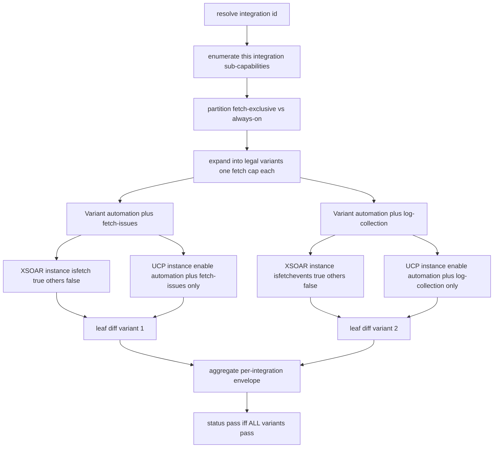

# Param Parity — Multi-Capability Variant Matrix Design

Status: **Approved** (architect-mode design; Philosophy A confirmed). Ready for
implementation in code mode.
Scope: redesign of the runtime `demisto.params()` parity test
([`runtime_demisto.params_parity/`](.)) so an integration that subscribes to
**multiple capabilities** — including the **mutually-exclusive fetch
capabilities** — is tested as a set of **legal per-integration variants**, each
diffed at the integration-instance level.

---

## 1. Motivating case — `Akamai WAF SIEM`

The handler [`xsoar-akamai-waf-siem/handler.yaml`](../../../unified-connectors-content/connectors/akamai/components/handlers/xsoar-akamai-waf-siem/handler.yaml:20)
subscribes to THREE capabilities:

```yaml
capabilities:
- id: automation-and-remediation_akamai-waf-siem
- id: fetch-issues_akamai-waf-siem
- id: log-collection_akamai-waf-siem
```

The integration YML [`Akamai_SIEM.yml`](../../Packs/Akamai_SIEM/Integrations/Akamai_SIEM/Akamai_SIEM.yml)
declares BOTH `isFetch` (line 88) and `isFetchEvents` (line 124).

**Platform rule:** none of the fetch flags may be enabled together on one
instance; and we must NOT enable multiple sub-capabilities of the same
integration for different fetch types.

---

## 2. Authoritative capability → fetch-flag mapping

| Connector capability | XSOAR `script` flag | Fetch-exclusive? |
|---|---|---|
| `automation-and-remediation` | (none — any non-fetch command) | No (always-on; **may be absent**) |
| `log-collection` | `isfetchevents: true` | **Yes** |
| `fetch-issues` | `isfetch: true` | **Yes** |
| `fetch-assets-and-vulnerabilities` | `isfetchassets: true` | **Yes** |
| `threat-intelligence-and-enrichment` | `isFeed: true` | **Yes** |
| `fetch-secrets` | `isFetchCredentials: true` | **Yes** |

**Constraint 1 — fetch flags are mutually exclusive.** At most ONE of the
fetch-exclusive capabilities may be enabled on a single integration instance.

**Constraint 2 — one fetch type per integration instance.** A variant never
contains two fetch-exclusive capabilities.

This mapping is the SINGLE SOURCE OF TRUTH, defined once in `resolver.py` and
re-used by `be_config_params.py`.

---

## 3. The bug in the current architecture

The test treats **one integration = one instance with EVERY capability enabled at
once**:

1. [`resolver._capabilities_from_handler()`](resolver.py:443) flattens all
   capabilities into one `ParityInputs.capabilities` list.
2. [`ucp_capture._build_instance_payload()`](ucp_capture.py:557) sets
   `enabled_values[cap.id] = sub_ids` for **every** parent → the single UCP
   instance enables Fetch Issues **and** Log Collection together → an instance
   with `isfetch=true` **and** `isfetchevents=true`. **Illegal.**
3. The XSOAR side derives fetch params from the **static YML `script` flags**
   ([`apply_be_config_transform()`](be_config_params.py:141)) — decoupled from
   the capability under test.

---

## 4. Core principle — the comparison unit is the **integration instance**

`demisto.params()` is dumped by the probe inside ONE integration container running
`test-module`. There is no connector-wide `demisto.params()`. Both flows create
exactly one integration instance per brand:

- UCP: [`wait_for_xsoar_mirror()`](ucp_capture.py:298) (mirror keyed by brand ==
  Integration ID).
- Legacy: [`capture_xsoar_params()`](xsoar_capture.py:826).

**The diff is ALWAYS leaf-level: one integration-instance's `demisto.params()`
(legacy) vs the same integration-instance's mirrored `demisto.params()` (UCP) for
a single variant. We NEVER aggregate params across integrations or capabilities.**

---

## 5. Decision — Philosophy A: per-integration ISOLATION

**Each run enables ONLY the target integration's sub-capabilities.** We never
co-enable a sibling integration's sub-capabilities on the same connector
instance, even though the platform technically allows it (a single connector
instance enabling sub-capabilities of multiple integrations would mirror multiple
XSOAR instances).

Rationale: cleanest, fully-attributable leaf diffs; the per-integration outer
loop (one `--integration-id` per run, already parallelized across shells/tenants)
covers the "connector has multiple integrations" dimension.

Explicitly out of scope (documented, not built): co-enabling sibling integrations
in one connector instance ("realistic connector instance" / Philosophy B).

---

## 6. Redesign — a two-level matrix

```
Connector (akamai)
└── Integration (--integration-id)            ← OUTER loop (exists today, 1 run each)
    └── Variant (legal capability combination) ← INNER loop (NEW)
        └── one XSOAR instance + one UCP instance + one leaf diff
```

### 6.1 Variant expansion rule

Partition the handler's sub-capabilities for THIS integration:

- **fetch-exclusive set** = caps whose parent maps to a fetch flag (table §2).
- **always-on set** = everything else (`automation-and-remediation` — **may be
  empty**, since automation is not guaranteed to exist).

Emit variants:

- **If ≥1 fetch-exclusive caps:** one variant per fetch-exclusive cap, each
  bundled with the (possibly empty) always-on set.
  - Each such variant sets EXACTLY its own fetch flag `true`; all other fetch
    flags `false`.
- **If 0 fetch-exclusive caps:** a single variant = the always-on set (today's
  behavior; single-capability integrations unchanged). All fetch flags `false`.

Edge cases:
- **No automation, multiple fetch caps** (e.g. a pure SIEM/secrets integration):
  → one variant per fetch cap, each a SINGLE fetch cap alone (always-on empty).
- **Automation only:** → one variant, no fetch flags.
- **Single fetch cap only:** → one variant with that fetch cap.

`Akamai WAF SIEM` → exactly 2 variants:

| Variant id | Enabled caps | isfetch | isfetchevents | (others) |
|---|---|---|---|---|
| `automation-and-remediation+fetch-issues` | automation, fetch-issues | true | false | false |
| `automation-and-remediation+log-collection` | automation, log-collection | false | true | false |

The illegal pair `{fetch-issues, log-collection}` is **structurally
unrepresentable**.

### 6.2 Diagram



---

## 7. Per-file changes (REUSE existing code; remove what's now redundant)

### 7.1 `resolver.py`
- Add the cap→flag classifier as a module constant `CAPABILITY_FETCH_FLAG`
  (parent capability id prefix → flag name), the SINGLE source of truth.
- Add dataclass `CapabilityVariant`:
  - `id: str` (e.g. `"automation-and-remediation+fetch-issues"` — stable, derived
    from the sorted enabled parent ids),
  - `capabilities: list[CapabilitySpec]` (subset to enable for THIS variant),
  - `fetch_flags: dict[str, bool]` (ALL known flags, exactly one `true` for a
    fetch variant, all `false` otherwise).
- Add `ParityInputs.variants: list[CapabilityVariant]` produced by a new
  `_expand_variants(capabilities)` (implements §6.1; handles empty always-on).
- **Keep** `ParityInputs.capabilities` for attribution/back-compat; the
  per-variant `capabilities` is the new driver.
- Add unit tests in a resolver test module covering: 2-fetch+automation (Akamai
  SIEM → 2 variants), automation-only (1 variant), single-fetch-no-automation
  (1 variant), multi-fetch-no-automation (N single-cap variants).

### 7.2 `be_config_params.py`
- `compute_be_synthesized_params()` / `apply_be_config_transform()` currently read
  flags from the static YML `script`. **Edit** them to accept an explicit
  `fetch_flags` override (the variant's flags). When provided, it drives the
  add/strip logic instead of the YML script flags. Import the flag names from the
  resolver's `CAPABILITY_FETCH_FLAG` to avoid duplication.
- Keep the YML-script path as the fallback used only when no variant flags are
  supplied (e.g. legacy callers); but the orchestrator always supplies them.

### 7.3 `ucp_capture.py`
- `_build_instance_payload()` already takes a `capabilities` list — **reuse as-is**
  but call it **once per variant** with `variant.capabilities`. No change to the
  payload shape; mutual exclusion is enforced by only ever passing a legal subset.
- Add a guardrail in `_build_instance_payload()`: assert at most one fetch-flag
  capability is present in the passed `capabilities` (raise → setup-blocked if
  violated; defends against future regressions).
- `capture_ucp_params()`: replace the `capabilities=parity_inputs.capabilities`
  call (line ~895) with the per-variant `capabilities`. Add a `capabilities`
  (or `variant`) parameter so the orchestrator drives it; **remove** the
  "enables ALL handler (sub-)capabilities" wording/behavior (now redundant).

### 7.4 `xsoar_capture.py`
- The XSOAR instance-creation payload must set the type-8 fetch toggles
  (`isFetch`, `isFetchEvents`, …) per the variant's `fetch_flags`. **Edit**
  `capture_xsoar_params()` (or the overrides it receives) so these toggles are
  set explicitly rather than left to YML defaults.

### 7.5 `check_param_parity.py` (orchestrator)
- **Edit** `main()` (currently a single capture→diff, lines ~330-438): wrap the
  capture+normalize+diff block in a **loop over `parity_inputs.variants`**.
  - Per variant: compute the variant-scoped `shared_dummies`
    (`apply_be_config_transform(..., fetch_flags=variant.fetch_flags)`), run
    `capture_xsoar_params` (with the variant fetch toggles), run
    `capture_ucp_params(..., capabilities=variant.capabilities)`, normalize, diff.
  - Collect each variant's existing single-diff envelope.
- Build the aggregate envelope (§8). Exit `0` iff EVERY variant passes; `1` if any
  variant has a real diff; `2` on setup failure (contract unchanged).

### 7.6 `diff.py`
- **No change** to the core diff. The orchestrator nests each variant's existing
  envelope under `variants[]`.

### 7.7 `results_ledger.py`
- Per-run JSON: the aggregate envelope with a `variants[]` array.
- `ledger.csv`: **edit** to write one row PER variant; add a `variant_id` column
  (existing columns retained for roll-up). Update
  [`results_ledger.write_result`/`append_ledger`](results_ledger.py) accordingly.

### 7.8 `deploy_and_test.py` + `README.md`
- Wrapper exit-code contract unchanged (0/10/11/20/21/30); the variant loop is
  internal to `check_param_parity.py`.
- **Edit** [`README.md`](README.md): update Architecture + envelope schema; remove
  the now-false MVP limitation "ONE capability at a time" and the Salesforce-only
  payload-builder note (the builder is already generalized).

---

## 8. Aggregate envelope schema (additive, backward-compatible)

```jsonc
{
  "status": "pass" | "fail",            // pass iff ALL variants pass
  "integration_id": "Akamai WAF SIEM",
  "connector_id": "akamai",
  "summary": {
    "n_variants": 2,
    "n_variants_pass": 1,
    "n_variants_fail": 1
  },
  "variants": [
    {
      "variant_id": "automation-and-remediation+fetch-issues",
      "enabled_capabilities": [
        "automation-and-remediation_akamai-waf-siem",
        "fetch-issues_akamai-waf-siem"
      ],
      "fetch_flags": {"isFetch": true, "isFetchEvents": false},
      "status": "pass" | "fail",
      "summary":   { /* EXISTING per-diff summary block */ },
      "per_param": [ /* EXISTING shape */ ],
      "dropped":   [ /* EXISTING */ ],
      "captures":  { "integration": {…}, "connector": {…} },
      "normalizer_dropped": {…},
      "creation_payloads": {…}
    },
    { "variant_id": "automation-and-remediation+log-collection", … }
  ],
  "inputs": { /* EXISTING reproducibility echo */ }
}
```

Single-capability integrations yield `variants` of length 1; top-level `status`
consumers are unaffected.

---

## 9. Guardrail (defense in depth)

`_expand_variants()` and `_build_instance_payload()` both assert that no variant /
no payload ever carries more than one fetch-exclusive capability. Violation →
raise → setup-blocked (exit 2) with an operator-facing message. Protects against a
mis-declared handler or a future regression in the expansion logic.

---

## 10. Out of scope / open question

- **`longRunning` interaction.** `Akamai_SIEM.yml` script has `longRunning: true`
  and `isfetchevents:xsoar: false`. `longRunning` is a separate beta toggle, also
  mutually exclusive with `isFetchEvents` per the YML notes. It is NOT in the §2
  capability→flag table, so by default it is left at YML/connector defaults and
  NOT treated as a variant axis. **Confirm during implementation** whether
  `log-collection` should ever map to `longRunning` instead of `isfetchevents`
  for any connector; if so, add it as a flag the classifier knows about.
- **Philosophy B** (co-enabled sibling integrations in one connector instance):
  documented, deferred.
- **Non-Python integrations:** remain out of scope (probe is Python-only).

---

## 11. Implementation order

1. `resolver.py`: `CAPABILITY_FETCH_FLAG`, `CapabilityVariant`,
   `_expand_variants`, `ParityInputs.variants` + tests.
2. `be_config_params.py`: `fetch_flags` override + tests; import flag names from
   resolver.
3. `ucp_capture.py`: per-variant `_build_instance_payload` call + single-fetch
   guardrail + `capture_ucp_params` capabilities param; remove "enable ALL"
   behavior.
4. `xsoar_capture.py`: set fetch toggles per variant.
5. `check_param_parity.py`: variant loop + aggregate envelope + exit-code logic.
6. `results_ledger.py`: `variant_id` column + `variants[]` JSON.
7. `README.md`: docs refresh; drop stale MVP limitations.
8. E2E validation: `Akamai WAF SIEM` (2 variants) + a single-capability
   regression (`Salesforce IAM`).
