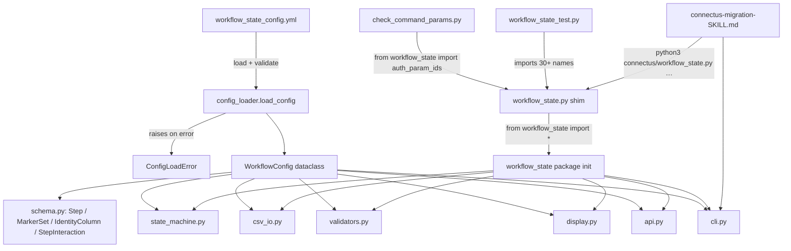
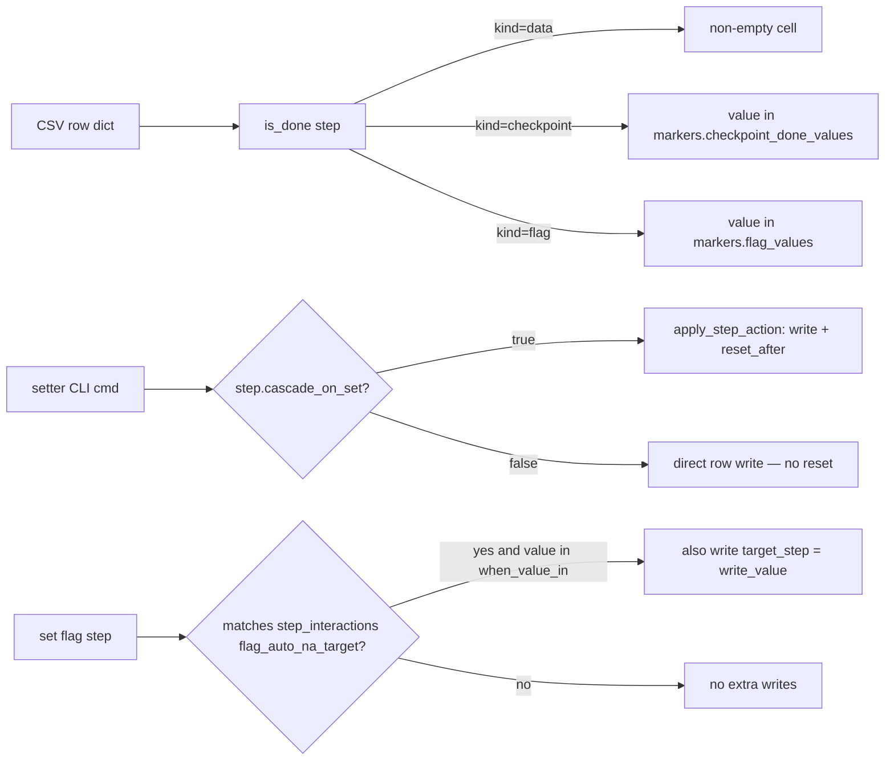

> **STATUS: implemented.** This document is the original design proposal for the `workflow_state` config-driven refactor. The refactor has been completed and the design described here is now reality — see [`connectus/workflow_state/`](workflow_state/__init__.py:1) for the implementation, [`connectus/workflow_state_config.yml`](workflow_state_config.yml:1) for the live YAML config, and [`connectus/Readme.md`](Readme.md:1) for current-state documentation. The "Open Questions" in §11 have been decided and are noted inline below. Line-number references throughout the doc point at the pre-refactor monolith and are kept for historical traceability.

# `workflow_state` — Config-Driven Refactor Design

A design for splitting [`connectus/workflow_state.py`](workflow_state.py) into a
small package whose **shape of the workflow** (the 16 ordered steps, their
kinds, the column schema, optional/skippable behaviour, the CLI verbs that set
each step) lives in a hardcoded YAML file rather than in Python literals.

The runtime engine (cascade reset, normalization, CSV I/O, CLI dispatch) stays
in Python. Only the *declarative* parts move out.

---

## 1. Current State Analysis

> *This section describes the codebase before the refactor; preserved for historical context. Today the package is split as described in §3 and the implementation lives in [`connectus/workflow_state/`](workflow_state/__init__.py:1) — `connectus/workflow_state.py` is now a thin backward-compatibility shim.*

[`connectus/workflow_state.py`](workflow_state.py) is a single ~2 585-line
script (historical; today's implementation is split across the
[`workflow_state/`](workflow_state/__init__.py:1) package) that did seven
distinct jobs:

| Concern | Where it lives today | Lines |
|---|---|---|
| Step / column declarations | [`STEPS`](workflow_state.py:171) literal + derived constants | 105–230 |
| Step model dataclass | [`Step`](workflow_state.py:134) | 134–144 |
| State predicates (`is_done`, `current_step`, `is_checked`) | top-level helpers | 247–290 |
| Cascade-reset / normalization engine | [`reset_after`](workflow_state.py:308), [`normalize_row`](workflow_state.py:319), [`apply_step_action`](workflow_state.py:704) | 304–750 |
| CSV I/O (atomic save, normalization on read/write) | [`load_csv`](workflow_state.py:358), [`save_csv`](workflow_state.py:379) | 354–428 |
| Per-cell schema validators (`Auth Details`, `Params to Commands`) | [`validate_auth_detail`](workflow_state.py:434), [`validate_params_to_commands`](workflow_state.py:462) | 430–578 |
| CLI commands & programmatic API | `cmd_*` + dispatch dict | 1042–2580 |

External callers (verified in the workspace):

- [`connectus/check_command_params.py`](check_command_params.py:589) — lazy
  `from workflow_state import auth_param_ids, WorkflowError`.
- [`connectus/check_command_params_test.py`](check_command_params_test.py:2123) — patches `workflow_state.auth_param_ids`.
- The CLI itself (the `__main__` entrypoint and the
  [`connectus-migration-SKILL.md`](connectus-migration-SKILL.md) which shells
  out via `python3 connectus/workflow_state.py …`).
- [`workflow_state_test.py`](workflow_state_test.py:22) — imports ~30 public
  names by name; this is the most comprehensive consumer and the strongest
  back-compat constraint.

### What is hardcoded today that should move to YAML

The ranking below is by "amount of repeated literal data per item":

1. **The 16 [`Step`](workflow_state.py:134) entries** ([`STEPS`](workflow_state.py:171)) — `index`, `name`, `kind`, `optional`, `setter`, `description`. Currently 33 lines of dense literal that every change touches. **Highest payoff.**
2. **The non-workflow data columns** ([`DATA_COLUMNS`](workflow_state.py:117)) — three identity/metadata column names.
3. **Sentinel / marker constants** ([`CHECK`](workflow_state.py:112), [`FAIL_MARK`](workflow_state.py:113), [`NA_MARK`](workflow_state.py:114), [`VALID_FLAG_VALUES`](workflow_state.py:123)) — all of these are part of the workflow's "shape", not its engine.
4. **The set of values that count as "done" for a checkpoint** ([`is_checked`](workflow_state.py:247) hardcodes `("✅", "✅", "YES", "N/A", "N/A", "true", "True", "done", "Done", "DONE")`).
5. **The "auth-parity flag → auto-N/A target" coupling** — the special case
   between step #12 and step #13. Today implemented by string-comparing
   [`AUTH_PARITY_FLAG_COLUMN`](workflow_state.py:219) and `"auth parity test passes"` in
   [`cmd_set_auth_flag`](workflow_state.py:1382), [`cmd_markpass`](workflow_state.py:1469),
   [`markpass_step`](workflow_state.py:987), and the programmatic API
   ([`markpass_integration_step`](workflow_state.py:2425)).
6. **The `set-assignee` carve-out** — the rule that `set-assignee` and
   `set-assignee-by-connector` skip the cascade-reset. Today expressed by
   bypassing [`apply_step_action`](workflow_state.py:704) in
   [`cmd_set_assignee`](workflow_state.py:1352) and
   [`cmd_set_assignee_by_connector`](workflow_state.py:1756) and described in a comment.
7. **CLI verb → step-name mappings** — implicit in
   [`NON_CHECKPOINT_STEPS`](workflow_state.py:224), explicit in the
   [`COMMANDS`](workflow_state.py:2538) dict. The verb name *for setting a step* is
   already on the [`Step`](workflow_state.py:134) dataclass; the verbs *that aren't
   per-step* (`status`, `dashboard`, `next`, `list*`, `files`, `auth-params`,
   `reset`, …) stay in code.
8. **JSON-cell schema rules for `Auth Details` and `Params to Commands`** —
   delegated to [`auth_config_parser`](auth_config_parser/DESIGN.md) and to
   [`validate_params_to_commands`](workflow_state.py:462). These are NOT in scope
   for the YAML extraction; see §11 Open Questions.

What we explicitly leave **in code**:

- The cascade-reset semantics and the `is_done` predicate dispatch by step
  `kind`. These are the engine; YAML declares which kind a step is and the
  engine knows what to do with each kind.
- All CSV I/O, the `next/--mine/--connector` arg parser, all `cmd_*`
  functions, the formatting/display helpers, and the programmatic API.
- The `Auth Details` / `Params to Commands` JSON validators (they have their
  own grammars; the YAML config only names *which* validator runs on *which*
  step).

---

## 2. Proposed YAML Schema — `connectus/workflow_state_config.yml`

The file is a single YAML document with three top-level sections:
[`identity_columns`](workflow_state_config.yml:1), [`steps`](workflow_state_config.yml:1),
and [`markers`](workflow_state_config.yml:1). All other current behaviour (cascade
reset, normalization, CLI dispatch) is engine, not config.

The schema is intentionally flat and explicit — a human reading the YAML
should be able to reconstruct the entire workflow without consulting the
Python.

### 2.1 Top-level structure

```yaml
# connectus/workflow_state_config.yml
# Hardcoded declarative configuration for the connectus migration workflow
# state machine. The runtime engine lives in connectus/workflow_state/.
# Editing this file changes the workflow's shape; engine code does not need
# to change for declarative edits (adding/removing/reordering steps,
# changing descriptions, toggling optional, etc.).

schema_version: 1

# Identity / metadata columns — present in the CSV but NOT part of the
# 16-step workflow. Never cleared by cascade reset. Order matters: this
# is the leftmost prefix of the CSV header.
identity_columns:
  - name: "Integration ID"
    description: "Unique human-readable id; primary key for find_row()."
  - name: "Integration File Path"
    description: "Repo-relative path to the integration's YML manifest."
  - name: "Connector ID"
    description: "ConnectUs connector this integration belongs to."

# Sentinels and marker strings. These are the literal values written into
# CSV cells by the engine. Changing them is a data migration, not a code
# change — bump schema_version when you do.
markers:
  check: "✅"
  fail:  "❌"
  na:    "N/A"
  # Values that count as "done" when seen in a checkpoint cell on read.
  # Includes the canonical `check` and `na` values plus historical aliases
  # we tolerate from human-edited rows.
  checkpoint_done_values:
    - "✅"
    - "YES"
    - "N/A"
    - "true"
    - "True"
    - "done"
    - "Done"
    - "DONE"
  # Valid values for any step whose kind is `flag`.
  flag_values:
    - "YES"
    - "NO"
    - "N/A"

# Cross-step interactions that don't fit the linear cascade model.
# Today there is exactly one: the auth-parity flag (#12) auto-fills the
# auth-parity test (#13) when set to NO/N/A. Modelled here so the engine
# can find the rule by name instead of string-comparing column titles.
step_interactions:
  - kind: flag_auto_na_target
    when_step: "requires auth parity test"   # source step (must be kind=flag)
    when_value_in: ["NO", "N/A"]
    target_step: "auth parity test passes"   # target step (must be kind=checkpoint)
    write_value: "N/A"

# The unified ordered sequence. Order in this list IS the step index
# (1-based). The engine asserts len(steps) >= 1 and unique names.
steps:
  - name: "assignee"
    kind: data
    optional: false
    setter: set-assignee
    cascade_on_set: false   # the set-assignee carve-out (override #5)
    description: "Assign an owner to drive this integration's migration."

  - name: "Auth Details"
    kind: data
    optional: false
    setter: set-auth
    json_schema: auth_details   # named validator the engine looks up
    description: "Record the auth classification JSON (validated against the Auth Details schema)."

  - name: "Params to Commands"
    kind: data
    optional: false
    setter: set-params-to-commands
    json_schema: params_to_commands
    cross_check: params_to_commands_no_auth_overlap
    description: "Map each integration command to the parameter IDs it consumes (JSON)."

  - name: "Params for test with default in code"
    kind: data
    optional: false
    setter: set-params-for-test
    json_schema: any_json
    description: "List the param IDs whose defaults live in the integration source (JSON)."

  - name: "Params same in other handlers"
    kind: data
    optional: true
    setter: set-shared-params
    json_schema: any_json
    description: "Optional: list params shared verbatim with sibling handlers (or `skip`)."

  - name: "generated manifest"
    kind: checkpoint
    optional: false
    setter: null
    description: "Generate the ConnectUs manifest YAML for the integration."

  - name: "run manifest make validate"
    kind: checkpoint
    optional: false
    setter: null
    description: "Run `make validate` on the generated manifest."

  - name: "wrote/checked code"
    kind: checkpoint
    optional: false
    setter: null
    description: "Write or review the integration source code."

  - name: "shadowed command test passes"
    kind: checkpoint
    optional: false
    setter: null
    description: "Verify there are no shadowed/conflicting commands in the same connector."

  - name: "write tests"
    kind: checkpoint
    optional: false
    setter: null
    description: "Author unit tests for the integration."

  - name: "precommit/validate/unit tests passed"
    kind: checkpoint
    optional: false
    setter: null
    description: "Run pre-commit, validate, and unit tests via demisto-sdk pre-commit."

  - name: "requires auth parity test"
    kind: flag
    optional: false
    setter: set-auth-flag
    description: "Decide whether the integration needs an auth-parity test (YES/NO/N/A)."

  - name: "auth parity test passes"
    kind: checkpoint
    optional: false
    setter: null
    description: "Run the auth-parity test (auto-N/A when step 12 is NO/N/A)."

  - name: "param parity test passes"
    kind: checkpoint
    optional: false
    setter: null
    description: "Run the parameter-parity test."

  - name: "code reviewed"
    kind: checkpoint
    optional: false
    setter: null
    description: "Complete code review."

  - name: "code merged"
    kind: checkpoint
    optional: false
    setter: null
    description: "Merge the integration to the branch."
```

### 2.2 Per-field semantics (the loader enforces these)

| Field | Required | Type | Meaning / constraint |
|---|---|---|---|
| `schema_version` | yes | int | Currently `1`. Loader rejects anything it doesn't know. |
| `identity_columns` | yes | list[obj] | ≥1 entry. Never modified by the engine. Order = leftmost CSV columns. |
| `identity_columns[].name` | yes | str | Non-empty, unique within the list. |
| `identity_columns[].description` | no | str | Documentation only. |
| `markers.check` | yes | str | The "passed" sentinel; written by `markpass` and accepted on read. |
| `markers.fail` | yes | str | Reserved (today only used as a constant; unused in writes). |
| `markers.na` | yes | str | The "N/A" sentinel; written by `skip`, by the flag-auto-NA interaction, and accepted on read. |
| `markers.checkpoint_done_values` | yes | list[str] | Superset that `is_checked` accepts. Must contain `markers.check` and `markers.na`. |
| `markers.flag_values` | yes | list[str] | The exact set a `flag`-kind step accepts. |
| `step_interactions[]` | no | list[obj] | Optional cross-step rules. Today only `flag_auto_na_target`. |
| `steps[]` | yes | list[obj] | ≥1 entry. Order = 1-based step index. |
| `steps[].name` | yes | str | Non-empty, unique across all steps. **This is also the CSV column title** — exact match required. |
| `steps[].kind` | yes | enum | One of `data`, `checkpoint`, `flag`. |
| `steps[].optional` | yes | bool | If `true`, the engine accepts `skip` (writes `markers.na`). |
| `steps[].setter` | conditional | str \| null | Required for `data` and `flag` kinds; must be `null` for `checkpoint`. The CLI subcommand the user runs to set this step. |
| `steps[].cascade_on_set` | no | bool | Default `true`. When `false`, setting this step does NOT cascade-reset later steps (the `set-assignee` carve-out). |
| `steps[].json_schema` | no | str | Named validator: `auth_details`, `params_to_commands`, `any_json`, or absent (no JSON validation; raw string). The engine has a small registry mapping name → callable. Future cells slot in here. |
| `steps[].cross_check` | no | str | Named cross-step semantic check (e.g. `params_to_commands_no_auth_overlap`). Same registry pattern as `json_schema`. |
| `steps[].description` | yes | str | Used by `next` and `format_status`. |

### 2.3 What the YAML does NOT encode

- The cascade-reset rule itself (the engine's job).
- The `is_done` semantics per kind (engine).
- The grammar of `Auth Details` config expressions (lives in
  [`auth_config_parser`](auth_config_parser/DESIGN.md)).
- CLI verbs that aren't per-step setters (`status`, `dashboard`, `next`,
  `list*`, `files`, `auth-params`, `reset`, `reset-to`, `fail`, `markpass`,
  `skip`, `at-step`, `show-step`, `set-assignee-by-connector`, `help`).
  These are engine commands; only the per-step *setters* are listed in
  YAML on each `Step`.
- Display formatting (the `format_*` helpers stay in code).

---

## 3. Module Structure

The new layout mirrors [`connectus/auth_config_parser/`](auth_config_parser/) at
a comparable scope, but stays small. Pragmatic over speculative.

```
connectus/
├── workflow_state.py              # Thin shim — re-exports the package's public API
│                                  # for back-compat. Imports * from the package.
│                                  # Existing callers `from workflow_state import …`
│                                  # keep working unmodified.
├── workflow_state_config.yml      # NEW: hardcoded YAML, the source of truth
│                                  # for steps/columns/markers/interactions.
└── workflow_state/
    ├── __init__.py                # Public API re-exports + CLI entrypoint glue.
    ├── DESIGN.md                  # This file (moved or symlinked here).
    ├── config_loader.py           # Reads YAML, validates schema, builds typed config.
    ├── schema.py                  # Dataclasses: Step, MarkerSet, IdentityColumn,
    │                              # StepInteraction, WorkflowConfig.
    ├── state_machine.py           # is_done / current_step / reset_after /
    │                              # apply_step_action / normalize_row.
    ├── csv_io.py                  # load_csv / save_csv / find_row.
    ├── validators.py              # validate_auth_detail / validate_params_to_commands
    │                              # + the named-validator registry that maps
    │                              # YAML's `json_schema:` strings to callables.
    ├── display.py                 # format_status / format_dashboard_row /
    │                              # format_step_value / format_next_line / …
    ├── api.py                     # Programmatic API: get_integration_status,
    │                              # next_step_for, set_integration_auth, …
    ├── cli.py                     # All cmd_* functions + COMMANDS dispatch
    │                              # + main(). The __main__ block lives here.
    └── tests/
        ├── __init__.py
        ├── test_config_loader.py  # YAML loader & validator tests (NEW).
        ├── test_state_machine.py  # Existing engine tests, ported.
        ├── test_csv_io.py         # CSV round-trip / atomic save tests, ported.
        ├── test_cli.py            # cmd_* tests, ported.
        └── test_api.py            # Programmatic API tests, ported.
```

### Why this split (and not finer)

- **`config_loader` separate from `schema`** — typed dataclasses (pure data,
  no I/O) deserve their own module so tests can build a `WorkflowConfig`
  directly without touching the YAML on disk. Mirrors the
  [`types.py`](auth_config_parser/types.py) / [`parser.py`](auth_config_parser/parser.py) split.
- **`validators` separate from `state_machine`** — JSON schema validation
  is per-cell and largely delegates to
  [`auth_config_parser`](auth_config_parser/__init__.py); the state machine
  doesn't import the validator implementations, only looks them up by name.
- **`display` and `cli` separate from `api`** — the programmatic API
  ([`get_integration_status`](workflow_state.py:2165),
  [`set_integration_auth`](workflow_state.py:2507), etc.) returns plain dicts
  and is consumed by the SKILL via subprocess and (if it switches to
  in-process) by Python imports. Display/CLI is print-only.
- **`workflow_state.py` shim stays at the old path** — preserves
  `from workflow_state import auth_param_ids, WorkflowError` (used by
  [`check_command_params.py:589`](check_command_params.py:589)) and the
  ~30 imports in [`workflow_state_test.py:22`](workflow_state_test.py:22)
  without touching either file. The shim is ~25 lines of `from
  workflow_state.* import *` plus an `if __name__ == "__main__":
  workflow_state.cli.main()` so the CLI invocation `python3
  connectus/workflow_state.py …` continues to work.

---

## 4. Public API

The shim at [`connectus/workflow_state.py`](workflow_state.py) re-exports
everything below from the new package. Tests and external callers see no
change.

### 4.1 Constants — preserved (now derived from YAML)

| Symbol | Today | After |
|---|---|---|
| [`CHECK`](workflow_state.py:112) | str literal | `_CFG.markers.check` |
| [`FAIL_MARK`](workflow_state.py:113) | str literal | `_CFG.markers.fail` |
| [`NA_MARK`](workflow_state.py:114) | str literal | `_CFG.markers.na` |
| [`VALID_FLAG_VALUES`](workflow_state.py:123) | set literal | `set(_CFG.markers.flag_values)` |
| [`VALID_AUTH_TYPES`](workflow_state.py:127) | derived from `AuthType` enum | unchanged (still imported from [`auth_config_parser`](auth_config_parser/__init__.py)) |
| [`DATA_COLUMNS`](workflow_state.py:117) | list literal | `[c.name for c in _CFG.identity_columns]` |
| [`STEPS`](workflow_state.py:171) | list[Step] literal | built by `config_loader.load()` |
| [`STEP_BY_NAME`](workflow_state.py:208) | dict | derived |
| [`STEP_BY_INDEX`](workflow_state.py:209) | dict | derived |
| [`WORKFLOW_COLUMNS`](workflow_state.py:212) | list | derived |
| [`WORKFLOW_DATA_COLUMNS`](workflow_state.py:213) | list | derived |
| [`CHECKPOINT_COLUMNS`](workflow_state.py:214) | list | derived |
| [`JSON_VALUED_COLUMNS`](workflow_state.py:215) | set | derived (`s.json_schema is not None`) |
| [`AUTH_PARITY_FLAG_COLUMN`](workflow_state.py:219) | str literal | derived: the `when_step` of the single `flag_auto_na_target` interaction (asserted unique). Falls back to the literal name on legacy YAML. |
| [`ALL_COLUMNS`](workflow_state.py:220) | list | derived |
| [`EXPECTED_COLUMN_COUNT`](workflow_state.py:221) | int | `len(ALL_COLUMNS)` |
| [`NON_CHECKPOINT_STEPS`](workflow_state.py:224) | dict | derived (`{s.name: s.setter for s in steps if s.setter}`) |

### 4.2 Types — preserved

| Symbol | Today | After |
|---|---|---|
| [`Step`](workflow_state.py:134) | dataclass | moved to `workflow_state.schema.Step`. Two new optional fields: `cascade_on_set: bool = True` and `json_schema: Optional[str] = None`. **Old constructor signature `Step(index, name, kind, optional, setter, description)` continues to work positionally** — defaults supply the new fields. |
| [`WorkflowError`](workflow_state.py:235) | exception | moved to `workflow_state.state_machine.WorkflowError` (re-exported). Unchanged. |

### 4.3 Functions — preserved (signatures identical)

State engine:
- [`is_checked(value: str) -> bool`](workflow_state.py:247)
- [`is_done(row, step) -> bool`](workflow_state.py:253)
- [`current_step(row) -> Optional[Step]`](workflow_state.py:265)
- [`get_current_step(row) -> Optional[str]`](workflow_state.py:275) (legacy alias)
- [`get_step(name) -> Step`](workflow_state.py:281)
- [`get_step_index(name) -> int`](workflow_state.py:292)
- [`reset_after(row, step) -> list[str]`](workflow_state.py:308)
- [`normalize_row(row) -> list[str]`](workflow_state.py:319)
- [`apply_step_action(row, target, new_value, *, verb) -> tuple[list[str], bool]`](workflow_state.py:704)
- [`reset_from_step(row, step_name) -> None`](workflow_state.py:961) (legacy)
- [`markpass_step(row, step_name) -> str`](workflow_state.py:987) (legacy)
- [`has_workflow_progress(row) -> bool`](workflow_state.py:900)

CSV I/O:
- [`load_csv() -> list[dict]`](workflow_state.py:358)
- [`save_csv(rows) -> None`](workflow_state.py:379)
- [`find_row(rows, integration_id) -> Optional[int]`](workflow_state.py:421)

Validators:
- [`validate_auth_detail(value) -> list[str]`](workflow_state.py:434)
- [`validate_params_to_commands(value) -> list[str]`](workflow_state.py:462)
- [`auth_param_ids(integration_id) -> list[str]`](workflow_state.py:609) — used by [`check_command_params.py`](check_command_params.py:589); back-compat critical.

Display:
- [`format_status(row)`](workflow_state.py:794), [`format_dashboard_row(row)`](workflow_state.py:844),
  [`format_step_value(row, step_name)`](workflow_state.py:859),
  [`format_next_line(row)`](workflow_state.py:1984), [`format_by_assignee(rows, name)`](workflow_state.py:927).

Listing/grouping:
- [`list_by_assignee`](workflow_state.py:912), [`list_by_connector`](workflow_state.py:918).

Programmatic API (returns dicts):
- [`get_integration_status`](workflow_state.py:2165), [`get_integration_files`](workflow_state.py:2187), [`next_step_for`](workflow_state.py:2320), [`list_integrations_by_connector`](workflow_state.py:2356), [`integrations_for_assignee`](workflow_state.py:2366), [`assign_connector`](workflow_state.py:2376), [`markpass_integration_step`](workflow_state.py:2411), [`fail_integration_step`](workflow_state.py:2455), [`reset_integration_to_step`](workflow_state.py:2479), [`skip_integration_step`](workflow_state.py:2483), [`set_integration_auth`](workflow_state.py:2507).

CLI (`cmd_*`) — all preserved by name. Unchanged behaviour.

### 4.4 New public API (added by this refactor)

| Symbol | Module | Purpose |
|---|---|---|
| `WorkflowConfig` (frozen dataclass) | `workflow_state.schema` | The fully-loaded, validated config. Has `.identity_columns`, `.markers`, `.steps`, `.step_interactions`, plus convenience properties (`step_by_name`, `step_by_index`, `workflow_columns`, …). |
| `MarkerSet` (frozen dataclass) | `workflow_state.schema` | The `markers:` block. |
| `IdentityColumn` (frozen dataclass) | `workflow_state.schema` | One identity column entry. |
| `StepInteraction` (frozen dataclass) | `workflow_state.schema` | One `step_interactions[]` entry; today only `flag_auto_na_target`. |
| `ConfigLoadError` (exception) | `workflow_state.config_loader` | Raised when the YAML is missing / malformed / fails schema validation. Carries `.errors: list[str]` like [`AuthConfigParseError`](auth_config_parser/types.py:159). |
| `load_config(path: str \| None = None) -> WorkflowConfig` | `workflow_state.config_loader` | Loads from `path` or from the default location next to the package. Cached behind a module-level singleton accessor. |
| `get_config() -> WorkflowConfig` | `workflow_state.config_loader` | Returns the singleton. First call triggers `load_config()`. Tests can call `_reset_config_for_testing()` (private) to swap in a fixture. |

### 4.5 Removed — none

Nothing is removed in the back-compat shim. Internally, the
`STEPS` list literal and the `Step()` constructor calls in
[`workflow_state.py:171-204`](workflow_state.py:171) get deleted (replaced by
the loader's output), but the names `STEPS`, `STEP_BY_NAME`, etc. remain
exported.

---

## 5. Config Loading & Validation Strategy

### 5.1 Lifecycle

- **When**: lazily, on the first access to any derived constant (`STEPS`,
  `CHECK`, etc.) or via explicit `get_config()` / `load_config()` calls.
  In practice this is at module import time of the shim, because the shim
  re-exports the constants. **An invalid YAML therefore fails *fast*** —
  the very first `import workflow_state` raises `ConfigLoadError` with all
  problems listed.
- **Cached**: `load_config()` memoizes by absolute path. Tests can call
  `_reset_config_for_testing()` to clear the cache and load a fixture YAML.
- **Default path**: the file lives next to the package
  (`connectus/workflow_state_config.yml`). The loader resolves it from
  `__file__` so it works whether the package is on PYTHONPATH or invoked
  directly.

### 5.2 Validation rules (all enforced by the loader)

The loader collects ALL errors and raises one `ConfigLoadError` whose
`.errors` lists every problem (matches the multi-error pattern in
[`validate_auth_details`](auth_config_parser/validator.py)):

1. **YAML parses cleanly** — surfaces `yaml.YAMLError` line/column.
2. **Top-level shape** — exactly the keys
   `{schema_version, identity_columns, markers, steps}` (plus optional
   `step_interactions`).
3. **`schema_version == 1`** — anything else is rejected with a "this loader
   doesn't know schema_version=N" message.
4. **`identity_columns`**: list of 1+ items, each with non-empty unique
   `name`.
5. **`markers`**: all required keys present (`check`, `fail`, `na`,
   `checkpoint_done_values`, `flag_values`); `markers.checkpoint_done_values`
   is a non-empty list of strings and CONTAINS `markers.check` and
   `markers.na`; `markers.flag_values` is a non-empty list of unique strings.
6. **`steps`**: list of 1+ items. For each step:
   - `name` is a non-empty string, unique across all steps, and does NOT
     collide with any `identity_columns[].name`.
   - `kind ∈ {data, checkpoint, flag}`.
   - `optional` is a bool.
   - `description` is a non-empty string.
   - **kind-specific rules**:
     - `data`: `setter` must be a non-empty string.
     - `flag`: `setter` must be a non-empty string.
     - `checkpoint`: `setter` must be `null`/absent.
   - `cascade_on_set` (if present) is a bool.
   - `json_schema` (if present) is a known validator name (`auth_details`,
     `params_to_commands`, `any_json`).
   - `cross_check` (if present) is a known cross-check name
     (`params_to_commands_no_auth_overlap`).
7. **Setters are unique** across steps (no two steps share a setter name).
8. **`step_interactions`**: each interaction's `when_step` and `target_step`
   must reference real step names; `when_step` must be `kind=flag`;
   `target_step` must be `kind=checkpoint`; `when_value_in` must be a
   subset of `markers.flag_values`; `write_value` must be in
   `markers.checkpoint_done_values`. **At most ONE
   `flag_auto_na_target` interaction** per `when_step` (engine assumes
   uniqueness when looking up the rule).

### 5.3 Error surfacing

- `ConfigLoadError` is raised with a multi-line message naming the file,
  the section, and the field, e.g.

  ```
  ConfigLoadError: connectus/workflow_state_config.yml has 2 problem(s):
    - steps[6] ('generated manifest'): kind=checkpoint requires setter to be null, got 'set-foo'
    - markers.checkpoint_done_values: missing required value '✅' (markers.check)
  ```

- Because import-time loading is the trigger, a malformed YAML stops the
  CLI before any subcommand runs — no risk of partial state.
- Tests assert specific error substrings (mirroring the pattern at
  [`workflow_state_test.py`](workflow_state_test.py:1128) for
  `validate_auth_detail`).

### 5.4 Why YAML and not JSON / TOML

- Multi-line `description:` strings read better in YAML.
- The file is hand-edited, never machine-generated.
- The project's manifest files (`pack_metadata.json`, `*.yml`) are already
  YAML-heavy; team familiarity is high.
- We add `pyyaml` as the only new dependency. (`PyYAML` is already
  transitively present via `demisto-sdk`; no real new install.)

---

## 6. Migration Plan (ordered)

Each step is independently testable; the test suite stays green at every
step.

1. **Create `connectus/workflow_state_config.yml`** with the exact 16 steps,
   markers, identity columns, and the one `step_interactions` entry that
   correspond to today's literal data. Bit-for-bit identical to current
   `STEPS`.

2. **Create `connectus/workflow_state/schema.py`** — the dataclasses
   (`Step`, `MarkerSet`, `IdentityColumn`, `StepInteraction`,
   `WorkflowConfig`). `Step` stays positionally compatible
   (`Step(index, name, kind, optional, setter, description, cascade_on_set=True, json_schema=None)`).
   No I/O, pure types, mirroring [`auth_config_parser/types.py`](auth_config_parser/types.py).

3. **Create `connectus/workflow_state/config_loader.py`** — `load_config()`,
   `get_config()`, `ConfigLoadError`, and `_reset_config_for_testing()`.
   Implement all §5.2 rules. Add `tests/test_config_loader.py` with
   one passing test per rule.

4. **Create `connectus/workflow_state/state_machine.py`** by moving
   [`is_checked`](workflow_state.py:247), [`is_done`](workflow_state.py:253),
   [`current_step`](workflow_state.py:265), [`reset_after`](workflow_state.py:308),
   [`normalize_row`](workflow_state.py:319), [`apply_step_action`](workflow_state.py:704),
   [`_can_advance_to`](workflow_state.py:688), [`reset_from_step`](workflow_state.py:961),
   [`markpass_step`](workflow_state.py:987), [`has_workflow_progress`](workflow_state.py:900),
   [`get_step`](workflow_state.py:281), [`get_step_index`](workflow_state.py:292),
   [`get_current_step`](workflow_state.py:275), [`WorkflowError`](workflow_state.py:235).
   These functions consult `get_config()` instead of module-level literals.
   The `flag_auto_na_target` interaction is read from config in
   `markpass_step` and `markpass_integration_step` (the two places that
   currently hardcode the #12→#13 coupling).

5. **Create `connectus/workflow_state/csv_io.py`** by moving
   [`load_csv`](workflow_state.py:358), [`save_csv`](workflow_state.py:379),
   [`find_row`](workflow_state.py:421), [`_normalize_rows_with_warning`](workflow_state.py:341),
   [`CSV_PATH`](workflow_state.py:110), [`BASE_DIR`](workflow_state.py:109).

6. **Create `connectus/workflow_state/validators.py`** by moving
   [`validate_auth_detail`](workflow_state.py:434),
   [`validate_params_to_commands`](workflow_state.py:462), and the small
   `_PARAMS_TO_COMMANDS_STRIP_HINT` constant. Add a registry:

   ```python
   _NAMED_VALIDATORS = {
       "auth_details": validate_auth_detail,
       "params_to_commands": validate_params_to_commands,
       "any_json": _validate_any_json,
   }

   def get_named_validator(name: str) -> Callable[[str], list[str]]:
       ...
   ```

   Cross-checks similarly:

   ```python
   _NAMED_CROSS_CHECKS = {
       "params_to_commands_no_auth_overlap": _check_params_to_commands_overlap,
   }
   ```

   The `cmd_set_*` handlers look up their validator/cross-check by the
   step's `json_schema`/`cross_check` field rather than hardcoding
   `step_name == "Auth Details"`/`"Params to Commands"`.

7. **Create `connectus/workflow_state/display.py`** by moving the
   `format_*` helpers and the helpers they call
   ([`_summary_value`](workflow_state.py:756),
   [`_auth_other_connection_summary`](workflow_state.py:771),
   [`_example_value_for`](workflow_state.py:1966),
   [`_format_step_for_listing`](workflow_state.py:1669)).

8. **Create `connectus/workflow_state/api.py`** by moving the dict-returning
   helpers ([`get_integration_status`](workflow_state.py:2165) … through …
   [`set_integration_auth`](workflow_state.py:2507)) and
   [`get_integration_files`](workflow_state.py:2187).

9. **Create `connectus/workflow_state/cli.py`** by moving every `cmd_*`
   function, the [`COMMANDS`](workflow_state.py:2538) dict, the
   [`_parse_next_flags`](workflow_state.py:2011) helper, and `main()`. The
   CLI handlers look up their validator via the step's `json_schema` field.

10. **Create `connectus/workflow_state/__init__.py`** with explicit
    re-exports — every name listed in §4.

11. **Replace `connectus/workflow_state.py` with a thin shim** that does
    `from workflow_state import *` (the *package*) and runs `main()` when
    invoked as `__main__`. Total ~25 lines.

12. **Run the full test suite** [`workflow_state_test.py`](workflow_state_test.py).
    Expected to pass unchanged — every imported name is still exported
    from the shim. Fix any drift.

13. **Add new tests** under `connectus/workflow_state/tests/test_config_loader.py`
    (see §7 below). Optionally split the existing 2 619-line monolith into
    `test_state_machine.py`/`test_cli.py`/`test_api.py`/`test_csv_io.py` —
    not required by this refactor.

14. **Update [`connectus/column-schemas.md`](column-schemas.md)** to
    cross-link the new YAML as the canonical source of column names and
    sentinels (the schema rules for individual cells stay in that file).

15. **Update [`connectus/Readme.md`](Readme.md)** (skim suggests it
    documents the workflow at length) to point at the YAML for the
    "what are the steps" section.

### Files created
- `connectus/workflow_state_config.yml`
- `connectus/workflow_state/__init__.py`
- `connectus/workflow_state/config_loader.py`
- `connectus/workflow_state/schema.py`
- `connectus/workflow_state/state_machine.py`
- `connectus/workflow_state/csv_io.py`
- `connectus/workflow_state/validators.py`
- `connectus/workflow_state/display.py`
- `connectus/workflow_state/api.py`
- `connectus/workflow_state/cli.py`
- `connectus/workflow_state/tests/__init__.py`
- `connectus/workflow_state/tests/test_config_loader.py`

### Files modified
- `connectus/workflow_state.py` → reduced to ~25-line shim.
- `connectus/workflow_state_test.py` → ideally unchanged; if any tests
  imported `_set_json_data_step` etc. (one does, line 2600), keep that
  re-exported from the shim.
- `connectus/column-schemas.md` → cross-links updated.
- `connectus/Readme.md` → cross-links updated.

### Functions deleted (replaced)
- The `STEPS = [...]` literal block in [`workflow_state.py:171-204`](workflow_state.py:171) (replaced by config-loader output).
- The `Step` `@dataclass` definition at [`workflow_state.py:134-144`](workflow_state.py:134) (moved to `schema.py`, augmented).

No public function/method is deleted.

---

## 7. Test Plan

### 7.1 Existing test file ([`workflow_state_test.py`](workflow_state_test.py))

**Goal: zero changes required.** The shim re-exports every imported name
([`workflow_state_test.py:22-82`](workflow_state_test.py:22)) so the test
file is the strongest signal that back-compat held.

The few specific assertions that hardcode current behavior need a sanity
re-check:

| Test | Assertion | After refactor |
|---|---|---|
| [`test_steps_has_exactly_16_entries`](workflow_state_test.py:141) | `len(STEPS) == 16` | passes — YAML has 16 entries |
| [`test_first_step_is_assignee`](workflow_state_test.py:144) | `STEPS[0].name == "assignee"` | passes |
| [`test_only_step_5_is_optional`](workflow_state_test.py:152) | step 5 optional, others not | passes |
| [`test_step_names_match_workflow_columns_in_order`](workflow_state_test.py:169) | derived order | passes |
| [`test_workflow_data_columns_derived`](workflow_state_test.py:172) | exact list | passes |
| [`test_checkpoint_columns_derived`](workflow_state_test.py:181) | exact list | passes |
| [`test_json_valued_columns_derived`](workflow_state_test.py:195) | exact set | passes (the four data-with-json_schema steps) |
| [`test_non_checkpoint_steps_mapping`](workflow_state_test.py:203) | exact dict | passes |
| [`test_total_column_count_unchanged`](workflow_state_test.py:213) | `EXPECTED_COLUMN_COUNT == 19` | passes (3 identity + 16 workflow) |
| [`test_data_columns_unchanged`](workflow_state_test.py:217) | exact list | passes (matches `identity_columns:`) |

The atomic-save and CSV-normalization tests
([`TestAtomicSaveCsv`](workflow_state_test.py:1457)) move with `csv_io.py`
unchanged.

The one place to watch: the test at
[`workflow_state_test.py:2600`](workflow_state_test.py:2600) does
`from workflow_state import _set_json_data_step`. The shim must re-export
private names too — easiest is `from workflow_state.cli import *` plus an
explicit `from workflow_state.cli import _set_json_data_step` line in the
shim. Document this in the shim.

### 7.2 New tests — `connectus/workflow_state/tests/test_config_loader.py`

| Test | Description |
|---|---|
| `test_loads_default_yaml` | The hardcoded `workflow_state_config.yml` loads cleanly and produces 16 steps, 3 identity columns, the expected markers. |
| `test_singleton_caches` | `get_config()` returns the same instance on repeated calls. |
| `test_reset_for_testing_clears_cache` | `_reset_config_for_testing()` causes the next `get_config()` to re-read. |
| `test_missing_file_raises_clear_error` | Pointing the loader at a non-existent path raises `ConfigLoadError` with the path in the message. |
| `test_invalid_yaml_syntax_raises` | Malformed YAML produces a `ConfigLoadError` mentioning line/column. |
| `test_unknown_schema_version_rejected` | `schema_version: 99` → error. |
| `test_extra_top_level_keys_rejected` | `something_else: foo` → error naming the extra key. |
| `test_missing_top_level_keys_rejected` | Drop `steps` → error naming `steps`. |
| `test_identity_column_duplicate_name_rejected` | Two with the same name → error. |
| `test_identity_column_collides_with_step_name_rejected` | `identity_columns[].name == steps[].name` → error. |
| `test_step_kind_invalid_rejected` | `kind: foo` → error. |
| `test_data_step_without_setter_rejected` | data kind + missing setter → error. |
| `test_flag_step_without_setter_rejected` | flag kind + missing setter → error. |
| `test_checkpoint_step_with_setter_rejected` | checkpoint kind + setter present → error. |
| `test_duplicate_step_name_rejected` | Two steps with same name → error. |
| `test_duplicate_setter_rejected` | Two steps with same setter → error. |
| `test_unknown_json_schema_name_rejected` | `json_schema: nope` → error listing valid names. |
| `test_unknown_cross_check_name_rejected` | `cross_check: nope` → error. |
| `test_markers_check_must_be_in_done_values` | `markers.check` not in `checkpoint_done_values` → error. |
| `test_markers_na_must_be_in_done_values` | `markers.na` not in `checkpoint_done_values` → error. |
| `test_step_interactions_unknown_step_rejected` | `when_step` references a non-existent step → error. |
| `test_step_interactions_when_step_must_be_flag` | `when_step` is a checkpoint → error. |
| `test_step_interactions_target_step_must_be_checkpoint` | `target_step` is data → error. |
| `test_step_interactions_when_value_in_must_be_subset_of_flag_values` | Value not in `markers.flag_values` → error. |
| `test_step_interactions_write_value_must_be_in_done_values` | Bad `write_value` → error. |
| `test_step_interactions_at_most_one_per_when_step` | Two interactions referencing same `when_step` → error. |
| `test_multi_error_collection` | Three problems in one YAML → `ConfigLoadError.errors` has 3 entries. |
| `test_cascade_on_set_default_true` | Step without `cascade_on_set` field → engine treats as `True`. |
| `test_cascade_on_set_false_assignee` | The `assignee` step is loaded with `cascade_on_set: False`. |

### 7.3 New engine tests (in `test_state_machine.py` if split, otherwise added to `workflow_state_test.py`)

| Test | Description |
|---|---|
| `test_set_assignee_uses_config_carve_out` | With a config where `cascade_on_set: false` is moved to a different step, `set-assignee` would cascade-reset (proves the rule comes from config, not hardcode). |
| `test_flag_auto_na_target_interaction_drives_step_13` | Mock a config where the `flag_auto_na_target` writes a different value, verify the engine honours it. |
| `test_engine_handles_alternative_marker_check` | Build a `WorkflowConfig` with `markers.check = "DONE"` and verify `is_done`/`apply_step_action` use it. |

These tests use `_reset_config_for_testing()` + a fixture YAML written to
`tmp_path`, then assert on engine behavior.

---

## 8. Risks & Mitigations

| Risk | Mitigation |
|---|---|
| Shim doesn't re-export every name some test/external caller uses | The shim does `from workflow_state.X import *` for every submodule + explicit re-imports for known underscore-prefixed names ([`_set_json_data_step`](workflow_state_test.py:2600)). The full test suite catches the rest. |
| Import-time YAML load slows CLI startup | `pyyaml.safe_load` on a ~150-line file is sub-millisecond; negligible vs. CSV I/O. |
| YAML and CSV header drift | The loader asserts `identity_columns + steps` produce the exact CSV header on `load_csv()` — the existing `if fieldnames != ALL_COLUMNS` warning at [`workflow_state.py:363`](workflow_state.py:363) keeps working. |
| The `Step` dataclass picks up new optional fields and a downstream caller breaks | New fields have defaults; existing positional `Step(...)` constructions keep working. The struct is `frozen=True` so behavior is unchanged. No external caller constructs `Step` (verified by search). |
| YAML edits accidentally break the engine (e.g., remove the `flag_auto_na_target` interaction without removing #12 from `steps`) | The validator in §5.2 rule 8 catches it: a `flag` step with no interaction is allowed (engine just won't auto-fill #13), but the SKILL documents the coupling. Bigger structural changes (renaming step #13) get caught by the existing tests' explicit name asserts. |
| YAML is hand-edited and someone breaks the column header order | Engine raises at first `load_csv()` call with the existing
"CSV header does not match expected schema" warning. |

---

## 9. Diagrams





---

## 10. Design Constraints Checklist

- [x] Pragmatic split — 7 modules, mirrors [`auth_config_parser/`](auth_config_parser/) without over-fragmenting.
- [x] Public API preserved verbatim via the shim.
- [x] No external caller (`check_command_params.py`) needs to change.
- [x] [`workflow_state_test.py`](workflow_state_test.py) does not need to change (modulo split-file imports if we choose to split).
- [x] YAML is the single source for steps/columns/markers/interactions.
- [x] Engine code knows nothing about specific step names; it works with whatever a valid YAML gives it.
- [x] Per-cell JSON validators stay in code (they're grammar, not config), but the *binding* of step → validator moves to YAML.
- [x] All errors collected and surfaced together (matches existing pattern in [`auth_config_parser`](auth_config_parser/DESIGN.md)).
- [x] No new runtime dependency beyond `pyyaml` (already transitively present).

---

## 11. Open Questions

1. **Should `cmd_set_assignee` and `cmd_set_assignee_by_connector`'s
   carve-out be expressed as `cascade_on_set: false` on the `assignee`
   step (current proposal), OR as a separate `interactions[]` rule
   ("admin updates")?** The dataclass field is simpler and the engine
   already needs to read it; the interactions list is only justified if
   we expect more carve-outs. **Recommendation: go with
   `cascade_on_set: false` (current proposal) and revisit if a second
   carve-out shows up.**

   **DECIDED: `cascade_on_set: false` on the assignee step.** Implemented
   exactly as proposed — see the `assignee` step in
   [`workflow_state_config.yml`](workflow_state_config.yml:54).

2. **Should `markers.checkpoint_done_values` include or exclude the
   historical aliases (`"YES"`, `"true"`, `"True"`, `"done"`, `"Done"`,
   `"DONE"`)?** Today they are accepted on read but never written. The
   YAML lists them for parity with [`is_checked`](workflow_state.py:247);
   if we want a strict-only mode (reject unknown values when reading), we
   add a future field like `markers.strict_checkpoint_values: bool`.
   **Recommendation: keep the historical aliases for now (no behavior
   change); a stricter mode is a separate cleanup.**

   **DECIDED (REVERSED FROM ORIGINAL RECOMMENDATION): strict `"✅"` and
   `"N/A"` only as of Q2 2026-05.** Historical aliases are no longer
   recognized by [`is_checked()`](workflow_state/state_machine.py:24).
   The canonical list lives in `markers.checkpoint_done_values` —
   see [`workflow_state_config.yml:22-24`](workflow_state_config.yml:22)
   for the breaking-change comment.

3. **Should the per-cell JSON schema validators (`validate_auth_detail`,
   `validate_params_to_commands`) ALSO move to YAML eventually
   (e.g., declared via JSONSchema)?** Out of scope here; they are
   grammar-rich (Auth Details has a config-expression mini-language) and
   declarative validation would be much more code than the current
   imperative validators. **Recommendation: leave in code, look up by
   name from YAML.**

   **DECIDED: validators stay in code, looked up by name from YAML.**
   The `json_schema.validator` field on each step in
   [`workflow_state_config.yml`](workflow_state_config.yml:65) names the
   in-code validator at
   [`workflow_state/validators.py`](workflow_state/validators.py:1)
   (`auth_details` delegates to
   [`auth_config_parser.validate_auth_details`](auth_config_parser/validator.py:47);
   `params_to_commands` lives at
   [`workflow_state/validators.py:49`](workflow_state/validators.py:49)).

4. **Should `CSV_PATH` itself be config-driven (currently a module-level
   `os.path.join`)?** Today there's exactly one CSV. Moving it to YAML
   is overkill until we have a second pipeline. **Recommendation: leave
   `CSV_PATH` in `csv_io.py`.**

   **DECIDED: `CSV_PATH` stays in code.** Implemented at
   [`workflow_state/csv_io.py`](workflow_state/csv_io.py:1) as proposed.

5. **Should we split the existing 2 619-line
   [`workflow_state_test.py`](workflow_state_test.py) into per-module test
   files as part of this refactor?** Not required for correctness; would
   make future edits easier. **Recommendation: defer to a separate
   cleanup; this refactor's success criterion is "the existing test file
   passes unchanged".**

   **DECIDED: deferred — single test file kept.** The success criterion
   was met (562/562 tests pass against the split package via the shim);
   a per-module test split remains open as future cleanup.
