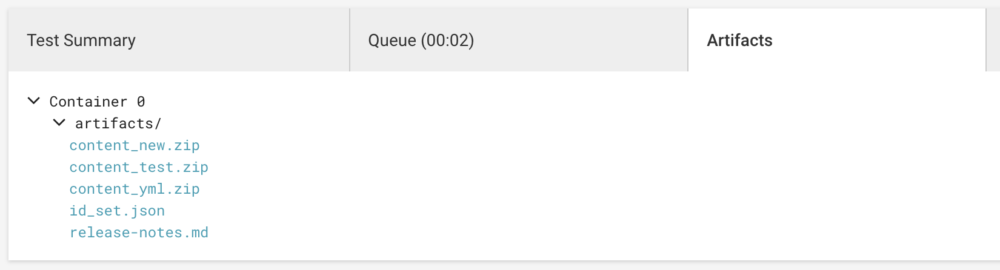
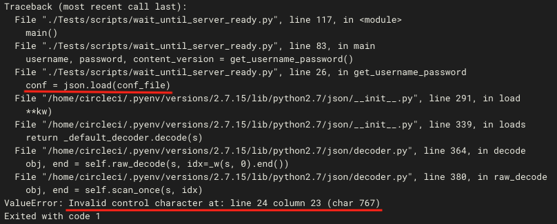
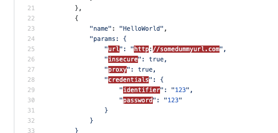

# Overview
Lets start with the basics, CircleCI is the service we use in order to run our tests and to check the integrity of our code.

As you are probably aware, while pushing any code to our repositories it will initiate a build within CircleCI, this build will execute several things, or in the Circle language steps.
Lets go over our steps to understand what each of them is doing.
In addition, we'll explain common errors and how to troubleshoot them.

# Build Sections
1. [Spin up Environment](#spin-up-environment)
2. [Checkout code](#checkout-code)
3. [Setup a remote Docker engine](#setup-a-remote-docker-engine)
4. [Prepare Environment](#prepare-environment)
5. [Installing additional ssh keys](#installing-additional-ssh-keys)
6. [Create ID Set](#create-id-set)
7. [Infrastructure testing](#infrastructure-testing)
8. [Validate Files and Yaml](#validate-files-and-yaml)
9. [Configure Test Filter](#configure-test-filter)
10. [Spell Checks](#spell-checks)
11. [Build Content Descriptor](#build-content-descriptor)
12. [Common Server Documentation](#common-server-documentation)
13. [Create Content Artifacts](#create-content-artifacts)
14. [Uploading artifacts](#uploading-artifacts)
15. [Run Unit Testing and Lint](#run-unit-testing-and-lint)
16. [Download Artifacts](#download-artifacts)
17. [Download Configuration](#download-configuration)
18. [Create Instance](#create-instance)
19. [Setup Instance](#setup-instance)
20. [Run Tests - Latest GA](#run-tests---latest-ga)
21. [Run Tests - One Before GA](#run-tests---one-before-ga)
22. [Run Tests - Two Before GA](#run-tests---two-before-ga)
23. [Run Tests - Server Master](#run-tests---server-master)
24. [Slack Notifier](#slack-notifier)
25. [Validate Docker Images](#validate-docker-images)
26. [Instance Test](#instance-test)
27. [Destroy Instances](#destroy-instances)
28. [Uploading artifacts](#uploading-artifacts-final)

### Spin up Environment
Sets up the testing environment before starting the build. This usually involves provisioning a test server, setting access rules, etc.
  
### Checkout code
Download the content source code (clones and checkout to the specific revision).

### Setup a remote Docker engine
Setup a docker engine in preparation for running python unit-tests in later steps.

### Prepare Environment
Setup workspace: 
- Set global variables.
- Create workspace and artifact folders
- Print build parameters: 
  - `NIGHTLY`: this parameter is set during the build triggered each night.
  - `NON_AMI_RUN`: Indicates whether the build should use predefined AMI (amazon machine image) or not.
  - `SERVER_BRANCH_NAME`: only relevant in case `NON_AMI_RUN` is set. indicates the Demisto server build the current build should work against.  

### Installing additional ssh keys
Add ssh keys to circle machine.

### Create ID Set
This is the first step in the static validation process of the content code.

By running [Tests/scripts/update_id_set.py](https://github.com/demisto/content/blob/master/Tests/scripts/update_id_set.py), we are able to detect conflict of entities (for example, IDs that are being used more than once).

Also, the script calculate dependencies between integration commands, scripts, playbooks and test-playbooks.
This is used in the test [selection step](#Configure-Test-Filter).

<!-- TODO: add troubleshooting errors -->

### Infrastructure testing
This step runs all unit-test files in the following folders:
- [Tests/scripts/hook_validations/tests](https://github.com/demisto/content/blob/master/Tests/scripts/hook_validations/tests)
- [Tests/scripts/infrastructure_tests](https://github.com/demisto/content/blob/master/Tests/scripts/infrastructure_tests)

<!-- TODO: add troubleshooting errors -->

### Validate Files and Yaml
This step is responsible for the majority of the static validations of the content code.
- It validates the schema of the yml files you created:
    - [You can learn more about the YAML structure here](/docs/yaml-file-integration)
- It checks for backward compatibility issues:
  - docker changes
  - id/name changes
  - additional required parameters/arguments
  - context key changes
- Enforce content standards:
  - valid descriptions
  - content entity schemas
  - argument/parameter conflicts
  - context output standards


<!-- TODO: add troubleshooting errors -->

### Configure Test Filter
This step decides and filters which test-playbooks should run.
Special behavior:
- nightly: will run all test-playbooks (with the exception of "skip" tests).
- changes to CommonServer/CommonServerPython: will run all test-playbooks (with the exception of "skip" and "nightly" tests).

<!-- TODO: add troubleshooting errors -->

### Spell Checks
**This will not run on master branch**

By running [Tests/scripts/circleci_spell_checker.py](https://github.com/demisto/content/blob/master/Tests/scripts/circleci_spell_checker.py), we scan yml and md files for typos and spelling mistakes.
One can whitelist a word (for example acronyms are usually detected as misspelled words) by adding it to the [known words](https://github.com/demisto/content/blob/master/Tests/known_words.txt) file.

At the moment, this step does not break the build.

### Build Content Descriptor
<!-- TODO: add troubleshooting errors -->

### Common Server Documentation
This Step generates documentation files used to populate the *Script Helper* menu.

#### Troubleshoot
<!-- TODO: add troubleshooting errors -->
Errors in this section indicates on a problem with the docstrings of CommonServer / CommonServerPython functions.
Make sure all docstrings compatible with the [Sphinx format](https://sphinx-doc.org).

### Create Content Artifacts
This step creates artifact files that are uploaded to the server and contain all of the content for Demisto. 
They are composed of 3 zip files:
- `content_new.zip`: Contains all content entities.
- `content_yml.zip`: **legacy**. Contains all content entities relevant to Demisto 3.4 and below.
- `content_test.zip`: Contains all entities under `TestPlaybooks` folder.

All 3 zip files can be uploaded manually to Demisto as a content update.
`content_new.zip` is published in content releases.

<!-- TODO: add troubleshooting errors -->

### Uploading artifacts
This will upload all files stored under the artifact folder as a circle build artifacts.


### Run Unit Testing and Lint
Run all relevant unit tests of integrations and scripts.
In master branch or due to changes to *CommonServerPython* all unit-tests will be triggered.

### Download Artifacts
**Not relevant for contributors**

This step is relevant only for custom builds that uses a specific Demisto server build.
It will download the Demisto installer from the given build number.

### Download Configuration
**Not relevant for contributors**

Downloads data from content-test-conf, where all the private data is stored. This includes AWS configurations, API keys, login details, and other configurations needed to create a Demisto server with an instance of an integration.
If one need to used a modified private configuration, One should create a new branch with the exact same branch name as this repository branch. 

<!-- TODO: add troubleshooting errors -->

### Create Instance
**Not relevant for contributors**

Creates AWS instances for the build.
<!-- TODO: add troubleshooting errors -->

### Setup Instance
**Not relevant for contributors**

Sets up Demisto on the AWS instances, as well as copies the content from the branch you are working on to the instance itself.
<!-- TODO: add troubleshooting errors -->

#### Troubleshoot
If you encounter an error of the form:

Check the `conf.json` file in "content-test-conf" repository. 
In most cases, the syntax error will highlighted:


### Run Tests - Latest GA
**Not relevant for contributors**

This step iterates over each of the test playbooks. This involves creating an incident, attaching the test playbook to the incident, running the playbook, and finally awaiting the results.
<!-- TODO: add troubleshooting errors -->


### Run Tests - One Before GA
**Not relevant for contributors**

Same as [Latest GA](#run-tests---latest-ga) except uses one version before the latest GA.

### Run Tests - Two Before GA
**Not relevant for contributors**

Same as [Latest GA](#run-tests---latest-ga) except uses two version before the latest GA.

### Run Tests - Server Master
**Not relevant for contributors**

Same as [Latest GA](#run-tests---latest-ga) except uses current master branch of Demisto server.

### Slack Notifier
**Not relevant for contributors**

This step runs only in nightly builds of master branch.
Notifies the `#dmst-content-team` of the results of the build test.
- **Green** - Awesome. Things aren't broken and the build passed all of its tests. You can share your joy in the content team slack channel with the ```:green-build:``` Anar emoji.
- **Red** - Bad. You've broken something and your current build will probably cause skynet to form. Try looking at the logs and seeing why it failed.

### Validate Docker Images
**This will not run on master branch (or release branches)**
<!-- this should be handled by running validate_files.py -->

### Instance Test
**Not relevant for contributors**

This is for the DevOps teams use and runs on the nightly builds only.
Iterates through all the integrations we have in the content-test-conf repo and tries to create an instance for each of them, after that it will run the test button for each of them.
Notifies `#dmst-content-lab` slack channel on failures.

### Destroy Instances
**Not relevant for contributors**

This step downloads the Demisto server log and destroys the AWS instance in a case of success in the relevant "Run Tests" step.
If the tests have failed, the instance is preserved for debug purposes. Instances are not persistent and **will be destroyed**.

### Uploading artifacts final
Once more, will upload artifact folder (which now also contains serverlogs) as circle build artifacts.

# More Build Options 
Some more capabilities we have enabled for CircleCI is to send parameters with the initiation of the build. The following are currently enabled for use:
- Nightly
    - This will make sure we are running all the tests we have in the conf.json file
    - You can initiate a build with this param via `utils/trigger_content_nightly_build.sh` in content repo
- NON_AMI_RUN
    - This will make sure we are not running the build with the AMI created in the nightly process but with the latest server build passed
    - You can initiate a build with this param via `utils/trigger_content_non_ami_build.sh` in content repo
 