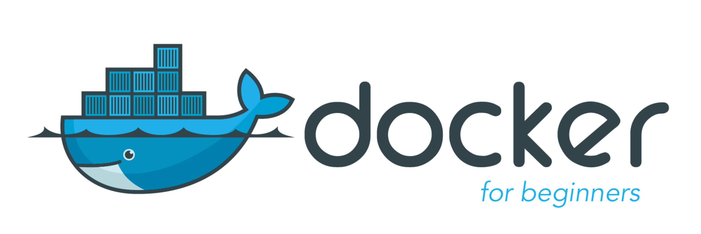

# Docker Images

There are often times during development where the standard Python libraries will be insufficient to meet our needs. When presented with these challenges, we must begin looking into creating a Docker image which would allow us to utilise other third party libraries.

# Package Requirements
We cannot just choose any package to be used in our integrations and there are many things to consider before we select a package. 
* Does this package have known security issues? 
* Is the package licensed? 
* If so, what type of license is being used?
These are just some of the many things we must take into consideration.

## Licensing/Lawyers Need Jobs Too
The Demisto Content repository is produced with a (Massachusetts Institute of Technology) MIT license which means that we can use only packages whose license is compatible with the MIT license. For example:
* GNU/GPL General Public License - Generally referred to as "Open Source", we **may not** use this license
* MIT Software Licensing - We **may** use other packages that are this type
* Apache License 2.0 - We **may** use these packages
* The Unlicense - We **may** use these packages

**Please Note:** Other licenses may be permitted, with approval from the Demisto Legal Department. For a more complete list see: https://en.wikipedia.org/wiki/Comparison_of_free_and_open-source_software_licenses . Any license on wikipedia list which is not marked as `permissive` requires approval.

## Security Concerns
It is imperative that we perform due diligence on packages we choose to use. This includes verifying the package name is correct. Just in 2018 alone, a scan of PyPI resulted in the detection of 11 "typo-squatted" packages which were found to be malicious. [[1]](https://medium.com/@bertusk/detecting-cyber-attacks-in-the-python-package-index-pypi-61ab2b585c67)

## Docker Image Creation
So we have decided we now need to create a Docker Image. After having done our due diligence, and checked the the licenses, we are now ready to proceed.

### Via Command Line (testing only)
To create a Docker Image you may use the Docker Create command in the war room by executing:
```
/docker_image_create
```

This command accepts the following arguments:

| Argument  | Use  |
|---|---|
| **name**  | New docker image name, should be lower case only  |
| **dependencies**  |  New docker image dependencies, those are python libs like stix or requests, can have multiple as comma separated: lib1,lib2,lib3 |
| **packages**  |  new docker image packages, those are OS packages like libxslt or wget, can have multiple as comma separated: pkg1,pkg2,pkg3 |


You may need to update a Docker Image. Do this by executing the following:
```
/docker_image_update
```

This command accepts the following arguments:

| Argument | Use |
|---|---|
| **image** | Image name |
| **all** | Pull all images|

If you would like to see all available Docker Images, you may execute the following command:
```
/docker_images
```
This command does not accept any arguments and will list all available Docker Images.

### Via Docker Files (required for production)
In most cases, if your integration is for public release, we will need to push Docker Files into the dockerfiles repository [located here.](https://github.com/demisto/dockerfiles). See [README,md](https://github.com/demisto/dockerfiles/blob/master/README.md) for instructions on building docker images. 

## Important Notes
When modifying an existing Docker Image, we need to ensure the change will not disrupt other integrations that may use that same package. Thus, all docker images are created with a unique version tag, which we don't allow overriding. 
