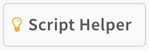
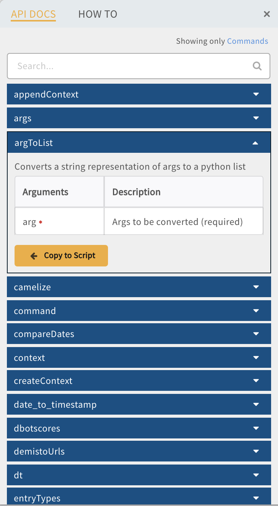
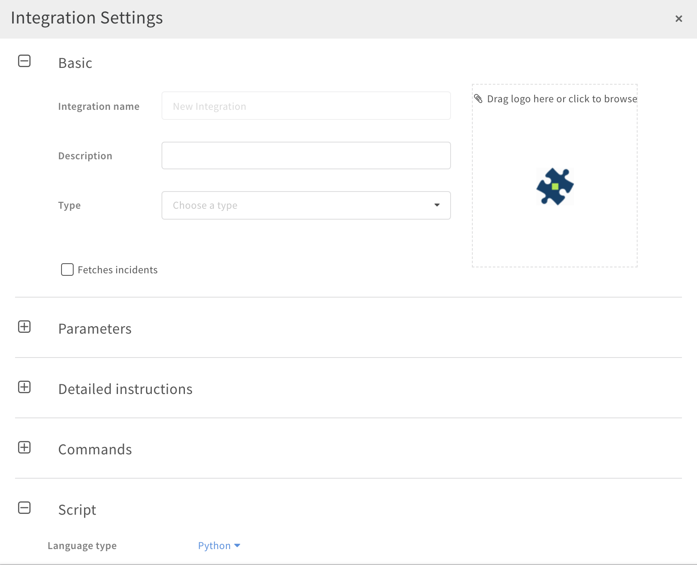

# Getting Started

## Prerequisites

### Development OS
Our recommended OS for development is either macOS or Linux, as we use bash and docker in some of our validation/testing flows.

If you are working on Windows, you can either work with a Linux VM or utilize [Windows Subsystem for Linux](https://docs.microsoft.com/en-us/windows/wsl/install-win10).

### Git
We use GitHub (as you can see). See: https://git-scm.com/book/en/v2/Getting-Started-Installing-Git for git client install instructions.

### Python
Our repository utilizes both Python 2 (2.7 and up) and Python 3 (3.7 and up). Make sure to install both versions.

We recommend managing python versions via [pyenv](https://github.com/pyenv/pyenv)

Optionally, macOS users can install via [homebrew](https://docs.brew.sh/Homebrew-and-Python).


### Docker
Docker is an optional, but highly recommended install. If you would like to write [unit tests](../tests/unit-testing) and run them, as we do in our CI process (within docker), we recommend installing docker. See: https://docs.docker.com/install/ for install options.

## Setting Up a Development Environment
Clone (Demisto users) or Fork (external contributors) the Demisto Content repository.
### Install Python virtualenv
We recommend using [virtualenv](https://github.com/pypa/virtualenv) to create an isolated virtual python development environment. To install virtual env run:
```
pip install virtualenv
```
**Note:** Python 3 includes the `venv` module for creating virtual envs, but it does not permit creating virtual envs with other versions of Python (such as Python 2). Thus, we use the `virtualenv` package.

### Bootstrap
Once `virtualenv` is installed you can run the [`bootstrap`](../../.hooks/bootstrap) script. The script will setup a pre-commit hook which will validate your modified files before committing and setup a python virtual env for development with the package requirements for [python2](../../dev-requirements-py2.txt) and [python3](../../dev-requirements-py3.txt). Run the script from the root directory of the source tree:
```
.hooks/bootstrap
```
After completing, you can activate the newly created virtual env by running:
```
. ./venv/bin/activate
```
**Congratulations!** You now have a fully configured virtual env, where you can run our different validation and utility scripts. For example, to convert an exported yml integration to our [package (directory) format](../package_directory_structure), you can use the `package_extractor.py` script. Try:
```
./package_extractor.py --help
```
**Note:** The virtual env we build contains both Python 2 and 3. `python` and `python2` will point to Python 2 and `python3` to Python 3.

## IDE

Demisto offers two IDEs for developing: IntelliJ Plugin and built-in platform IDE.

## Demisto IntelliJ Plugin
The Demisto Add-on for PyCharm simplifies third-party integration and script development by enabling users to author Python content for Demisto directly in PyCharm. Recommended for developing Python [unit tests](../tests/unit-testing).

Read more [here](https://plugins.jetbrains.com/plugin/12093-demisto-add-on-for-pycharm)

## The Demisto IDE
It is important to take a moment and familiarise yourself with the Demisto IDE as it may work differently than other IDEs you are familiar with. Some key differences between the Demisto IDE and ,for example pyCharm, is the absence of an interpreter. You will have to be mindful of Demisto reserved variables as you develop your integration. **(See Reserved Variables) **

### The Script Helper
Demisto is equipped with a script helper which is accessible via the button below:




The script helper will open up a flyout menu which presents all of the functions that are part of the common server. If you are trying to accomplish something that may seem trivial, check the script helper as a function for it may already exist.



## The Settings Menu
The settings menu contains configurations for Basic Settings, Parameters, Detailed Instructions, Commands and Script settings. Clicking the **Settings** button will open a flyout menu as seen below:


### Basic Settings
In the basic settings menu, is where we give an integration the following:
* **Integration Name** - This is what the display name will be for the integration.
* **Description** - This is a basic description of what the integration does and displays in the integration menu.
* **Type** - Denotes what type of integration we are building. Please note: This setting is required.
* **Fetches Incidents** - If the integration pulls events periodically, we must have this setting enabled.

### Parameters
Parameters are fields which are required for the integration to function properly. This is where we configure a proxy, set API keys, as well as set other global variables for the integration. Parameters have the following configurable settings:
* **Parameter Name** - This is the name of the variable we will use in our integration. Please note that these names need to follow standard python/JS naming conventions.
* **Select Type** - The type of variable being used.
* **Mandatory** - The parameter is required in order for the integration to operate.
* **Initial Value** - The default value for the given parameter.
* **Display Name** - This is the name for the parameter that will be visible in the menu to create an instance.

Add additional parameters with the (+) symbol at the bottom of the menu.

### Detailed Instructions
Use this section to include a "How to" for the integration as well as some common troubleshooting steps. These instructions need to help the user to configure the instance/connection. If there are special user permissions that are required, or the user needs to create an api key, or if a special port need to be configured. Additionally, it is advised to link to the original product's documentation. This section supports markdown.

### Commands
The Command menu consists of the command name and details, as well as Arguments, Outputs, and Important.
* **Command Name** - The name given for the command. Is used by entering ```!command-name``` in the command-line.
* **Potentially Harmful** - Use this to indicate that the command runs scripts that my be seen as harmful.
* **Description** - Seen in the command-line, the description should include an example of how the command is executed, as well as a brief summary of what the command does.

### Arguments
Arguments are variables for a command that are dynamic and can be changed each time the command is executed. For example ```!test-command query="This is an example"``` Shows "query" as an argument for the command "test-command". The configurable fields for arguments are listed below:
* **Argument** - The name used for the argument and should follow Python/JS naming conventions.
* **Mandatory** - If the argument is required, tick this checkbox.
* **Default** - When enabled, the command will always use this argument with its default setting, unless changed.
* **Description** - A brief description of the argument. Should also include an example.
* **Is Array** - Indicates that the argument is an array of variables.
* **List Options** - Add options separated by a comma to include a dropdown list of options for the argument.

### Outputs
Please [read here](https://github.com/demisto/content/blob/master/docs/context_and_ouputs) to learn more about Outputs and Context.