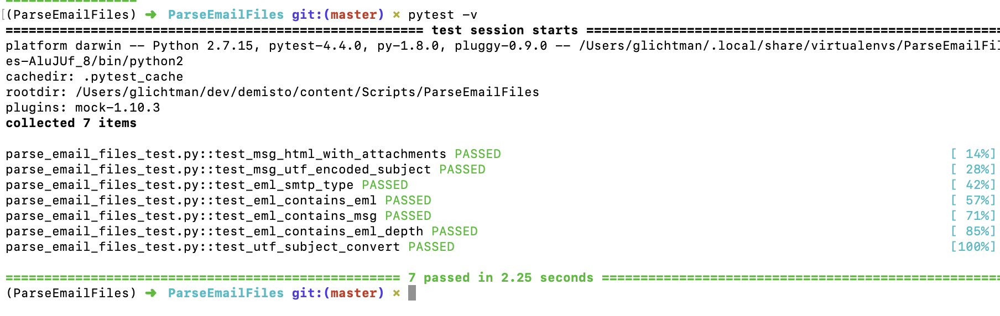
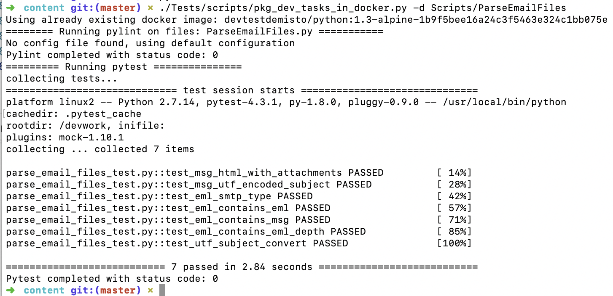

# Unit Testing
Unit testing should be used to test small units of code in an isolated and deterministic fashion. Unit tests should avoid performing communication with external APIs and should prefer to use mocking. Testing actual interaction with external APIs should be performed via Test Playbooks. Unit testing is currently only supported for Python (no JS).
# Environment Setup
In order to work with unit testing the integration or automation script need to be developed in [package (directory) format](../package_directory_structure/README.MD), where the yml file is separated from the python file and resides in its own directory.

## Setup Pipenv 
To run locally the unit tests we want to setup a virtual environment with all required dependencies (both runtime and development). To achieve this we use [Pipenv](https://pipenv.readthedocs.io/en/latest/). Setup:

* **Install pipenv**: Follow the [instructions](https://pipenv.readthedocs.io/en/latest/install/#installing-pipenv).
* **Copy base Pipenv files**: Copy the base Pipenv and Pipenv.lock files to the target package directory from: [Tests/scripts/dev_envs](https://github.com/demisto/content/tree/master/Tests/scripts/dev_envs).
* **Install additional runtime dependencies**: using: `pipenv install <dependency>`. For example: `pipenv install ldap3`
* **Sync Pipenv**: (including dev dependencies) by running: `pipenv sync --dev`
* **Enable Virtual Env**: To enable the Pipenv virtual env in the shell run: `pipenv shell`. To exit the virtual env simply run: `exit`.

You should now have a managed virtual environment to run unit tests locally.

## Setup PyCharm 
We recommend using PyCharm with the Demisto Plugin. This is optional and you can also run/debug unit tests with other ides (such as VS Code), but only PyCharm currently has a dedicated plugin, which can manage the yml file via the UI and also provide remote execution. See: https://plugins.jetbrains.com/plugin/12093-demisto-add-on-for-pycharm. Setup: 

* **Install the Demisto Plugin**: Install with-in PyCharm by navigating to `Preferences.. -> Plugins`. Or download and install from [here](https://plugins.jetbrains.com/plugin/12093-demisto-add-on-for-pycharm/versions)
* **Open Pycharm**: Open PyCharm where the root folder is the folder you wish to develop within. 
* **Choose Interpreter**: Choose the Pipenv interpreter (with all dependencies we setup in the previous step). See: https://www.jetbrains.com/help/pycharm/configuring-python-interpreter.html
* **Enable PyTest**: We run our unit tests with `pytest`. See the following on how to enable PyTest: https://www.jetbrains.com/help/pycharm/pytest.html

# Use `main` in Integration/Automation 
When writing unit tests you will import the Integration/Automation file in order to test specific files. Thus, there is need to make sure that the file is written in such a way that when importing it will not execute. This can be done with a simple `main` function which is called depening on how the file was executed. When the Integration/Automation script is called by Demisto it will have the property `__name__` set to either `__builtin__` or `builtins` depending upon the python version. Additiong the following code will ensure the script is not run when imported by the unit tests:

```python
# python2 uses __builtin__ python3 uses builtins
if __name__ == "__builtin__" or __name__ == "builtins":
    main()
``` 

# Write Your Unit Tests
Unit test should be written in a separate Python file named: `<you_choice>_test.py`. Within the unit test file, each unit test function should be named: `test_<your name>`. More information on writing unit tests and their format is available at the [PyTest Docs](https://docs.pytest.org/en/latest/contents.html). Good place to see example unit tests: [Proofpoint TAP v2 integration](https://github.com/demisto/content/blob/master/Integrations/ProofpointTAP_v2/ProofpointTAP_v2_test.py) 

## Mocking
We use [pytest-mock](https://github.com/pytest-dev/pytest-mock/) for mocking. `pytest-mock` is enabled by default and installed in the base environment mentioned above. To use a `mocker` object simply pass it as a parameter to your test function. The `mocker` can then be used to mock both the demisto object and also external APIs. For an example of using a `mocker` object see: https://github.com/demisto/content/blob/master/Scripts/ParseEmailFiles/parse_email_files_test.py#L29 .

# Running Your Unit Tests
## Command Line
To run your unit tests from the command line simply run from within the virtual env:
```
pytest -v
```
Sample run:


It is also possible to run from outside the virtual env by running:
```
pipenv run pytest -v
```

## Run with PyCharm
Open the unit test file within PyCharm. You will see a green arrow next to each unit test function. When pressing the arrow you will get a prompt to either Debug or Run the unit test. Set breakpoints as needed and Debug the test. 

Sample clip of debugging in PyCharm:


## Run With Docker
CircleCI build will run the unit tests within the docker image the Integration/Automation will run with. To test and run locally the same way CircleCI runs the tests, use the following script from the root of the `content` project: [Tests/scripts/pkg_dev_test_tasks.py](https://github.com/demisto/content/blob/master/Tests/scripts/pkg_dev_test_tasks.py). **Note**: this script by default will also run pylint (as is done in the build process). 

Run the script with `-h` to see command line options:
```
./Tests/scripts/pkg_dev_test_tasks.py -h
usage: pkg_dev_test_tasks.py [-h] -d DIR [--no-pylint] [--no-mypy]
                             [--no-flake8] [--no-test] [-k] [-v]
                             [--cpu-num CPU_NUM]

Run lintings (flake8, mypy, pylint) and pytest. pylint and pytest will run
within the docker image of an integration/script. Meant to be used with
integrations/scripts that use the folder (package) structure. Will lookup up
what docker image to use and will setup the dev dependencies and file in the
target folder.

optional arguments:
  -h, --help            show this help message and exit
  -d DIR, --dir DIR     Specify directory of integration/script (default:
                        None)
  --no-pylint           Do NOT run pylint linter (default: False)
  --no-mypy             Do NOT run mypy static type checking (default: False)
  --no-flake8           Do NOT run flake8 linter (default: False)
  --no-test             Do NOT test (skip pytest) (default: False)
  -k, --keep-container  Keep the test container (default: False)
  -v, --verbose         Verbose output (default: False)
  --cpu-num CPU_NUM     Number of CPUs to run pytest on (can set to `auto` for
                        automatic detection of the number of CPUs.) (default:
                        0)
  ```

Sample output:



**Troubleshooting Tips:**
* The `pkg_dev_test_tasks.py` by default prints out minimal output. If for some reason it is failing and not clear, run the script with `-v` for verbose output.

* When running mypy against python 2 code and the file contains non-ascii characters it may fail with an error of the sort: 
  
  `can't decode file 'ThreatConnect.py': 'ascii' codec can't decode byte 0xe2 in position 47329: ordinal not in range(128)`.
  
  To find the character use the following python one liner: 
  
  `python -c "index = 47329; f = open('Integrations/ThreatConnect/ThreatConnect.py'); d = f.read(); print(d[index-20:index+20])"`
  
* The script creates a container image which is used to run pytest and pylint. The container image will be named: `devtest<origin-image>-[deps hash]`. For example: `devtestdemisto/python:1.3-alpine-1b9f5bee16a24c3f5463e324c1bb075`. You can examine the image if needed by simple using docker run. For example: 
```
docker run --rm -it devtestdemisto/python:1.3-alpine-1b9f5bee16a24c3f5463e324c1bb075e sh
```

* If you have faced the error `ValueError: unknown locale: UTF-8` when running `pkg_dev_test_tasks.py`, add these lines to your ~/.bash_profile: 
```
export LC_ALL=en_US.UTF-8
export LANG=en_US.UTF-8
```


